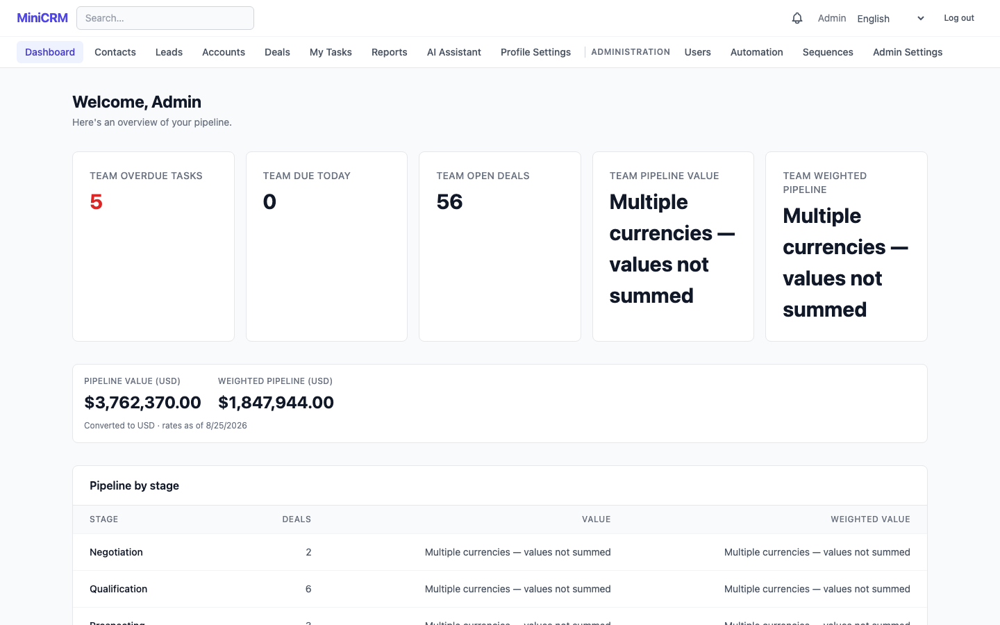
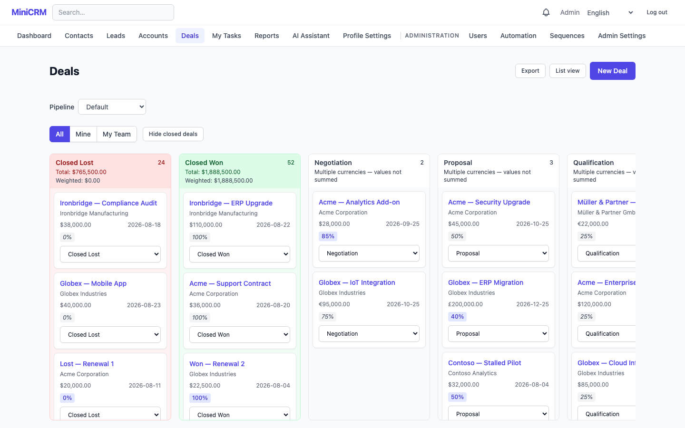
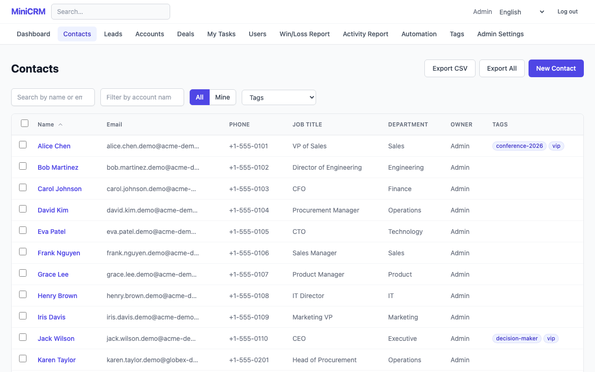
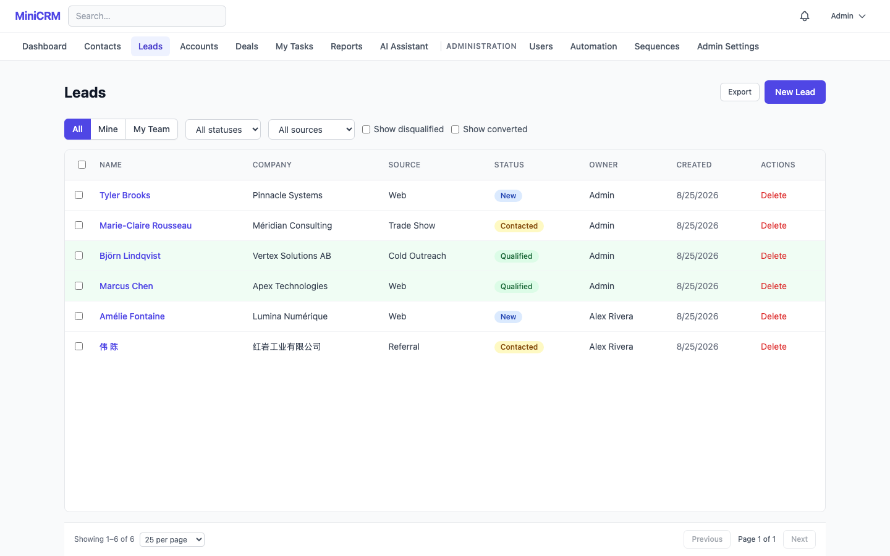
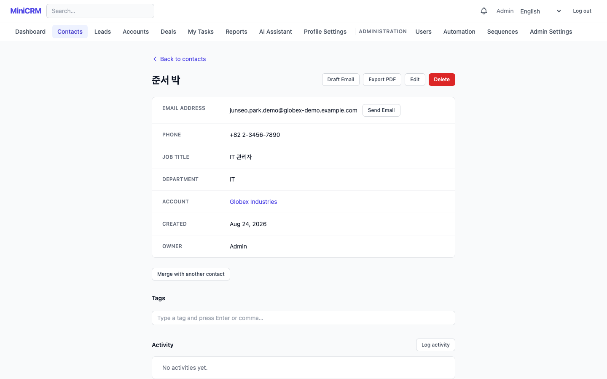
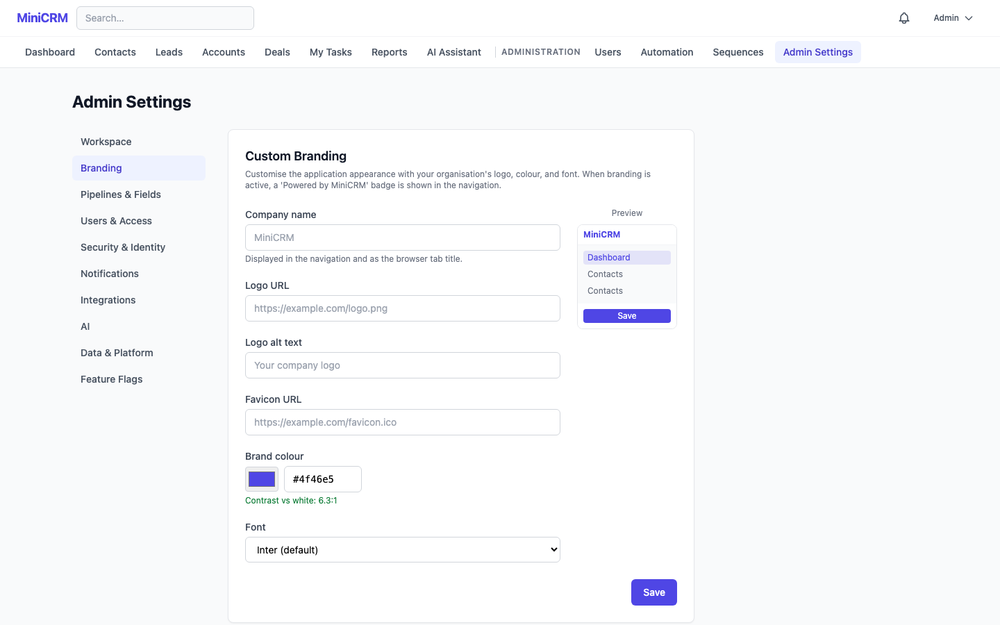

# MiniCRM

A minimal viable CRM (alpha / proof of concept) built to validate the core sales workflow loop: create a contact → attach them to a deal → log activity → move the deal through a pipeline.

[](https://github.com/rkseattle/minicrm/actions/workflows/ci.yml) [](LICENSE) [](https://nodejs.org/)

## Quick Start

```bash
git clone https://github.com/rkseattle/minicrm.git
cd minicrm
cp .env.example .env

# Generate the two secrets the server refuses to start without. This prints two
# labeled lines — paste each over the matching placeholder in .env. Generate them
# separately as below; the two keys must not share a value.
node -e "console.log('JWT_SECRET=' + require('crypto').randomBytes(32).toString('hex'))"
node -e "console.log('NODE_ENCRYPTION_KEY=' + require('crypto').randomBytes(32).toString('hex'))"

# Then set ADMIN_PASSWORD in .env: at least 12 characters, with a letter, a
# number, and a special character.

docker compose --profile web up -d
```

Open http://localhost — the admin account is created automatically on first boot.

`JWT_SECRET` and `NODE_ENCRYPTION_KEY` are validated at startup: the server throws and
exits if either is missing or malformed, before it binds to a port. The placeholders
shipped in `.env.example` deliberately fail that check, so replacing them is not
optional. See [Required Secrets](docs/operations.md#required-secrets) for what each key
protects and how to rotate it.

> **Upgrading an existing clone:** `NODE_ENCRYPTION_KEY` is now declared active in
> `server/.env.example` rather than commented out, because the server has always
> required it unconditionally at startup — the template understated that. If you have a
> local `server/.env` without the key, add it (generate with the command above); leaving
> it out fails `bash qa/scripts/check-env-example-parity.sh`, which CI runs on any
> `.env*.example` change. A root `.env` is unaffected: `.env.example` already declared
> the key active, so its parity requirement has not changed.

`--profile web` starts the nginx client on port 80. It serves a production build, so it
does not hot-reload; for day-to-day development use the Vite dev server instead (see
Local Development below).

## Documentation

| Guide                                               | Audience                                                                                                            |
| --------------------------------------------------- | ------------------------------------------------------------------------------------------------------------------- |
| [User Guide](docs/user-guide/index.md)              | Sales reps and managers — contacts, deals, leads, activities, notes, dashboard, tasks, search, and profile settings |
| [Admin Guide](docs/admin-guide.md)                  | Administrators — user management, pipeline config, settings, branding, automation                                   |
| [REST API Reference](docs/api.md)                   | Developers — authentication, versioning, pagination, error codes, gRPC                                              |
| [Webhook Integration Guide](docs/webhooks.md)       | Developers — subscriptions, event types, payload verification, retry behaviour                                      |
| [Operations Guide](docs/operations.md)              | Developers and operators — local test environment, running E2E, secrets, backups                                    |
| [Developer Documentation](docs/dev/index.md)        | Contributors — architecture references, migrations, E2E authoring, CI, troubleshooting                              |
| [Troubleshooting](docs/dev/troubleshooting.md)      | Contributors — symptoms, causes, and fixes for common local failures                                                |
| [Architecture Decision Records](docs/adr/README.md) | Contributors — why significant architectural decisions were made, and what they cost                                |
| [Database Schema Reference](docs/schema/README.md)  | Contributors — every table and column, generated from the live database                                             |
| [Performance Testing](docs/performance-testing.md)  | Developers — load and performance test setup and results                                                            |

For upgrade procedures, backup and restore scripts, email deliverability setup (SPF/DKIM/DMARC), and other operational guidance, see [docs/operations.md](docs/operations.md).

To populate realistic demo data:

```bash
npm run seed:demo
```

## Screenshots

### Dashboard



### Pipeline Board



### Contacts



### Leads



### Contact Detail



### Admin Settings



## Tech Stack

- **Frontend:** React (Vite), TanStack Query, React Router, Tailwind CSS
- **Backend:** Node.js + Express, REST API, TypeScript
- **Database:** PostgreSQL 16
- **Validation:** Zod (shared schemas used on both client and server)
- **Auth:** JWT stored in httpOnly cookies
- **Infrastructure:** Docker + Docker Compose
- **Monorepo:** npm workspaces (`/client`, `/server`, `/shared`, `/qa`, `/coverage-dashboard`)

## Local Development

To run with source mounts and hot-reload instead of built images:

```bash
docker compose -f docker-compose.yml -f docker-compose.dev.yml up -d
npm run dev:client   # separate terminal — Vite dev server with HMR
```

The application will be available at:

- Client: http://localhost:5173 (Vite dev server — this is the one with hot reload)
- Server API: http://localhost:3001

Hot reload only exists on the Vite dev server. The containerized client is a static
production build behind the `web` profile and needs an image rebuild to pick up changes,
so develop against 5173, not 80. (MINCRM-684)

Automated tests never touch this stack. The server unit, coverage and E2E suites all run
against the isolated test environment in `docker-compose.test.yml` (Postgres on 5433) —
see [docs/operations.md](docs/operations.md#local-test-environment-developer-workflow)
and Running Tests below. (MINCRM-684)

To develop without Docker:

```bash
nvm use          # reads .nvmrc — the Node version CI and both Docker images run
npm install
```

`.nvmrc` is the single source of truth for the Node version: every CI job reads it via
`setup-node`'s `node-version-file`, and both Dockerfiles default their `ARG NODE_VERSION`
to the same major. `engines` in the root `package.json` records the floor but is not
enforced (no `.npmrc` sets `engine-strict`), so a mismatched Node produces warnings rather
than an error — and can resolve the lockfile differently from CI.

**Server:**

```bash
cp server/.env.example server/.env

# Edit server/.env: set your local Postgres credentials, and replace the
# JWT_SECRET and NODE_ENCRYPTION_KEY placeholders. The server validates both at
# startup and exits before binding a port if either is missing or malformed.
node -e "console.log('JWT_SECRET=' + require('crypto').randomBytes(32).toString('hex'))"
node -e "console.log('NODE_ENCRYPTION_KEY=' + require('crypto').randomBytes(32).toString('hex'))"

npm run dev --workspace=minicrm-server
```

**Client:**

```bash
npm run dev --workspace=minicrm-client
```

## Running Tests

To reproduce what CI runs — including the coverage thresholds a bare `npm test` skips —
see [Reproducing a failure locally](docs/dev/ci.md#reproducing-a-failure-locally).

**Server tests** (run against the isolated test stack, never the dev database):

```bash
# Start the test stack first — the suite targets Postgres on 5433, not 5432.
docker compose -f docker-compose.test.yml up -d

cp .env.test.example .env.test
# Fill in DB_PASSWORD and JWT_SECRET — see comments in .env.test.example for generation instructions.
# Never commit .env.test — it is excluded by .gitignore.
npm test --workspace=minicrm-server
```

**Client tests:**

```bash
npm test --workspace=minicrm-client
# With coverage:
npm run test:coverage --workspace=minicrm-client
```

**E2E tests** run against the test stack (client on 5175, API on 3002) — not the dev
stack on 5173/3001 that Local Development above starts. They need the test stack up, a
`qa/e2e/.env`, `npm run e2e:setup`, and a separate `npm run e2e:client`.

The full procedure — prerequisites, both run commands, `PW_GLOBAL_TIMEOUT_MS`, the tag
split, and how to read `results.xml` — is in
[docs/operations.md](docs/operations.md#running-the-e2e-suite).

> **Upgrading an existing clone:** `E2E_DATABASE_URL` was retired (MINCRM-699) — the
> stale-data guard now reads `DB_HOST`/`DB_PORT` (and `DB_USER`/`DB_PASSWORD`) like every
> other test-stack consumer, so there is one source of truth for where the test database
> lives. The database name itself is pinned by the resolver, not read from your env. Delete the
> `E2E_DATABASE_URL` line from your local `qa/e2e/.env` and `qa/.env`; leaving it there
> fails `bash qa/scripts/check-env-example-parity.sh`, which the Definition of Done runs
> for any `.env*.example` change.

## E2E Test Framework (`qa/e2e/`)

The E2E suite is built on Playwright with a custom framework layer designed for long-term resilience and maintainability. All specs are tagged `@functional`; a subset is additionally tagged `@smoke`.

### Architecture

Tests are organized in four layers:

```
Tests (qa/e2e/tests/apps/minicrm/functional/<domain>/)
    ↓  import behaviors, never raw locators
Behaviors (qa/e2e/behaviors/minicrm/)
    ↓  named async fns; compose Page Objects; return typed results; no assertions
Page Objects (qa/e2e/pages/minicrm/)
    ↓  encapsulate all UI interactions; use HealingLocators
HealingLocators (qa/e2e/framework/healing/)
    ↓  multi-strategy resilient element finders
```

Tests import from `@apps/minicrm/fixtures.js` rather than `@playwright/test` directly, which provides the custom fixtures alongside the standard ones.

### Self-Healing Locators

`HealingLocator` resolves elements using a priority-ordered list of strategies. When the primary strategy fails, it automatically falls back through the list and records the event. This keeps tests green through routine UI refactors without requiring immediate selector updates.

Strategy priority order (highest to lowest):

1. `testId` — `data-testid` attribute (most resilient)
2. `role` — ARIA role + name
3. `label` — form label text
4. `text` — visible text
5. `css` — CSS selector
6. `xpath` — XPath expression (least resilient)

When all static strategies are exhausted and an `intent` string is provided, the locator optionally falls back to an AI-powered recovery step that generates a candidate selector from a scoped DOM snapshot (requires `ANTHROPIC_API_KEY`; disabled if not set).

### Healing Reports

Every heal event (primary strategy failed; fallback used) is recorded in memory per worker and flushed to per-shard JSON files at the end of a run. A post-CI merge step produces a single `healing-report.json` summarizing total heals, AI vs. static heals, and per-event detail. In CI this report is posted as a sticky PR comment so teams can spot selectors that are consistently brittle.

### Test Data Management

The `TestDataManager` fixture tracks every entity created during a test and deletes them in reverse order during teardown. Tests create entities via the REST API using helpers from `qa/e2e/apps/minicrm/helpers.ts` (e.g. `createTestContact`, `createTestDeal`) which automatically register the entity for cleanup. Pre-existing data is never touched.

### REST and gRPC Clients

Both are available as Playwright fixtures:

- `restClient` — typed HTTP client wrapping Playwright's `APIRequestContext`; throws `RestClientError` on 4xx/5xx; supports Bearer, API Key, and Basic Auth strategies.
- `grpcClient` — wraps `@grpc/grpc-js` with JSON serialization; supports unary calls and async-iterable server-streaming calls.

### Global Auth Setup

`globalSetup.ts` runs once before all workers. It logs in via the REST API and writes session state (cookies) to `.auth/admin.json`. All tests reuse this cached state, eliminating per-test browser login overhead. Tests that intentionally exercise unauthenticated flows opt out with `test.use({ storageState: undefined })`.

### Visual Regression

`PageFacade` exposes two visual assertion methods backed by Playwright's native `toHaveScreenshot` (no third-party library required):

- `page.checkScreenshot(name, options?)` — full-page pixel comparison against a stored baseline.
- `page.checkLocatorScreenshot(locator, name, options?)` — element-scoped comparison using a `SafeLocator` from `page.locate().resolve()`.

Both methods default to `maxDiffPixels: 50` (permissive enough for cross-machine anti-aliasing differences). Callers can tighten per-assertion by passing options.

**Snapshot storage:** `qa/e2e/snapshots/` — committed to version control alongside the tests.

**Generating / updating baselines:** Run the suite normally for first-run generation. After an intentional UI change, rerun with `--update-snapshots`. Baselines **must** be generated on Linux (the same OS as CI) to avoid macOS/Linux font rendering differences — use the Docker E2E environment. See `qa/e2e/framework/README.md` for the full workflow.

### Accessibility Auditing

`PageFacade` exposes `page.auditAccessibility(options?)` backed by `@axe-core/playwright`. The method runs an axe-core audit against the current page and returns the raw `AxeResults` without throwing — all assertion logic belongs in the test.

```ts
const results = await page.auditAccessibility({
  tags: ['wcag2a', 'wcag2aa', 'wcag21aa'],
  exclude: '#third-party-widget',
});
expect(
  results.violations.filter((v) => v.impact === 'critical' || v.impact === 'serious'),
  'No critical or serious WCAG violations',
).toHaveLength(0);
```

Recommended WCAG level tags: `wcag2a` (WCAG 2.0 A), `wcag2aa` (WCAG 2.0 AA), `wcag21aa` (WCAG 2.1 AA). See `qa/e2e/framework/README.md` for full documentation.

### Network Route Interception

`PageFacade` exposes `page.mockRoute(pattern, handler)`, `page.unmockRoute(pattern)`, and `page.unmockAllRoutes()` for intercepting HTTP requests in tests. All registered mocks are automatically removed at fixture teardown — routes never bleed between tests.

```ts
// Simulate a server error
await page.mockRoute('/api/v1/deals', async (route) => {
  await route.fulfill({
    status: 500,
    body: JSON.stringify({ error: { code: 'INTERNAL', message: 'Server error' } }),
  });
});

// Simulate a slow response to test loading states
await page.mockRoute('/api/v1/contacts', async (route) => {
  await new Promise((resolve) => setTimeout(resolve, 3000));
  await route.continue();
});

// Verify request payload
await page.mockRoute('/api/v1/contacts', async (route) => {
  const body = route.request().postDataJSON();
  expect(body.email).toBe('test@example.com');
  await route.continue();
});
```

Both string and RegExp patterns are supported. See `qa/e2e/framework/README.md` for full documentation.

### Framework Purity

The `qa/e2e/framework/` directory must contain zero application-domain references (no MiniCRM-specific strings, route paths, or domain terms). A CI step (`check-framework-purity.sh`) enforces this — the framework is designed to be dropped into any project unchanged.

### CI Integration

E2E tests run in Phase 3 of the CI pipeline (after server and client unit tests pass). Each push triggers two parallel matrix dimensions:

| Dimension | Values                  |
| --------- | ----------------------- |
| Project   | `desktop`, `mobile-web` |
| Shard     | `1`..`N` (from probe)   |

Shard and worker counts come from the `capacity-probe` job rather than being fixed: on today's GitHub-hosted runners (4 vCPUs) that is 2 shards, so 4 concurrent runners with 4 Playwright workers each — 16 parallel test slots per push. Per-shard artifacts (JUnit XML, blob reports, healing files) are collected and merged by an aggregation job. The merged JUnit results are posted to the GitHub Checks tab via `dorny/test-reporter`; the test summary and healing report are posted as sticky PR comments.

## Automated PR Code Review

`.github/workflows/claude-review.yml` runs a Claude Code review that posts inline comments and a summary review. **It is currently disabled** — its `pull_request` trigger was removed, leaving `workflow_dispatch` only, pending credit availability. `claude-review-autofix.yml` is disabled more thoroughly: its triggers were removed too, and its one job still requires a `pull_request_review` or `issue_comment` event, so a manual dispatch skips the job and does nothing.

What the review checks, when run:

### What it checks

- **Architecture violations** — business logic in controllers or routes; `pool.query()` calls outside `server/src/services/`
- **Validation** — missing Zod validation on request bodies; ORDER BY params not allowlist-validated before SQL interpolation
- **Frontend** — missing `data-testid` attributes on interactable elements; hardcoded user-facing strings not wrapped in `t('key')`; physical Tailwind directional classes instead of logical property utilities (RTL safety)
- **Security** — missing `authenticate` middleware; missing `requireRole('admin')` on admin routes; PATCH/DELETE ownership not enforced; `owner_id` from request body instead of `req.user.id`
- **Documentation** — new service functions missing JSDoc; async handlers not wrapped in `try/catch` or `asyncHandler`; non-standard error response shape
- **Scope** — any implementation touching out-of-scope features
- **PR title** — conventional commit prefix (`feat:`, `fix:`, `chore:`, `test:`, `docs:`)

### What it does NOT flag

Style issues enforced by ESLint/Prettier, naming preferences, and correct-but-stylistically-different patterns.

### How to interpret comments

Comments quote the specific code that violated a rule and explain the correct pattern. If the diff is clean, the review will say so briefly.

### Triggering a review

Run the workflow by hand from the Actions tab. With no `pull_request` trigger, pushing a commit does not start a review.

### Auto-fix loop

`.github/workflows/claude-review-autofix.yml` runs Claude Code on the branch to address review feedback and pushes a fix commit. It cannot currently be run at all: its event triggers were removed, and its job condition still requires a `pull_request_review` or `issue_comment` event that a manual dispatch cannot supply.

## Project Structure

```
/client              React + Vite frontend
/server              Express API server
/shared              Zod schemas shared between client and server
/qa                  Playwright E2E suite and its static checks
/coverage-dashboard  Standalone coverage/TIA reporting app
/db                  PostgreSQL migration files (node-pg-migrate)
/docs                User, admin, and developer documentation
```

### Server conventions

| Directory                 | Purpose                             |
| ------------------------- | ----------------------------------- |
| `server/src/routes/`      | Route definitions only (no logic)   |
| `server/src/controllers/` | Request/response shaping            |
| `server/src/services/`    | Business logic and database queries |
| `server/src/middleware/`  | JWT auth, role gating               |

### Client conventions

| Directory                | Purpose                               |
| ------------------------ | ------------------------------------- |
| `client/src/api/`        | Axios wrappers, one file per resource |
| `client/src/pages/`      | Full page components                  |
| `client/src/components/` | Reusable UI components                |

## Database Migrations

Migrations run automatically on server startup. To run manually:

```bash
npm run migrate --workspace=minicrm-server
```

## Demo Data

Seed realistic demo data into any MiniCRM environment for local development or live demos:

```bash
# Insert demo data (idempotent — safe to check before running)
npm run seed:demo

# Preview what would be inserted without writing to the DB
npm run seed:demo -- --dry-run

# Remove all demo data (leaves real data untouched)
npm run remove:demo
```

Both scripts read database connection from `.env` (`DB_USER`, `DB_PASSWORD`, `DB_NAME`, `DB_HOST`, `DB_PORT`).

Demo data volume (MINCRM-353):

- 2 accounts (Acme Corporation, Globex Industries — with parent/child relationship)
- 20 contacts (10 per account, with addresses, social URLs, and custom field values)
- 11 deals across all pipeline stages, including multi-currency deals (USD and GBP) with custom probability overrides
- Activities (calls, emails, notes, meetings, tasks) linked to deals and contacts
- 7 rich notes on contacts, accounts, and deals — covering team-visible and private visibility
- Custom field definitions: LinkedIn URL, Lead Source Detail (select), Contract Signed Date, Estimated ARR; values populated on representative records
- Exchange rate table seeded with USD, EUR, GBP, CAD, AUD, JPY, CHF rates

All demo records have `is_demo = true`. The remove script deletes **only** rows where `is_demo = true`, so real data is never affected. Running the seed script twice is a no-op if demo data already exists.

### Demo accounts

The seed script creates a full set of IAM users to explore role-based access control:

| Email                           | Name             | Role             | Team             |
| ------------------------------- | ---------------- | ---------------- | ---------------- |
| `admin@demo.minicrm.dev`        | Amara Okonkwo    | admin            | —                |
| `manager.west@demo.minicrm.dev` | Sofia Reyes      | manager          | West Coast Sales |
| `manager.east@demo.minicrm.dev` | Kenji Tanaka     | manager          | East Coast Sales |
| `rep1@demo.minicrm.dev`         | Priya Sharma     | rep              | West Coast Sales |
| `rep2@demo.minicrm.dev`         | Marcus Chen      | rep              | West Coast Sales |
| `rep3@demo.minicrm.dev`         | Fatima Al-Rashid | rep + Senior Rep | East Coast Sales |
| `viewer@demo.minicrm.dev`       | Lars Müller      | viewer           | —                |
| `svc-demo@demo.minicrm.dev`     | Demo Integration | service_account  | —                |

**Password for all demo accounts:** `Demo1234!`

Team structure: `Sales` (parent) → `West Coast Sales` + `East Coast Sales` (children).

The **Senior Rep** custom role grants `reports:create`, `reports:edit`, `reports:export`, and `data:export` capabilities. It is assigned to Jordan Closer (rep3).

Record distribution: ~40% of contacts and deals are owned by West Coast reps (Priya/Marcus, alternating), ~30% by the East Coast rep (Jordan), ~30% by the admin.

After seeding, a service account API token is written to `.env.demo` in the project root. This file is gitignored.

## Implemented Features

### Auth

- Email/password login and logout
- Admin can invite users (generates a set-password link)
- Admin can set a user's password directly from the Users page (no email invite required); the user is prompted to change it on their next login
- Users prompted to change their password are redirected to `/change-password` immediately after login
- Admin can assign roles (admin / rep) and deactivate / reactivate users
- JWT stored in httpOnly cookie; sessions idle out after 30 minutes, with an 8-hour absolute cap from login
- Password requirements: at least 12 characters, at least one letter, at least one number, and at least one special character (validated on both client and server via shared Zod schema)
- Database migration: `007_add_must_change_password.js` adds `must_change_password` boolean column to `users`

### Leads

- Full CRUD for lead records with required fields (`first_name`, `email`) and optional fields (`last_name`, `phone`, `company_name`, `lead_source`, `notes`)
- Lead status lifecycle: `New → Contacted → Qualified → Disqualified`; inline status update from list view with color-coded badges
- Optional disqualification reason stored when status is set to `Disqualified`; disqualified leads hidden by default with a "Show disqualified" toggle
- Status change history recorded in `lead_status_history` and displayed on the lead detail page
- Atomic lead conversion: "Convert Lead" button creates a contact, account, and deal in a single transaction; converted leads hidden by default with a "Show converted" toggle
- Conversion modal prefills contact and deal fields from the lead; supports creating a new account or linking an existing one via typeahead search
- "Converted from lead" back-reference banner shown on the created contact and deal detail pages
- Duplicate email warning on create (matching contact behavior); rep can dismiss or create anyway
- Full CRUD REST API at `/api/v1/leads`; conversion endpoint at `POST /api/v1/leads/:id/convert`; status history at `GET /api/v1/leads/:id/status-history`
- Database migrations: `020_create_leads.js` adds `leads` and `lead_status_history` tables; adds `source_lead_id` FK column to `contacts` and `deals`

### Optimistic Locking (MINCRM-349)

- Every contact, account, deal, lead, and activity carries a `version` integer that increments on each update
- PATCH endpoints require the client to echo back the current `version`; if the record was updated by someone else in the meantime the server returns **409** with the full current state in the response body, preventing silent overwrites
- The version field is included in all read responses so the client always has the latest value after any successful save
- Database migration: `048_add_version_to_all_entities.js` adds `version INTEGER NOT NULL DEFAULT 1` to `contacts`, `accounts`, `deals`, `leads`, and `activities`

### Three-Way Merge UI for Conflicts (MINCRM-351)

- When a 409 optimistic-lock conflict occurs on any edit form, a **Field Merge Modal** opens instead of showing a generic error
- The modal presents a field-by-field comparison table with three value columns: **Original** (value when the page was opened), **Their change** (current server state), and **Your change** (what the user tried to save)
- Conflicts where both sides changed the same field differently are highlighted and require the user to pick a value via radio buttons; non-conflicting changes are auto-resolved
- String fields show character-level inline diffs (red strikethrough for removed text, green highlight for added text)
- After resolving all conflicts the user clicks **Save resolved** to resubmit with the merged values, or **Discard my changes** to abandon the edit
- Component: `client/src/components/FieldMergeModal.tsx`

### Localized Server Error Messages (MINCRM-354)

- Server error codes (e.g. `CONTACT_EMAIL_DUPLICATE`, `OPTIMISTIC_LOCK_CONFLICT`, `STAGE_HAS_OPEN_DEALS`) are translated to user-friendly messages in the active locale instead of showing raw code strings
- The `resolveApiError()` utility in `client/src/utils/apiError.ts` looks up `errors.<CODE>` in the i18n catalog and falls back to `errors.generic` for unrecognized codes
- All five supported locales (`en`, `zh-Hans`, `es`, `fr`, `de`) include translations for every domain error code
- No API or migration changes — purely a client-side presentation improvement

### Contacts

- List all contacts in a sortable table with owner column
- Create, edit, and delete contacts via inline forms
- Contact detail page with full field display including resolved owner name
- Search contacts by name or email via the search input (passes `?search=<text>` to the API; case-insensitive substring match across `first_name`, `last_name`, and `email`)
- Search contacts by linked account name via the account search input (`?accountSearch=<text>`)
- Filter contacts by owner (all vs. mine) via `?owner=me` query parameter
- Owner defaults to the creating user; can be reassigned to any active user from the edit form
- Duplicate email detection on create: returns a persistent inline warning banner with a link to the existing contact; rep can still proceed by clicking "Create anyway"
- Address fields: `address_line1`, `address_line2`, `city`, `state_region`, `postal_code`, `country` — collapsible section in the form, displayed on detail page when populated
- Social profile URLs: `linkedin_url`, `twitter_x_url` — collapsible section in the form, displayed as clickable links on detail page when populated
- Contact merge: merge two contact records into one via `POST /api/v1/contacts/:id/merge`; winner survives, loser is deleted; per-field value choices; activities and deal links re-routed to winner; merged audit entry written
- Full CRUD REST API at `/api/v1/contacts`; merge endpoint: `POST /api/v1/contacts/:id/merge`

### Full-Viewport List Layout (MINCRM-343)

- All list pages (Contacts, Accounts, Leads, Activities) use a full-viewport layout where the table scrolls internally and the nav bar, filters, and pagination remain fixed on screen
- The table container fills all remaining vertical space between the filter bar and the pagination strip — no page-level scrollbar
- Sticky table header stays visible while scrolling through long record lists
- Layout is implemented with Tailwind flex column utilities (`h-screen`, `flex-1`, `min-h-0`, `overflow-auto`) applied consistently across all list pages

### Always-Visible Pagination with Page-Size Selector (MINCRM-342)

- Every list page shows a persistent pagination strip at the bottom of the viewport — it is never pushed off screen regardless of how many rows are loaded
- The left side of the strip shows a record count summary ("Showing X–Y of Z records") and a **Rows per page** dropdown (10 / 25 / 50 / 100); changing the page size resets to page 1
- The right side shows Previous / Next navigation buttons and a "Page N of M" indicator
- Implemented in the shared `Pagination` component (`client/src/components/ui/Pagination.tsx`) used by all list pages

### Accounts

- List all accounts in a sortable table with owner column
- Create, edit, and delete accounts via inline forms
- Account detail page with full field display including resolved owner name
- Search accounts by company name via the search input (passes `?search=<text>` to the API; case-insensitive substring match on `name`)
- Filter accounts by industry via `?industry=<text>`
- Filter accounts by account type via `?accountType=<type>`
- Filter accounts by owner (all vs. mine) via `?owner=me` query parameter
- Owner defaults to the creating user; can be reassigned to any active user from the edit form
- Account type field: `Prospect`, `Customer`, `Partner`, `Vendor`, `Competitor`, `Other` — displayed as badge on list and detail pages
- Parent account relationship: accounts may have a parent account; circular chain detection prevents invalid hierarchies; subsidiary accounts listed on parent detail page
- Type-ahead parent account search in the edit form
- Linked contacts listed on the account detail page
- Full CRUD REST API at `/api/v1/accounts`; additional endpoints: `GET /api/v1/accounts/search`, `GET /api/v1/accounts/:id/children`

### Deals

- List all deals in a table with stage, value, close date, linked account, and owner columns
- Create, edit, and delete deals via inline forms
- Deal detail page with full field display including resolved owner name and linked account
- Filter deals by owner (all vs. mine) via `?owner=me` query parameter
- Owner defaults to the creating user; can be reassigned to any active user from the edit form
- Linked contacts listed on the deal detail page (populated via `deal_contacts` join table)
- Pipeline stages are admin-configurable (see [Custom Pipeline Stages](#custom-pipeline-stages)); default stages are Prospecting → Qualification → Proposal → Negotiation → Closed Won / Closed Lost
- Full CRUD REST API at `/api/v1/deals`
- Database migrations: `004_create_deals.js`, `005_create_deal_contacts.js`

### Rich Notes on Entity Detail Pages (MINCRM-352)

- Contact, Account, Deal, and Lead detail pages include a **Notes** section with a rich-text composer (Lexical editor)
- Notes support an optional title, a body with inline formatting, and a **visibility** setting: **Team** (visible to all users, default), **Private** (visible only to the creator and admins), or **Public**
- Private notes authored by another user appear with the body masked — the card shows the author and timestamp but not the content
- Notes are paginated; each entity's notes feed is independent
- Notes support soft-delete: deleted notes are removed from the feed but retained in the audit log
- Audit events (`note_created`, `note_updated`, `note_deleted`, `note_visibility_changed`) are written in the same transaction as the note change; private note bodies appear as `[private note]` in the audit log
- API endpoints:
  - `GET /api/v1/{entityType}/{entityId}/notes` — list notes (paginated)
  - `POST /api/v1/{entityType}/{entityId}/notes` — create a note (auth required)
  - `PATCH /api/v1/{entityType}/{entityId}/notes/:noteId` — update a note (creator or admin only)
  - `DELETE /api/v1/{entityType}/{entityId}/notes/:noteId` — soft-delete a note (creator or admin only)
- Database migration: `044_create_notes.js` creates the `notes` table with `entity_type`, `entity_id`, `title`, `body` (Lexical JSON), `visibility`, `deleted_at` (soft-delete), `created_by`, and `updated_by` columns; migration `045_extend_audit_event_types.js` adds note event types to the audit log enum

### Activities & Tasks

- Unified activity model with types: Note, Call, Email, Meeting, Task
- Activities can be attached to a contact, account, or deal (at least one required)
- Activity type auto-defaults to "Task" when a due date is provided; "Note" otherwise
- Task completion — mark a task as complete from the timeline; completed tasks are visually distinguished (strikethrough subject, "Complete" badge)
- Edit and delete activities from the timeline (owners and admins only)
- `ActivityTimeline` is a shared component embedded in Contact, Account, and Deal detail pages
- Full CRUD REST API at `/api/v1/activities` with `?contact`, `?account`, `?deal`, and `?owner=me` filter support
- Database migration: `006_create_activities.js`

#### Structured communication logging

- Call and Email activities support two additional fields: **direction** (Inbound / Outbound, required) and **outcome** (free text, optional)
- The `ActivityForm` conditionally shows direction and outcome fields when the selected type is Call or Email; direction is required before the form can be submitted
- The `ActivityTimeline` displays the direction label below the type badge and the outcome text in the card body
- Database migration: `010_add_communication_fields_to_activities.js` (adds `direction activity_direction` and `outcome text` columns, both nullable)

#### My Tasks view

- Dedicated `/tasks` page (linked in the nav bar as **My Tasks**) listing all Task-type activities owned by the current user
- Tasks sorted by due date ascending (no due date appears last)
- Overdue tasks (past due date, still open) show the due date in red with an "Overdue" badge
- Each row shows subject, type badge, due date, and the name of the linked record (contact, account, or deal) as a clickable link
- User can mark any open task complete directly from the list — no navigation to the parent record needed
- Completed tasks are hidden by default; a **Show completed** toggle reveals them
- API endpoint: `GET /api/v1/activities/my-tasks` — returns Task-type activities for the authenticated user, with `linked_record_name` and `linked_record_type` fields joined from the parent record

### Admin Settings

- New `/admin/settings` route and **Admin Settings** nav link (visible to admins only)
- Admin can set a system-wide default language from a dropdown populated with all supported locales
- Selected default persists across restarts via the `system_settings` table (key/value store)
- API endpoints:
  - `GET /api/v1/settings/default-language` — public, returns `{ language }` (used on app load)
  - `PATCH /api/v1/settings/default-language` — admin only, body `{ language }`, returns `{ language }`
- Shared Zod schema `settingsSchema.ts` in `/shared/schemas/` defines `SUPPORTED_LOCALES` and the request/response schemas; locale display names are stored in the i18n translation files under `settings.languages.*`
- Database migration: `008_create_system_settings.js` creates the `system_settings` table and seeds the default row (`default_language = 'en'`)

### Custom Branding (MINCRM-356)

- Admins can configure organisation-wide branding from the **Admin Settings** page: upload a logo and favicon, set a primary brand colour, choose a Google Font family, enter a company name, and optionally show a "Powered by MiniCRM" badge
- A live preview panel on the settings page reflects changes before saving
- The brand colour picker includes a WCAG AA contrast ratio indicator; the server derives a matching text colour (white or dark grey) based on relative luminance so branded buttons always remain readable
- Branding is distributed to the client on app load via `BrandingContext`; the full CSS colour scale (50–900 shades) is injected as CSS custom properties and consumed via the Tailwind `primary-*` colour utilities, so every use of `bg-primary-*`, `text-primary-*`, etc. picks up the brand colour automatically
- Custom fonts are loaded from Google Fonts and applied globally; the page font updates immediately without a reload
- API endpoints (admin only):
  - `GET /api/v1/settings/branding` — public, returns current branding config or `{ branding: null }` if not configured
  - `PUT /api/v1/settings/branding` — admin only, partial merge of branding fields
  - `DELETE /api/v1/settings/branding` — admin only, resets all branding to defaults
- Branding is stored as a JSON value in the `system_settings` table under the `branding` key; no dedicated migration required

### Navigation Layout

- Admin can choose between three navigation layouts from the **Admin Settings** page: **Top Nav** (tab bar, default), **Left Nav** (collapsible sidebar), and **Hamburger Menu** (icon-triggered overlay)
- The selected layout is stored in the `system_settings` table (`nav_layout` key) and applies immediately to all users without a page reload
- API endpoints:
  - `GET /api/v1/settings/nav-layout` — public, returns `{ layout }` (used on app load)
  - `PATCH /api/v1/settings/nav-layout` — admin only, body `{ layout }`, returns `{ layout }`
- The active layout is distributed via `NavLayoutContext` / `NavLayoutProvider`; page components use `<NavBar />` without knowing which layout is active
- Each layout is a self-contained React component (`NavTop`, `NavLeft`, `NavHamburger`) with `data-testid` attributes following the `nav-{layout}-{destination}` convention (e.g. `nav-top-contacts`, `nav-left-deals`, `nav-hamburger-tasks`)
- Database migration: `014_add_nav_layout_setting.js` seeds the `nav_layout = 'top'` default row

### Email Notifications

- **Overdue task digest**: A daily cron job (see [Scheduled Jobs](docs/operations.md#scheduled-jobs)). For each active user who has opted in to overdue task notifications, it sends one HTML email listing all open Tasks past their due date that have not previously been notified. Deduplication is tracked in the `overdue_task_notifications` table — each task is notified at most once.
- **Assignment notifications**: When a contact, account, or deal is reassigned, the new owner receives an email if they have assignments notifications enabled. Multiple assignment events within a 2-minute window are batched into a single email per recipient.
- **User notification preferences**: Every authenticated user can configure three per-category toggles on the `/profile` page: overdue task digests, assignment notifications, and deal stage change notifications. Admins additionally have a global kill switch on the **Admin Settings** page that suppresses all notification emails regardless of individual preferences.
- API endpoints:
  - `GET /api/v1/users/me/notification-preferences` — auth required, returns `{ preferences: { notify_overdue_tasks, notify_assignments, notify_deal_stage_changes } }`
  - `PATCH /api/v1/users/me/notification-preferences` — auth required, body with any subset of the three boolean fields
  - `GET /api/v1/users/notification-recipient-count` — admin only, returns `{ count }` (active users with any notification pref enabled)
  - `GET /api/v1/settings/email-notifications` — auth required, returns `{ enabled: boolean }`
  - `PATCH /api/v1/settings/email-notifications` — admin only, body `{ enabled: boolean }`
- Database migrations: `016_add_notification_prefs_to_users.js` adds three boolean columns to `users`; `017_create_overdue_task_notifications.js` creates the dedup table and seeds the `email_notifications_enabled` system setting
- Email transport uses nodemailer with SMTP env vars (`SMTP_HOST`, `SMTP_PORT`, `SMTP_USER`, `SMTP_PASS`); in development and test environments emails are stubbed (logged to console rather than sent)

### Custom Pipeline Stages

- Admin Settings includes a **Pipeline Stages** section where admins can add, rename, reorder (up/down buttons), and delete custom pipeline stages with per-stage default probability percentages
- **Closed Won** and **Closed Lost** are always present, always last, and cannot be renamed or deleted (marked `is_fixed = true` in the DB)
- Deleting a stage is blocked if any open (non-terminal) deals are currently in that stage — the admin sees the deal count and must move those deals first
- Stage names must be unique (case-insensitive); blank names are rejected
- Renaming a stage atomically updates all deals in the old stage name in the same DB transaction — no deal records are orphaned
- Pipeline stage definitions are stored in the new `pipeline_stages` table (migration `021_create_pipeline_stages.js`); the `deals_stage_check` constraint is removed in the same migration
- The client fetches the live stage list on app startup via `GET /api/v1/settings/pipeline-stages` (public endpoint) and caches it for 5 minutes via React Query (`PIPELINE_STAGES_QUERY_KEY`)
- All stage selectors (`DealForm`, `DealCard`, `AutomationRulesPage`) and board columns (`DealsPage`, `StageColumn`) now consume the live stage list via the `usePipelineStages` hook instead of the hardcoded constant
- Custom stage names are displayed using their raw name; built-in stage names still use i18n translation keys
- API endpoints:
  - `GET /api/v1/settings/pipeline-stages` — public, returns `{ stages: PipelineStageResponse[] }` in sort order
  - `POST /api/v1/settings/pipeline-stages` — admin only, body `{ name, sort_order, probability? }`, returns the new stage
  - `PATCH /api/v1/settings/pipeline-stages/:id` — admin only, body `{ name?, sort_order?, probability? }`, returns updated stage; fixed stages reject name changes with 403
  - `DELETE /api/v1/settings/pipeline-stages/:id` — admin only, returns `{ id }` on success; 409 if open deals exist
- Database migration: `021_create_pipeline_stages.js` creates the `pipeline_stages` table, seeds the six default stages, and drops the hardcoded `deals_stage_check` constraint

### Multi-Currency Deal Values

- Each deal now stores an ISO 4217 currency code (`USD`, `EUR`, `GBP`, `CAD`, `AUD`, `JPY`, `CHF`) alongside its value
- The **Deal Form** includes a currency selector; new deals default to the system-wide default currency (see below)
- **Deal cards** and **deal detail pages** format the value with the correct currency symbol and locale-appropriate number format via `Intl.NumberFormat`
- **Pipeline board stage columns** and **dashboard summary cards** detect mixed currencies in a stage: when deals with different currencies are present, totals are replaced with "Multiple currencies — values not summed" to avoid misleading cross-currency arithmetic
- **Win/loss report** similarly shows the mixed-currency note when the filtered deals span multiple currencies
- Admin can set a system-wide **default currency** on the **Admin Settings** page; new deals without an explicit currency pick up the system default at creation time
- **CSV export** includes a `Currency` column alongside `Value`
- API endpoints:
  - `GET /api/v1/settings/default-currency` — public, returns `{ currency }` (used at deal creation time); cached client-side for 5 minutes via `DEFAULT_CURRENCY_QUERY_KEY`
  - `PATCH /api/v1/settings/default-currency` — admin only, body `{ currency }`, returns `{ currency }`
- Database migration: `031_add_currency_to_deals.js` adds `currency VARCHAR(3) NOT NULL DEFAULT 'USD'` to the `deals` table

### Tags / Labels

- **Tags** are freeform labels that can be attached to any contact, account, or deal
- **Tag input** on detail pages (`ContactDetailPage`, `AccountDetailPage`, `DealDetailPage`): type to create or search existing tags, press Enter or comma to confirm, × to remove; matching existing tags appear as a suggestion dropdown (combobox pattern, keyboard-accessible)
- **Tag badges** on list views (`ContactsPage`, `AccountsPage`, and `DealsPage` list view): compact `#tag-name` badges rendered alongside each row; mobile card views also show badges
- **Tag filter** on list views: a dropdown lets users filter to records tagged with one or more tags (any-match); active filters appear as removable badge chips; resets to page 1 on change
- **Admin Tags page** at `/admin/tags`: admins can rename or delete tags globally; accessible from admin nav
- Tag names are stored lowercase; creating a tag that already exists (case-insensitive) returns the existing tag (idempotent upsert)
- Filter uses `EXISTS` subquery in SQL — does not break existing queries when no tags are selected
- List responses embed tags via `JSON_AGG` lateral subquery to avoid N+1 queries
- Database migration: `032_create_tags.js` creates `tags`, `contact_tags`, `account_tags`, and `deal_tags` tables; junction tables have composite PKs and `ON DELETE CASCADE`
- API endpoints:
  - `GET /api/v1/tags` — list all tags
  - `POST /api/v1/tags` — create a tag (name required)
  - `GET /api/v1/tags/:id` — get a tag by ID
  - `PATCH /api/v1/tags/:id` — rename a tag (admin only)
  - `DELETE /api/v1/tags/:id` — delete a tag and all its junction rows (admin only)
  - `GET /api/v1/contacts/:id/tags` — list tags attached to a contact
  - `POST /api/v1/contacts/:id/tags` — attach a tag by name (creates tag if new)
  - `DELETE /api/v1/contacts/:id/tags/:tagId` — detach a tag from a contact
  - Same pattern applies to `/api/v1/accounts/:id/tags` and `/api/v1/deals/:id/tags`

### User Language Preference

- Any authenticated user can set a personal preferred language from the **Profile** page (`/profile`) or by using the language dropdown in the nav bar
- Personal preference overrides the system-wide default at all times; setting it to "Use system default" clears the preference and falls back to the admin-configured default
- The language dropdown in the nav bar now persists the selection to the server (previously session-only)
- On login, the user's stored preference is returned with the `/api/v1/auth/me` response and applied immediately — no language flash
- API endpoints:
  - `GET /api/v1/users/me/language` — auth required, returns `{ language: SupportedLocale | null }`
  - `PATCH /api/v1/users/me/language` — auth required, body `{ language: SupportedLocale | null }`, returns `{ language }`
- Database migration: `009_add_user_preferred_language.js` adds the nullable `preferred_language` column to the `users` table

### Home Dashboard

- Stat cards on the dashboard home page: overdue tasks, tasks due today, open deal count, total open pipeline value, and weighted pipeline value
- Overdue task count is clickable for non-admins and navigates to **My Tasks** pre-filtered to show only overdue tasks (`/tasks?filter=overdue`)
- Per-stage breakdown table showing open deal count and total value for each active pipeline stage (Closed Won / Closed Lost excluded)
- Admins see team-wide metrics; reps see their own data only — enforced server-side
- Data is always fresh on page load (React Query `staleTime: 0`)
- API endpoint: `GET /api/v1/dashboard/summary` — returns `{ overdueTasks, tasksDueToday, openDealCount, openPipelineValue, weightedPipelineValue, mixedCurrencies, currency, stageBreakdown, recentActivities }` plus home-currency conversion fields (auth required)

### Automation Rules

- Admin-only page at `/admin/automation`, accessible from the **Automation** nav link (visible to admins only)
- Admins can create automation rules that pair a **trigger** with an **action**
- **Triggers:** Deal stage changes to a specific stage, Deal is created, Contact is created
- **Actions:** Create task (with configurable subject, type, assignee, and due date offset in days), Send notification (logs message to the server)
- Rules have a name and an enable/disable toggle; disabled rules do not fire
- Rule execution is synchronous — fires inline after the triggering database operation
- For `create_task` actions, the assignee can be the record owner or a specific user
- A **logs drawer** shows the 20 most recent executions per rule: timestamp, triggering record, and outcome (Success / Error with error message on failure)
- API endpoints (admin-only):
  - `GET /api/v1/automation/rules` — list all rules
  - `POST /api/v1/automation/rules` — create a rule
  - `GET /api/v1/automation/rules/:id` — get a rule
  - `PATCH /api/v1/automation/rules/:id` — update a rule (supports partial updates including toggling `enabled`)
  - `DELETE /api/v1/automation/rules/:id` — delete a rule and its logs (CASCADE)
  - `GET /api/v1/automation/rules/:id/logs` — 20 most recent execution logs
- Database migrations: `011_create_automation_rules.js`, `012_create_automation_rule_logs.js`
- Shared Zod schemas in `shared/schemas/automationSchema.ts`

### Win/Loss Report

- Admin-only report page at `/reports/win-loss`, accessible from the navigation bar
- Displays Closed Won count and total value, Closed Lost count and total value, and win rate (Won / Total Closed) for a selected date range
- Date range defaults to the current month; presets for "this quarter" and a custom date range are also available
- Admins can filter the report by owner (rep); reps always see only their own deals
- Loss reason breakdown table shows top loss reasons by count when loss reasons were captured
- Report data is filtered by `close_date` (not `created_at`)
- API endpoint: `GET /api/v1/reports/win-loss?start=YYYY-MM-DD&end=YYYY-MM-DD[&owner_id=UUID]` — returns `{ wonCount, wonValue, lostCount, lostValue, winRate, lossReasonBreakdown }` (auth required)

### Activity Volume Report

- Admin-only report page at `/reports/activity-volume`, accessible from the navigation bar
- Displays activity counts broken down by type (Note, Call, Email, Meeting, Task) and by rep for a selected date range
- Date range defaults to the current month; presets for "this week", "this quarter", and a custom date range are also available
- Admins can filter by owner (rep); reps always see only their own activity
- CSV export available for the full report dataset
- API endpoint: `GET /api/v1/reports/activity-volume?start=YYYY-MM-DD&end=YYYY-MM-DD[&owner_id=UUID]` — returns activity counts grouped by type and owner (auth required)

### Global Search

- Unified search bar available in the nav bar searches across contacts, accounts, deals, and leads simultaneously
- Case-insensitive partial-word matching; returns up to 10 results per entity type
- Ownership-aware: admins see results from all records; reps see only records they own
- Results panel shows entity type label and key fields (e.g. name, email, stage); clicking a result navigates to the detail page
- Results panel is capped in height with long text truncated to keep the UI compact
- API endpoint: `GET /api/v1/search?q=<term>` — returns `{ contacts, accounts, deals, leads }` arrays (auth required)

### Ownership

- Every contact and account has a single `owner_id` that defaults to the creating user
- Owner is displayed as a resolved name (not UUID) in list and detail views
- Active users are fetched from `GET /api/v1/users/active` (auth required, no admin role needed)
- Owner can be changed from the record's edit form; change is reflected immediately without page reload

### CSV Import

- Admin-only two-step CSV import for contacts, accounts, and deals
- **Step 1 — Parse:** upload a CSV file; the server returns the detected column headers and a preview of the first few rows so the admin can map columns before committing
- **Step 2 — Run:** upload the CSV again with the column mapping; the server creates a background import job and returns `202 Accepted` immediately
- **Job polling:** the client polls `GET /api/v1/admin/import/jobs/:job_id` until `status` is `complete` or `error`; the final result includes `total_rows`, `imported`, `skipped`, and `errors`
- Rows that fail validation are collected in the `errors` array and skipped — the rest are imported
- API endpoints (admin only):
  - `POST /api/v1/admin/import/contacts/parse` — parse CSV, returns headers + preview
  - `POST /api/v1/admin/import/contacts/run` — start import job, returns `{ job_id }`
  - Same pattern for `/api/v1/admin/import/accounts/...` and `/api/v1/admin/import/deals/...`
  - `GET /api/v1/admin/import/jobs/:job_id` — poll job status and result
- Database migration: `037_create_import_jobs.js` creates the `import_jobs` table

### SMTP Configuration (Admin)

- Admins can configure outgoing email (SMTP) directly from the **Admin Settings** page without editing environment variables
- Settings stored in the `system_settings` table (keys: `smtp_host`, `smtp_port`, `smtp_user`, `smtp_pass` (encrypted), `smtp_enabled`)
- A **Send Test Email** button on the settings page verifies the saved configuration by delivering a test email to the logged-in admin's address
- SMTP password is encrypted at rest via AES-256-GCM; it is never returned in API responses (`smtp_pass_set: boolean` indicates whether a password is stored)
- API endpoints (admin only unless noted):
  - `GET /api/v1/settings/smtp` — returns current config (auth required; no admin needed for read)
  - `PATCH /api/v1/settings/smtp` — save SMTP config (admin only)
  - `POST /api/v1/settings/smtp/test` — send a test email (admin only); always returns HTTP 200 with `{ success, error? }` in the body
- Database migration: `036_add_smtp_settings.js` seeds the five SMTP rows in `system_settings`
- Environment variable `SMTP_FROM` (optional) sets the sender address when no DB config is active; defaults to `MiniCRM <noreply@minicrm.local>`

### Currency Exchange Rates

- Admins can configure exchange rates relative to a home currency on the **Admin Settings** page
- The home currency row has `is_home = true` and `rate_to_home = 1.000000`; at most one home row can exist (enforced by a partial unique index)
- Exchange rates are used for cross-currency deal value aggregation on the pipeline board and dashboard when `SUPPORTED_CURRENCIES` deals are mixed
- API endpoints:
  - `GET /api/v1/settings/currencies` — returns home currency and all exchange rates (auth required)
  - `PUT /api/v1/settings/currencies` — replace full exchange rate table (admin only); body `{ home_currency, currencies: [{ code, rate_to_home }] }`
- Database migration: `035_create_currencies.js` creates the `currencies` table and seeds USD as the home currency

### Onboarding

Each user has their own onboarding checklist that appears as a widget until they dismiss it. Tasks are role-specific:

**Admin tasks (org-wide progress):**

1. Invite a team member
2. Create a pipeline stage
3. Configure SMTP
4. Seed demo data
5. Review pipeline stages

**Rep tasks (personal progress):**

1. Add a contact
2. Create an account
3. Create a deal
4. Log an activity

Task completion is determined live from actual record counts — there is no separate per-task flag stored. This means that if an admin resets a user's onboarding checklist, tasks that reflect work the user has already done (contacts added, deals created, etc.) will still appear checked. The reset only causes the checklist widget to reappear on the user's next login; it does not undo their work.

- State persists in the `onboarding_completed` and `onboarding_completed_at` columns on the `users` table (migration `058_add_onboarding_to_users.js`)
- Admins can reset another user's checklist from **User Management → ⋯ menu → Reset onboarding**
- Auth-specific specs and `globalSetup` mark onboarding completed via `PUT /api/v1/settings/onboarding` so the widget does not appear during E2E test runs
- API endpoints:
  - `GET /api/v1/settings/onboarding` — returns current user's checklist status and task list (auth required)
  - `PUT /api/v1/settings/onboarding` — body `{ onboarding_completed: true }`; marks checklist complete for the authenticated user (auth required)
  - `POST /api/v1/users/:id/reset-onboarding` — resets the target user's `onboarding_completed` flag to false (admin only)

## API Documentation

The REST API is documented using [OpenAPI 3.0](https://swagger.io/specification/) annotations in the Express route files, generated by [swagger-jsdoc](https://github.com/Surnet/swagger-jsdoc), and served via [Swagger UI](https://swagger.io/tools/swagger-ui/).

### Accessing the docs

Swagger UI is available **only in development and staging** (disabled in production):

```
http://localhost:3001/api-docs
```

The raw OpenAPI JSON spec is available at:

```
http://localhost:3001/api-docs.json
```

### Schema source of truth

All request/response schemas are defined in `server/src/swagger.ts` as `componentSchemas`, derived directly from the shared Zod schemas in `/shared/schemas/`. This means schemas are maintained in one place — the Zod definitions — and referenced via `$ref` in the OpenAPI annotations.

### Keeping docs in sync

A CI step validates that the generated spec is well-formed on every pull request:

```bash
# Runs locally as:
npm run lint:api --workspace=minicrm-server
```

This generates `server/openapi.json` from the annotations and runs `@redocly/cli lint` against it. The lint fails if annotations are malformed or reference undefined schemas.

`eslint-plugin-jsdoc` requires a JSDoc block on every route handler in `server/src/routes/`, and the repo-local `local-openapi/require-openapi-tag` rule requires that block to carry an `@openapi` tag, so a route cannot ship undocumented. The rule checks that an annotation exists, not that its path key matches where the router is mounted — a dual-mounted router or a mistyped path is still on the author. (`GET /api/health` is registered in `app.ts`, outside both the rule's glob and swagger-jsdoc's, and is declared directly in `swagger.ts`.)

### Generating the spec manually

```bash
npm run generate-spec --workspace=minicrm-server
# Writes: server/openapi.json
```

## Auth

- Two roles: `admin` and `rep`
- Sessions idle out after 30 minutes of inactivity. The client refreshes the token on
  user activity, so an active session continues until the 8-hour absolute cap measured
  from login, which no amount of activity extends.
- JWT stored in httpOnly cookie named `minicrm_token` (override with `AUTH_COOKIE_NAME`)

## Pipeline Stages

Stages are admin-configurable via the **Admin Settings** page. Default stages are:
Prospecting → Qualification → Proposal → Negotiation → Closed Won / Closed Lost

**Closed Won** and **Closed Lost** are fixed — they cannot be renamed or deleted. All
other stages can be added, renamed, reordered, and deleted (if no open deals are in them).
See [Custom Pipeline Stages](#custom-pipeline-stages) in the Implemented Features section.

## Internationalization

All user-facing text supports English, Mandarin Chinese Simplified (`zh-Hans`), Spanish, French, and German via `i18next`.

Supported locale codes (BCP 47): `en`, `zh-Hans`, `es`, `fr`, `de`

The active language is resolved in this order (highest precedence first):

1. User's stored personal preference (set via Profile Settings or the nav bar language dropdown)
2. System-wide default set by an admin via Admin Settings
3. English (hard-coded fallback)

The document `dir` attribute is updated automatically when the language changes. All layout classes in the client use Tailwind logical property utilities (`ps-`/`pe-`, `ms-`/`me-`, `text-start`/`text-end`, `rounded-s-`/`rounded-e-`, etc.) so layout mirrors correctly under `dir="rtl"`. To add an RTL locale (e.g. `ar`), add the locale to `SUPPORTED_LOCALES` in `shared/schemas/settingsSchema.ts` and to the `RTL_LOCALES` set in `client/src/i18n.ts`. Any new UI work must use logical property utilities — physical directional classes (`pl-`, `pr-`, `ml-`, `mr-`, `text-left`, `text-right`, etc.) are not permitted.

Pipeline stage names and currency values are formatted using the active locale (`Intl.NumberFormat` with `style: 'currency'`). i18n keys for pipeline stages use camelCase (e.g. `pipeline.stages.closedWon`) to remain compatible with TMS static-extraction tooling.

## Privacy and Compliance

MiniCRM includes built-in support for GDPR data subject rights:

- **Right to Erasure (Art. 17):** Admin users can erase all personal data fields for a contact or lead through the GDPR & Privacy section on each detail page. The audit trail structure is preserved; only personal values are masked.
- **Right of Access / Data Portability (Art. 15 & 20):** Admin users can download a complete JSON export of all data held for a contact or lead.

See [docs/gdpr.md](docs/gdpr.md) for step-by-step operator instructions, a summary of operator vs. MiniCRM responsibilities, and a recommended data retention policy template.

## Contributing

Contributions are welcome. For small fixes, open a pull request directly. For larger
changes — new features, architectural changes, or anything that touches the E2E
framework — please open a discussion first so the approach can be agreed on before
work begins.

All commits must follow [Conventional Commits](https://www.conventionalcommits.org/)
(`feat:`, `fix:`, `chore:`, `docs:`, `test:`). Pull requests must pass CI before merging.

## License

MIT — see [LICENSE](LICENSE).
