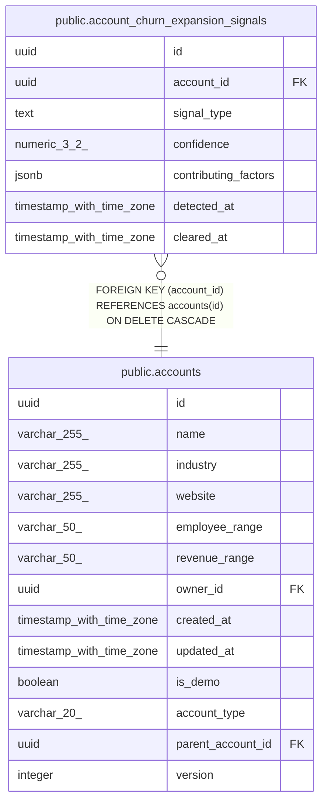

# public.account_churn_expansion_signals

## Description

Nightly AI churn/expansion signals per closed-won account (MINCRM-469). A new row is inserted per detection run; cleared_at is set (not deleted) when contradicted by new positive activity.

## Columns

| Name | Type | Default | Nullable | Children | Parents | Comment |
| ---- | ---- | ------- | -------- | -------- | ------- | ------- |
| id | uuid | gen_random_uuid() | false |  |  |  |
| account_id | uuid |  | false |  | [public.accounts](public.accounts.md) |  |
| signal_type | text |  | false |  |  |  |
| confidence | numeric(3,2) | 0 | false |  |  |  |
| contributing_factors | jsonb | '[]'::jsonb | false |  |  |  |
| detected_at | timestamp with time zone | now() | false |  |  |  |
| cleared_at | timestamp with time zone |  | true |  |  |  |

## Constraints

| Name | Type | Definition |
| ---- | ---- | ---------- |
| account_churn_expansion_signals_confidence_range | CHECK | CHECK (((confidence >= (0)::numeric) AND (confidence <= (1)::numeric))) |
| account_churn_expansion_signals_signal_type_check | CHECK | CHECK ((signal_type = ANY (ARRAY['churn_risk'::text, 'expansion'::text]))) |
| account_churn_expansion_signals_account_id_fkey | FOREIGN KEY | FOREIGN KEY (account_id) REFERENCES accounts(id) ON DELETE CASCADE |
| account_churn_expansion_signals_pkey | PRIMARY KEY | PRIMARY KEY (id) |

## Indexes

| Name | Definition | Comment |
| ---- | ---------- | ------- |
| account_churn_expansion_signals_pkey | CREATE UNIQUE INDEX account_churn_expansion_signals_pkey ON public.account_churn_expansion_signals USING btree (id) |  |
| account_churn_expansion_signals_account_id_idx | CREATE INDEX account_churn_expansion_signals_account_id_idx ON public.account_churn_expansion_signals USING btree (account_id) |  |
| account_churn_expansion_signals_active_idx | CREATE INDEX account_churn_expansion_signals_active_idx ON public.account_churn_expansion_signals USING btree (signal_type) WHERE (cleared_at IS NULL) |  |
| account_churn_expansion_signals_one_active_per_type | CREATE UNIQUE INDEX account_churn_expansion_signals_one_active_per_type ON public.account_churn_expansion_signals USING btree (account_id, signal_type) WHERE (cleared_at IS NULL) | At most one active (cleared_at IS NULL) signal per account per signal_type — guards against overlapping nightly-job runs racing to insert duplicates. (MINCRM-469) |

## Relations

---

> Generated by [tbls](https://github.com/k1LoW/tbls)
