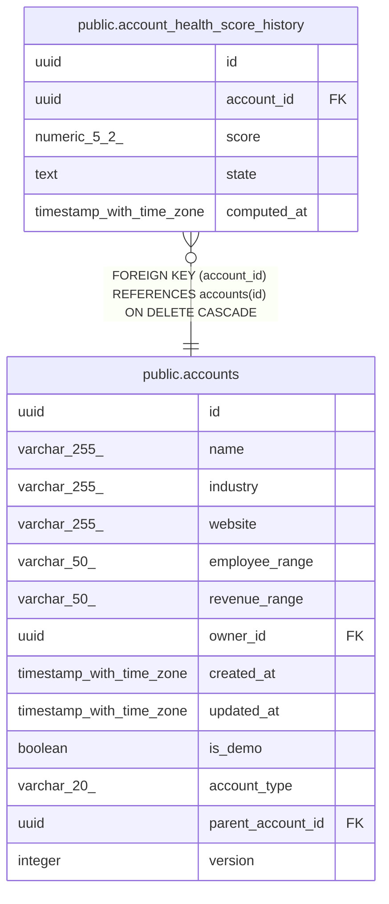

# public.account_health_score_history

## Description

Append-only per-run history of account health scores (MINCRM-467), feeding the 6-month trend sparkline on the Account detail view. One row inserted per account per nightly run.

## Columns

| Name | Type | Default | Nullable | Children | Parents | Comment |
| ---- | ---- | ------- | -------- | -------- | ------- | ------- |
| id | uuid | gen_random_uuid() | false |  |  |  |
| account_id | uuid |  | false |  | [public.accounts](public.accounts.md) |  |
| score | numeric(5,2) |  | false |  |  |  |
| state | text |  | false |  |  |  |
| computed_at | timestamp with time zone | now() | false |  |  |  |

## Constraints

| Name | Type | Definition |
| ---- | ---- | ---------- |
| account_health_score_history_score_range | CHECK | CHECK (((score >= (0)::numeric) AND (score <= (100)::numeric))) |
| account_health_score_history_state_check | CHECK | CHECK ((state = ANY (ARRAY['strong'::text, 'healthy'::text, 'cooling'::text, 'at_risk'::text, 'dormant'::text]))) |
| account_health_score_history_account_id_fkey | FOREIGN KEY | FOREIGN KEY (account_id) REFERENCES accounts(id) ON DELETE CASCADE |
| account_health_score_history_pkey | PRIMARY KEY | PRIMARY KEY (id) |

## Indexes

| Name | Definition |
| ---- | ---------- |
| account_health_score_history_pkey | CREATE UNIQUE INDEX account_health_score_history_pkey ON public.account_health_score_history USING btree (id) |
| account_health_score_history_account_id_computed_at_idx | CREATE INDEX account_health_score_history_account_id_computed_at_idx ON public.account_health_score_history USING btree (account_id, computed_at DESC) |

## Relations

---

> Generated by [tbls](https://github.com/k1LoW/tbls)
