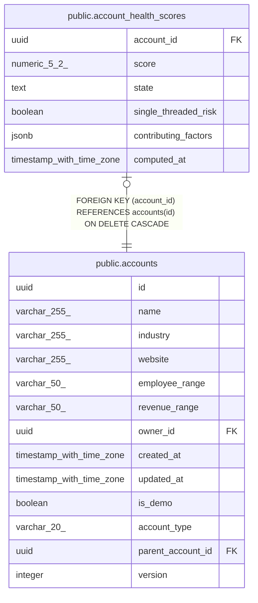

# public.account_health_scores

## Description

Current cached relationship health score per account (MINCRM-467). Upserted nightly; the read path never computes live. Absence of a row means insufficient data (fewer than min_logged_activities logged activities).

## Columns

| Name | Type | Default | Nullable | Children | Parents | Comment |
| ---- | ---- | ------- | -------- | -------- | ------- | ------- |
| account_id | uuid |  | false |  | [public.accounts](public.accounts.md) |  |
| score | numeric(5,2) |  | false |  |  |  |
| state | text |  | false |  |  |  |
| single_threaded_risk | boolean | false | false |  |  |  |
| contributing_factors | jsonb | '[]'::jsonb | false |  |  |  |
| computed_at | timestamp with time zone | now() | false |  |  |  |

## Constraints

| Name | Type | Definition |
| ---- | ---- | ---------- |
| account_health_scores_score_range | CHECK | CHECK (((score >= (0)::numeric) AND (score <= (100)::numeric))) |
| account_health_scores_state_check | CHECK | CHECK ((state = ANY (ARRAY['strong'::text, 'healthy'::text, 'cooling'::text, 'at_risk'::text, 'dormant'::text]))) |
| account_health_scores_account_id_fkey | FOREIGN KEY | FOREIGN KEY (account_id) REFERENCES accounts(id) ON DELETE CASCADE |
| account_health_scores_pkey | PRIMARY KEY | PRIMARY KEY (account_id) |

## Indexes

| Name | Definition |
| ---- | ---------- |
| account_health_scores_pkey | CREATE UNIQUE INDEX account_health_scores_pkey ON public.account_health_scores USING btree (account_id) |

## Relations

---

> Generated by [tbls](https://github.com/k1LoW/tbls)
