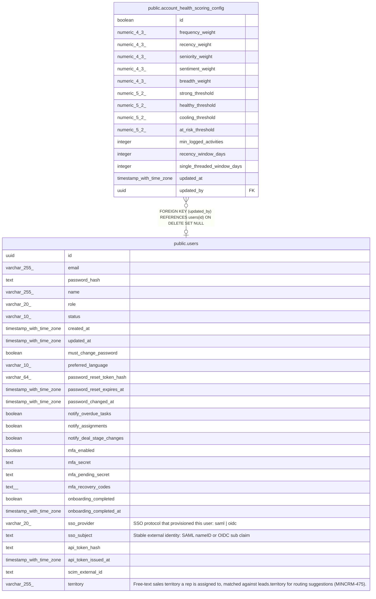

# public.account_health_scoring_config

## Description

Singleton admin-editable weights/thresholds for account health scoring (MINCRM-467). id is a boolean-typed singleton key (id = true) following the single-row-config convention.

## Columns

| Name | Type | Default | Nullable | Children | Parents | Comment |
| ---- | ---- | ------- | -------- | -------- | ------- | ------- |
| id | boolean | true | false |  |  |  |
| frequency_weight | numeric(4,3) | 0.250 | false |  |  |  |
| recency_weight | numeric(4,3) | 0.250 | false |  |  |  |
| seniority_weight | numeric(4,3) | 0.150 | false |  |  |  |
| sentiment_weight | numeric(4,3) | 0.200 | false |  |  |  |
| breadth_weight | numeric(4,3) | 0.150 | false |  |  |  |
| strong_threshold | numeric(5,2) | 80.00 | false |  |  |  |
| healthy_threshold | numeric(5,2) | 60.00 | false |  |  |  |
| cooling_threshold | numeric(5,2) | 40.00 | false |  |  |  |
| at_risk_threshold | numeric(5,2) | 20.00 | false |  |  |  |
| min_logged_activities | integer | 3 | false |  |  |  |
| recency_window_days | integer | 90 | false |  |  |  |
| single_threaded_window_days | integer | 90 | false |  |  |  |
| updated_at | timestamp with time zone | now() | false |  |  |  |
| updated_by | uuid |  | true |  | [public.users](public.users.md) |  |

## Constraints

| Name | Type | Definition |
| ---- | ---- | ---------- |
| account_health_scoring_config_min_activities_check | CHECK | CHECK ((min_logged_activities >= 1)) |
| account_health_scoring_config_singleton | CHECK | CHECK ((id = true)) |
| account_health_scoring_config_threshold_order_check | CHECK | CHECK (((strong_threshold > healthy_threshold) AND (healthy_threshold > cooling_threshold) AND (cooling_threshold > at_risk_threshold))) |
| account_health_scoring_config_weights_sum_check | CHECK | CHECK (((((((frequency_weight + recency_weight) + seniority_weight) + sentiment_weight) + breadth_weight) >= 0.999) AND (((((frequency_weight + recency_weight) + seniority_weight) + sentiment_weight) + breadth_weight) <= 1.001))) |
| account_health_scoring_config_windows_check | CHECK | CHECK (((recency_window_days >= 1) AND (single_threaded_window_days >= 1))) |
| account_health_scoring_config_updated_by_fkey | FOREIGN KEY | FOREIGN KEY (updated_by) REFERENCES users(id) ON DELETE SET NULL |
| account_health_scoring_config_pkey | PRIMARY KEY | PRIMARY KEY (id) |

## Indexes

| Name | Definition |
| ---- | ---------- |
| account_health_scoring_config_pkey | CREATE UNIQUE INDEX account_health_scoring_config_pkey ON public.account_health_scoring_config USING btree (id) |

## Relations

---

> Generated by [tbls](https://github.com/k1LoW/tbls)
