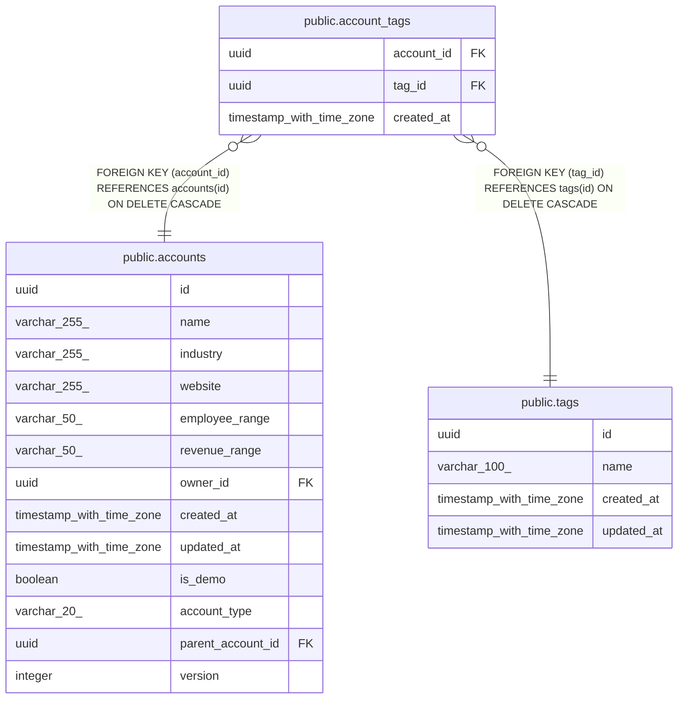

# public.account_tags

## Columns

| Name | Type | Default | Nullable | Children | Parents | Comment |
| ---- | ---- | ------- | -------- | -------- | ------- | ------- |
| account_id | uuid |  | false |  | [public.accounts](public.accounts.md) |  |
| tag_id | uuid |  | false |  | [public.tags](public.tags.md) |  |
| created_at | timestamp with time zone | now() | false |  |  |  |

## Constraints

| Name | Type | Definition |
| ---- | ---- | ---------- |
| account_tags_account_id_fkey | FOREIGN KEY | FOREIGN KEY (account_id) REFERENCES accounts(id) ON DELETE CASCADE |
| account_tags_tag_id_fkey | FOREIGN KEY | FOREIGN KEY (tag_id) REFERENCES tags(id) ON DELETE CASCADE |
| account_tags_pkey | PRIMARY KEY | PRIMARY KEY (account_id, tag_id) |

## Indexes

| Name | Definition |
| ---- | ---------- |
| account_tags_pkey | CREATE UNIQUE INDEX account_tags_pkey ON public.account_tags USING btree (account_id, tag_id) |
| account_tags_tag_id_index | CREATE INDEX account_tags_tag_id_index ON public.account_tags USING btree (tag_id) |

## Relations

---

> Generated by [tbls](https://github.com/k1LoW/tbls)
