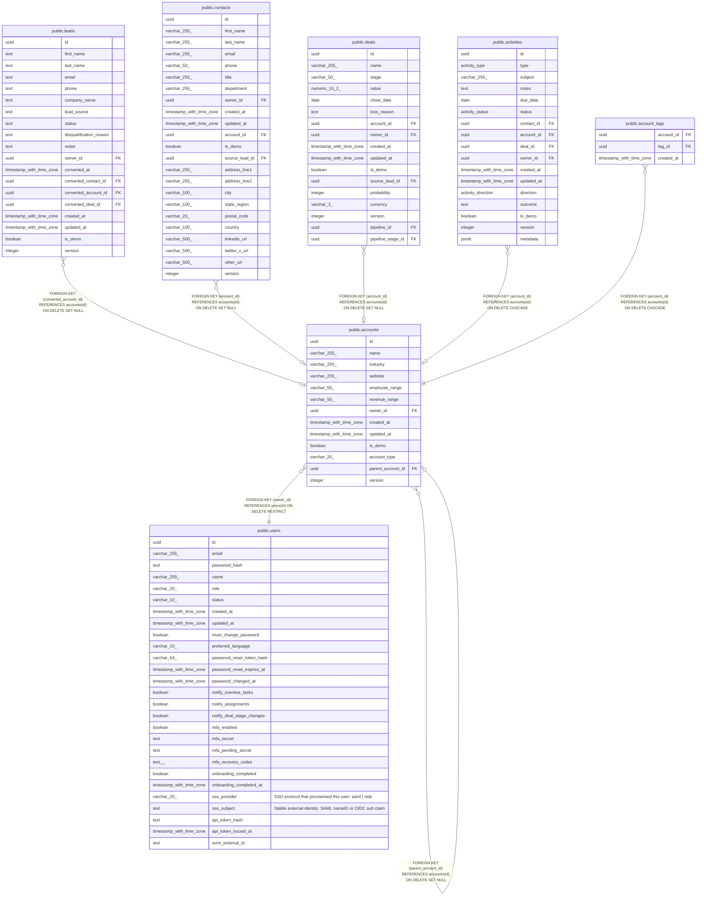

# public.accounts

## Columns

| Name | Type | Default | Nullable | Children | Parents | Comment |
| ---- | ---- | ------- | -------- | -------- | ------- | ------- |
| id | uuid | gen_random_uuid() | false | [public.leads](public.leads.md) [public.accounts](public.accounts.md) [public.contacts](public.contacts.md) [public.deals](public.deals.md) [public.activities](public.activities.md) [public.account_tags](public.account_tags.md) |  |  |
| name | varchar(255) |  | false |  |  |  |
| industry | varchar(255) |  | true |  |  |  |
| website | varchar(255) |  | true |  |  |  |
| employee_range | varchar(50) |  | true |  |  |  |
| revenue_range | varchar(50) |  | true |  |  |  |
| owner_id | uuid |  | false |  | [public.users](public.users.md) |  |
| created_at | timestamp with time zone | now() | false |  |  |  |
| updated_at | timestamp with time zone | now() | false |  |  |  |
| is_demo | boolean | false | false |  |  |  |
| account_type | varchar(20) |  | true |  |  |  |
| parent_account_id | uuid |  | true |  | [public.accounts](public.accounts.md) |  |
| version | integer | 1 | false |  |  |  |

## Constraints

| Name | Type | Definition |
| ---- | ---- | ---------- |
| accounts_account_type_check | CHECK | CHECK (((account_type IS NULL) OR ((account_type)::text = ANY (ARRAY[('Prospect'::character varying)::text, ('Customer'::character varying)::text, ('Partner'::character varying)::text, ('Vendor'::character varying)::text, ('Competitor'::character varying)::text, ('Other'::character varying)::text])))) |
| accounts_owner_id_fkey | FOREIGN KEY | FOREIGN KEY (owner_id) REFERENCES users(id) ON DELETE RESTRICT |
| accounts_parent_account_id_fkey | FOREIGN KEY | FOREIGN KEY (parent_account_id) REFERENCES accounts(id) ON DELETE SET NULL |
| accounts_pkey | PRIMARY KEY | PRIMARY KEY (id) |

## Indexes

| Name | Definition |
| ---- | ---------- |
| accounts_pkey | CREATE UNIQUE INDEX accounts_pkey ON public.accounts USING btree (id) |
| accounts_owner_id_index | CREATE INDEX accounts_owner_id_index ON public.accounts USING btree (owner_id) |
| accounts_is_demo_index | CREATE INDEX accounts_is_demo_index ON public.accounts USING btree (is_demo) |
| accounts_name_trgm_idx | CREATE INDEX accounts_name_trgm_idx ON public.accounts USING gin (name gin_trgm_ops) |

## Triggers

| Name | Definition |
| ---- | ---------- |
| accounts_set_updated_at | CREATE TRIGGER accounts_set_updated_at BEFORE UPDATE ON public.accounts FOR EACH ROW EXECUTE FUNCTION set_updated_at() |

## Relations

---

> Generated by [tbls](https://github.com/k1LoW/tbls)
