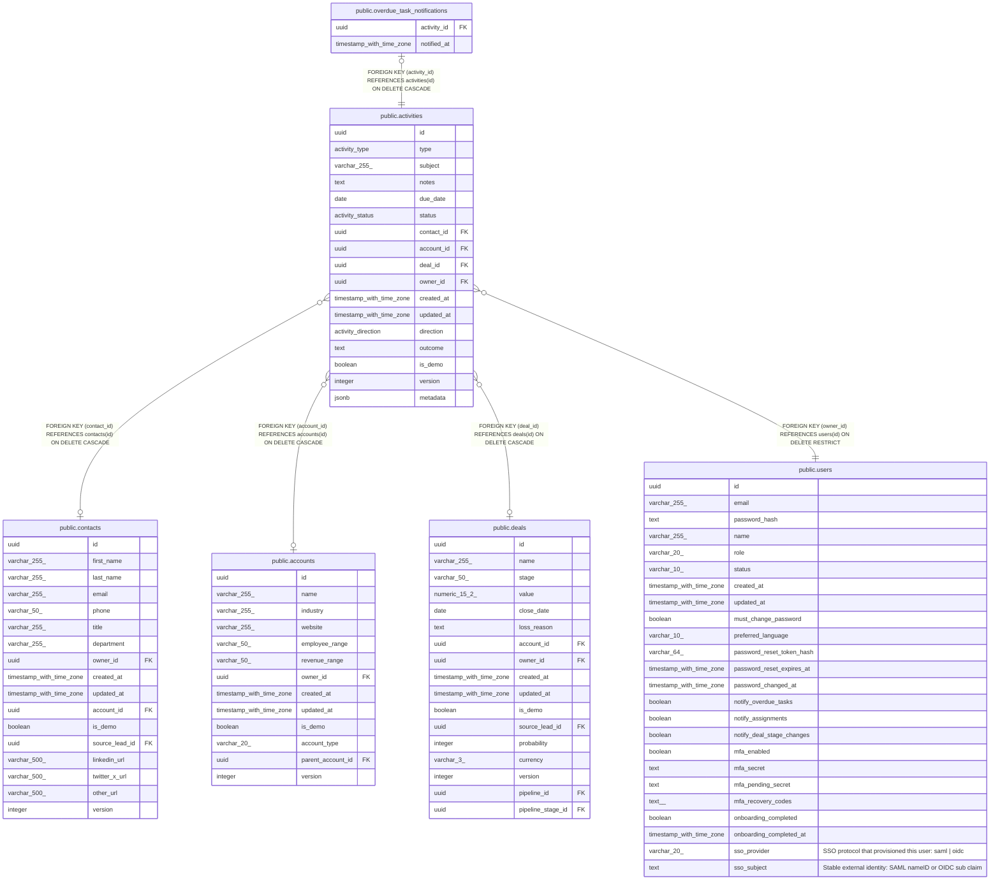

# public.activities

## Columns

| Name | Type | Default | Nullable | Children | Parents | Comment |
| ---- | ---- | ------- | -------- | -------- | ------- | ------- |
| id | uuid | gen_random_uuid() | false | [public.overdue_task_notifications](public.overdue_task_notifications.md) |  |  |
| type | activity_type |  | false |  |  |  |
| subject | varchar(255) |  | false |  |  |  |
| notes | text |  | true |  |  |  |
| due_date | date |  | true |  |  |  |
| status | activity_status | 'open'::activity_status | false |  |  |  |
| contact_id | uuid |  | true |  | [public.contacts](public.contacts.md) |  |
| account_id | uuid |  | true |  | [public.accounts](public.accounts.md) |  |
| deal_id | uuid |  | true |  | [public.deals](public.deals.md) |  |
| owner_id | uuid |  | false |  | [public.users](public.users.md) |  |
| created_at | timestamp with time zone | now() | false |  |  |  |
| updated_at | timestamp with time zone | now() | false |  |  |  |
| direction | activity_direction |  | true |  |  |  |
| outcome | text |  | true |  |  |  |
| is_demo | boolean | false | false |  |  |  |
| version | integer | 1 | false |  |  |  |
| metadata | jsonb |  | true |  |  |  |

## Constraints

| Name | Type | Definition |
| ---- | ---- | ---------- |
| activities_has_parent | CHECK | CHECK (((contact_id IS NOT NULL) OR (account_id IS NOT NULL) OR (deal_id IS NOT NULL))) |
| activities_owner_id_fkey | FOREIGN KEY | FOREIGN KEY (owner_id) REFERENCES users(id) ON DELETE RESTRICT |
| activities_contact_id_fkey | FOREIGN KEY | FOREIGN KEY (contact_id) REFERENCES contacts(id) ON DELETE CASCADE |
| activities_account_id_fkey | FOREIGN KEY | FOREIGN KEY (account_id) REFERENCES accounts(id) ON DELETE CASCADE |
| activities_deal_id_fkey | FOREIGN KEY | FOREIGN KEY (deal_id) REFERENCES deals(id) ON DELETE CASCADE |
| activities_pkey | PRIMARY KEY | PRIMARY KEY (id) |

## Indexes

| Name | Definition |
| ---- | ---------- |
| activities_pkey | CREATE UNIQUE INDEX activities_pkey ON public.activities USING btree (id) |
| activities_contact_id_index | CREATE INDEX activities_contact_id_index ON public.activities USING btree (contact_id) |
| activities_account_id_index | CREATE INDEX activities_account_id_index ON public.activities USING btree (account_id) |
| activities_deal_id_index | CREATE INDEX activities_deal_id_index ON public.activities USING btree (deal_id) |
| activities_owner_id_index | CREATE INDEX activities_owner_id_index ON public.activities USING btree (owner_id) |
| activities_is_demo_index | CREATE INDEX activities_is_demo_index ON public.activities USING btree (is_demo) |

## Triggers

| Name | Definition |
| ---- | ---------- |
| activities_set_updated_at | CREATE TRIGGER activities_set_updated_at BEFORE UPDATE ON public.activities FOR EACH ROW EXECUTE FUNCTION set_updated_at() |

## Relations

---

> Generated by [tbls](https://github.com/k1LoW/tbls)
