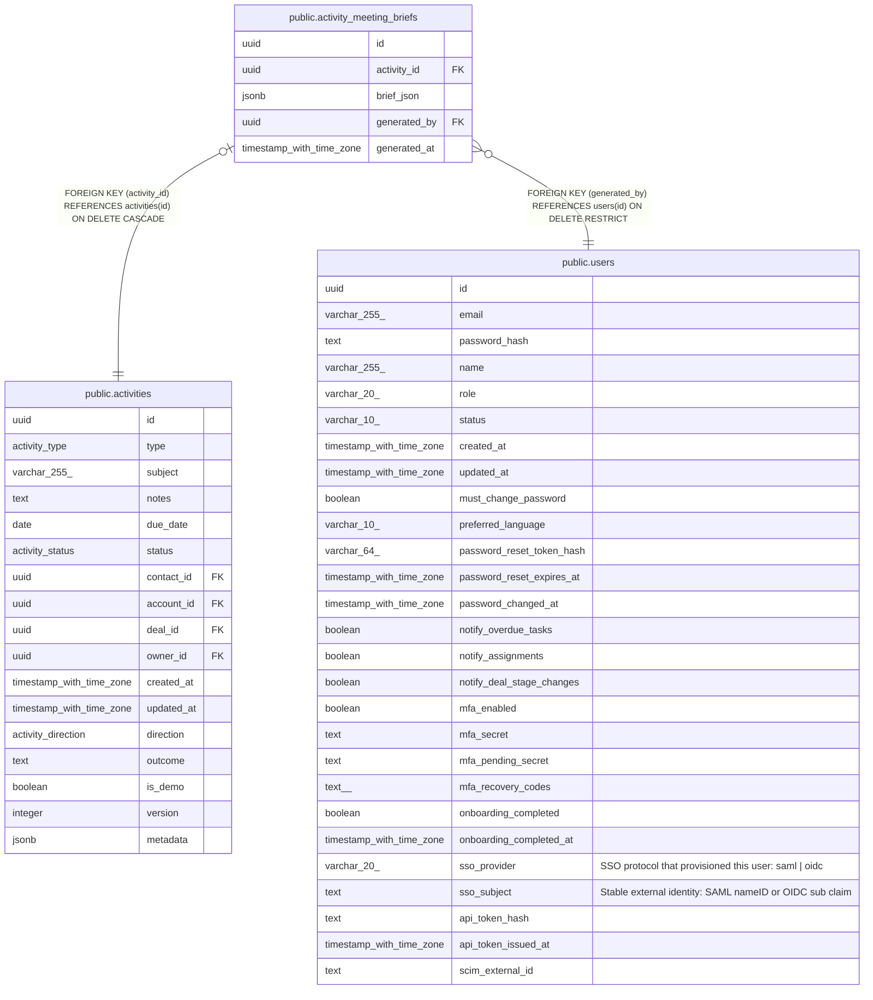

# public.activity_meeting_briefs

## Description

Most recently generated AI pre-meeting brief per activity (MINCRM-465). One row per activity — replaced on regenerate, not appended.

## Columns

| Name | Type | Default | Nullable | Children | Parents | Comment |
| ---- | ---- | ------- | -------- | -------- | ------- | ------- |
| id | uuid | gen_random_uuid() | false |  |  |  |
| activity_id | uuid |  | false |  | [public.activities](public.activities.md) |  |
| brief_json | jsonb |  | false |  |  |  |
| generated_by | uuid |  | false |  | [public.users](public.users.md) |  |
| generated_at | timestamp with time zone | now() | false |  |  |  |

## Constraints

| Name | Type | Definition |
| ---- | ---- | ---------- |
| activity_meeting_briefs_generated_by_fkey | FOREIGN KEY | FOREIGN KEY (generated_by) REFERENCES users(id) ON DELETE RESTRICT |
| activity_meeting_briefs_activity_id_fkey | FOREIGN KEY | FOREIGN KEY (activity_id) REFERENCES activities(id) ON DELETE CASCADE |
| activity_meeting_briefs_pkey | PRIMARY KEY | PRIMARY KEY (id) |
| activity_meeting_briefs_activity_id_unique | UNIQUE | UNIQUE (activity_id) |

## Indexes

| Name | Definition |
| ---- | ---------- |
| activity_meeting_briefs_pkey | CREATE UNIQUE INDEX activity_meeting_briefs_pkey ON public.activity_meeting_briefs USING btree (id) |
| activity_meeting_briefs_activity_id_unique | CREATE UNIQUE INDEX activity_meeting_briefs_activity_id_unique ON public.activity_meeting_briefs USING btree (activity_id) |

## Relations

---

> Generated by [tbls](https://github.com/k1LoW/tbls)
