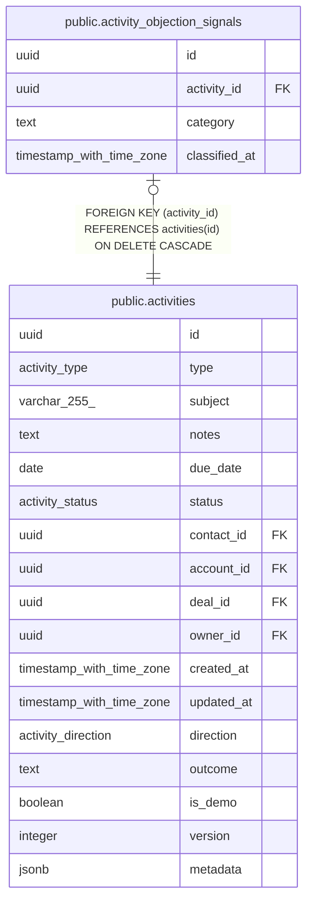

# public.activity_objection_signals

## Description

AI objection classification per activity (MINCRM-471). One row per classified activity — classification runs on-demand, not pre-computed, so this table is populated lazily as reps view objection-logged activities.

## Columns

| Name | Type | Default | Nullable | Children | Parents | Comment |
| ---- | ---- | ------- | -------- | -------- | ------- | ------- |
| id | uuid | gen_random_uuid() | false |  |  |  |
| activity_id | uuid |  | false |  | [public.activities](public.activities.md) |  |
| category | text |  | false |  |  |  |
| classified_at | timestamp with time zone | now() | false |  |  |  |

## Constraints

| Name | Type | Definition |
| ---- | ---- | ---------- |
| activity_objection_signals_category_check | CHECK | CHECK ((category = ANY (ARRAY['Price'::text, 'Timing'::text, 'Competitor'::text, 'Product Fit'::text, 'Authority'::text, 'Risk'::text, 'Other'::text]))) |
| activity_objection_signals_activity_id_fkey | FOREIGN KEY | FOREIGN KEY (activity_id) REFERENCES activities(id) ON DELETE CASCADE |
| activity_objection_signals_pkey | PRIMARY KEY | PRIMARY KEY (id) |
| activity_objection_signals_activity_id_unique | UNIQUE | UNIQUE (activity_id) |

## Indexes

| Name | Definition |
| ---- | ---------- |
| activity_objection_signals_pkey | CREATE UNIQUE INDEX activity_objection_signals_pkey ON public.activity_objection_signals USING btree (id) |
| activity_objection_signals_activity_id_unique | CREATE UNIQUE INDEX activity_objection_signals_activity_id_unique ON public.activity_objection_signals USING btree (activity_id) |
| activity_objection_signals_category_idx | CREATE INDEX activity_objection_signals_category_idx ON public.activity_objection_signals USING btree (category) |

## Relations

---

> Generated by [tbls](https://github.com/k1LoW/tbls)
