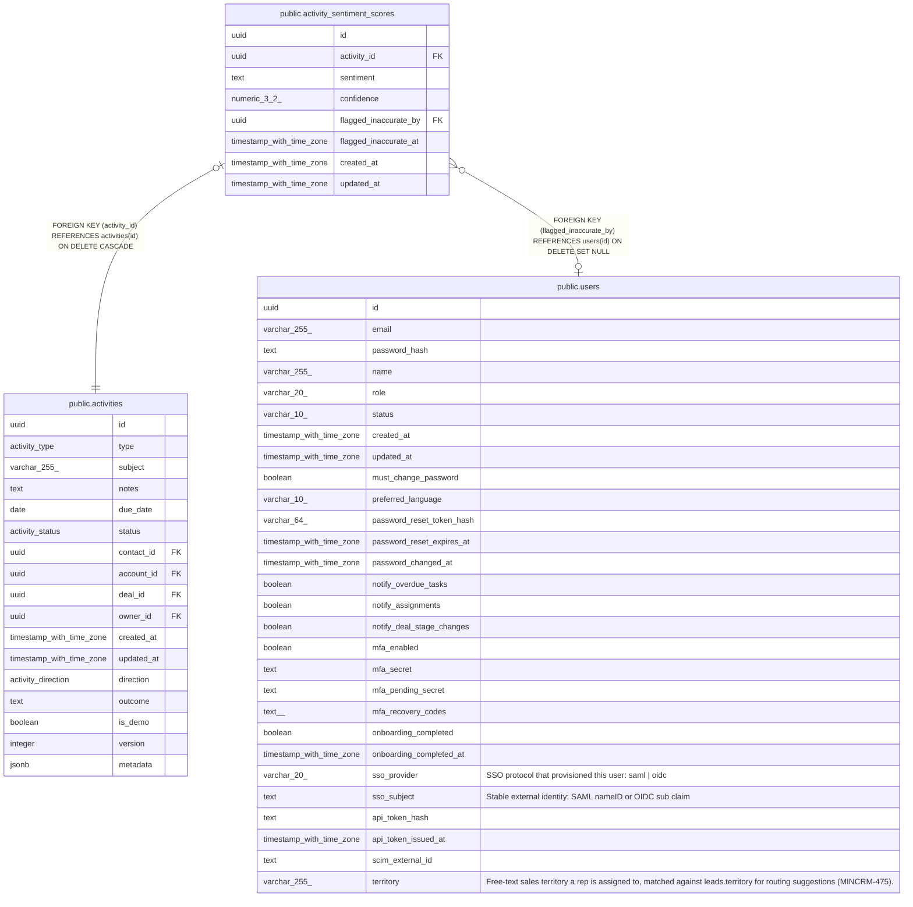

# public.activity_sentiment_scores

## Description

Per-activity AI sentiment classification (MINCRM-472). One row per activity, scored asynchronously after save.

## Columns

| Name | Type | Default | Nullable | Children | Parents | Comment |
| ---- | ---- | ------- | -------- | -------- | ------- | ------- |
| id | uuid | gen_random_uuid() | false |  |  |  |
| activity_id | uuid |  | false |  | [public.activities](public.activities.md) |  |
| sentiment | text |  | false |  |  |  |
| confidence | numeric(3,2) | 0 | false |  |  |  |
| flagged_inaccurate_by | uuid |  | true |  | [public.users](public.users.md) |  |
| flagged_inaccurate_at | timestamp with time zone |  | true |  |  |  |
| created_at | timestamp with time zone | now() | false |  |  |  |
| updated_at | timestamp with time zone | now() | false |  |  |  |

## Constraints

| Name | Type | Definition |
| ---- | ---- | ---------- |
| activity_sentiment_scores_sentiment_check | CHECK | CHECK ((sentiment = ANY (ARRAY['positive'::text, 'neutral'::text, 'negative'::text]))) |
| activity_sentiment_scores_flagged_inaccurate_by_fkey | FOREIGN KEY | FOREIGN KEY (flagged_inaccurate_by) REFERENCES users(id) ON DELETE SET NULL |
| activity_sentiment_scores_activity_id_fkey | FOREIGN KEY | FOREIGN KEY (activity_id) REFERENCES activities(id) ON DELETE CASCADE |
| activity_sentiment_scores_pkey | PRIMARY KEY | PRIMARY KEY (id) |
| activity_sentiment_scores_activity_id_unique | UNIQUE | UNIQUE (activity_id) |

## Indexes

| Name | Definition |
| ---- | ---------- |
| activity_sentiment_scores_pkey | CREATE UNIQUE INDEX activity_sentiment_scores_pkey ON public.activity_sentiment_scores USING btree (id) |
| activity_sentiment_scores_activity_id_unique | CREATE UNIQUE INDEX activity_sentiment_scores_activity_id_unique ON public.activity_sentiment_scores USING btree (activity_id) |
| activity_sentiment_scores_activity_id_idx | CREATE INDEX activity_sentiment_scores_activity_id_idx ON public.activity_sentiment_scores USING btree (activity_id) |

## Relations

---

> Generated by [tbls](https://github.com/k1LoW/tbls)
