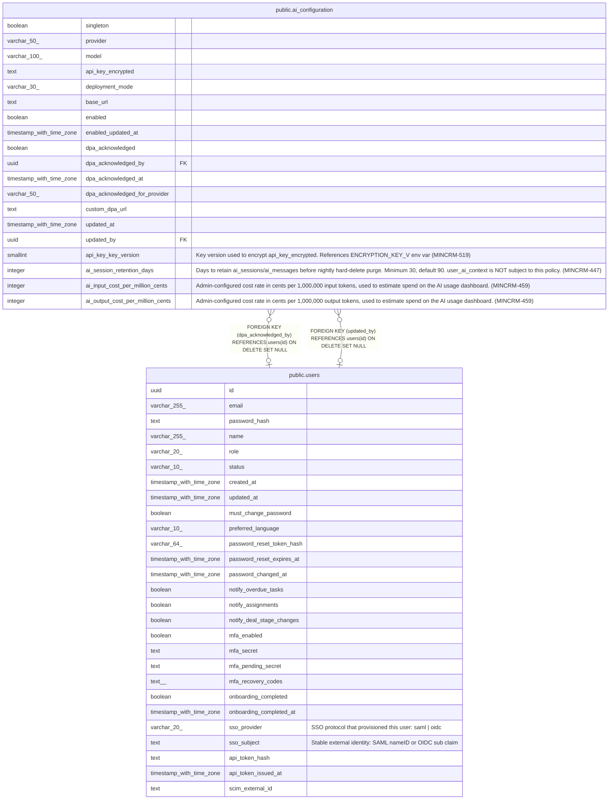

# public.ai_configuration

## Columns

| Name | Type | Default | Nullable | Children | Parents | Comment |
| ---- | ---- | ------- | -------- | -------- | ------- | ------- |
| singleton | boolean | true | false |  |  |  |
| provider | varchar(50) | 'anthropic'::character varying | false |  |  |  |
| model | varchar(100) | 'claude-sonnet-4-20250514'::character varying | false |  |  |  |
| api_key_encrypted | text | ''::text | false |  |  |  |
| deployment_mode | varchar(30) | 'cloud_api'::character varying | false |  |  |  |
| base_url | text | ''::text | false |  |  |  |
| enabled | boolean | false | false |  |  |  |
| enabled_updated_at | timestamp with time zone |  | true |  |  |  |
| dpa_acknowledged | boolean | false | false |  |  |  |
| dpa_acknowledged_by | uuid |  | true |  | [public.users](public.users.md) |  |
| dpa_acknowledged_at | timestamp with time zone |  | true |  |  |  |
| dpa_acknowledged_for_provider | varchar(50) | ''::character varying | false |  |  |  |
| custom_dpa_url | text | ''::text | false |  |  |  |
| updated_at | timestamp with time zone | now() | false |  |  |  |
| updated_by | uuid |  | true |  | [public.users](public.users.md) |  |
| api_key_key_version | smallint | 1 | false |  |  | Key version used to encrypt api_key_encrypted. References ENCRYPTION_KEY_V\<n\> env var (MINCRM-519) |
| ai_session_retention_days | integer | 90 | false |  |  | Days to retain ai_sessions/ai_messages before nightly hard-delete purge. Minimum 30, default 90. user_ai_context is NOT subject to this policy. (MINCRM-447) |
| ai_input_cost_per_million_cents | integer | 300 | false |  |  | Admin-configured cost rate in cents per 1,000,000 input tokens, used to estimate spend on the AI usage dashboard. (MINCRM-459) |
| ai_output_cost_per_million_cents | integer | 1500 | false |  |  | Admin-configured cost rate in cents per 1,000,000 output tokens, used to estimate spend on the AI usage dashboard. (MINCRM-459) |

## Constraints

| Name | Type | Definition |
| ---- | ---- | ---------- |
| ai_configuration_input_cost_nonnegative | CHECK | CHECK ((ai_input_cost_per_million_cents >= 0)) |
| ai_configuration_output_cost_nonnegative | CHECK | CHECK ((ai_output_cost_per_million_cents >= 0)) |
| ai_configuration_session_retention_min | CHECK | CHECK ((ai_session_retention_days >= 30)) |
| ai_configuration_singleton | CHECK | CHECK (singleton) |
| ai_configuration_dpa_acknowledged_by_fkey | FOREIGN KEY | FOREIGN KEY (dpa_acknowledged_by) REFERENCES users(id) ON DELETE SET NULL |
| ai_configuration_updated_by_fkey | FOREIGN KEY | FOREIGN KEY (updated_by) REFERENCES users(id) ON DELETE SET NULL |
| ai_configuration_singleton_unique | UNIQUE | UNIQUE (singleton) |

## Indexes

| Name | Definition |
| ---- | ---------- |
| ai_configuration_singleton_unique | CREATE UNIQUE INDEX ai_configuration_singleton_unique ON public.ai_configuration USING btree (singleton) |

## Relations

---

> Generated by [tbls](https://github.com/k1LoW/tbls)
