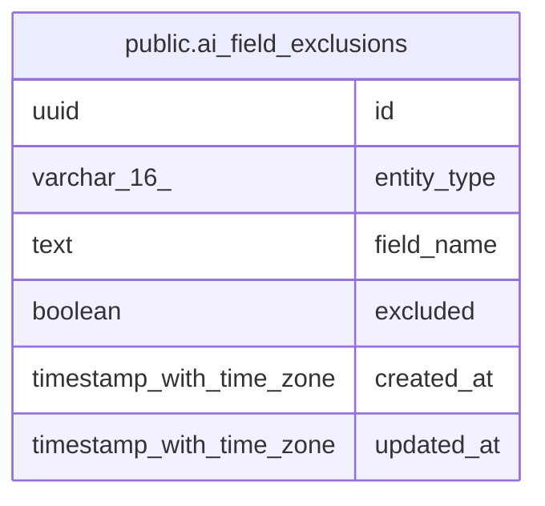

# public.ai_field_exclusions

## Description

Admin-configurable AI payload exclusion toggles for standard entity fields. Immutable defaults live in code (ALWAYS_EXCLUDED_FIELDS), not here. (MINCRM-461)

## Columns

| Name | Type | Default | Nullable | Children | Parents | Comment |
| ---- | ---- | ------- | -------- | -------- | ------- | ------- |
| id | uuid | gen_random_uuid() | false |  |  |  |
| entity_type | varchar(16) |  | false |  |  |  |
| field_name | text |  | false |  |  |  |
| excluded | boolean | false | false |  |  |  |
| created_at | timestamp with time zone | now() | false |  |  |  |
| updated_at | timestamp with time zone | now() | false |  |  |  |

## Constraints

| Name | Type | Definition |
| ---- | ---- | ---------- |
| ai_field_exclusions_entity_type_check | CHECK | CHECK (((entity_type)::text = ANY (ARRAY[('contact'::character varying)::text, ('account'::character varying)::text, ('deal'::character varying)::text]))) |
| ai_field_exclusions_pkey | PRIMARY KEY | PRIMARY KEY (id) |

## Indexes

| Name | Definition |
| ---- | ---------- |
| ai_field_exclusions_pkey | CREATE UNIQUE INDEX ai_field_exclusions_pkey ON public.ai_field_exclusions USING btree (id) |
| ai_field_exclusions_entity_field_idx | CREATE UNIQUE INDEX ai_field_exclusions_entity_field_idx ON public.ai_field_exclusions USING btree (entity_type, field_name) |

## Relations

---

> Generated by [tbls](https://github.com/k1LoW/tbls)
