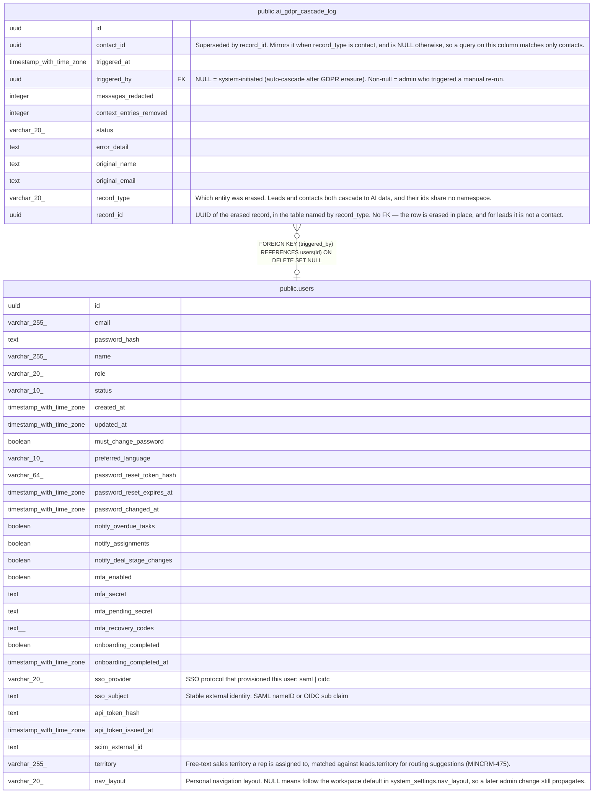

# public.ai_gdpr_cascade_log

## Description

Audit log for GDPR AI data cascade runs — redaction of PII in ai_messages and removal of matching user_ai_context entries following contact erasure. (MINCRM-446)

## Columns

| Name | Type | Default | Nullable | Children | Parents | Comment |
| ---- | ---- | ------- | -------- | -------- | ------- | ------- |
| id | uuid | gen_random_uuid() | false |  |  |  |
| contact_id | uuid |  | true |  |  | Superseded by record_id. Mirrors it when record_type is contact, and is NULL otherwise, so a query on this column matches only contacts. |
| triggered_at | timestamp with time zone | now() | false |  |  |  |
| triggered_by | uuid |  | true |  | [public.users](public.users.md) | NULL = system-initiated (auto-cascade after GDPR erasure). Non-null = admin who triggered a manual re-run. |
| messages_redacted | integer | 0 | false |  |  |  |
| context_entries_removed | integer | 0 | false |  |  |  |
| status | varchar(20) | 'completed'::character varying | false |  |  |  |
| error_detail | text |  | true |  |  |  |
| original_name | text |  | true |  |  |  |
| original_email | text |  | true |  |  |  |
| record_type | varchar(20) | 'contact'::character varying | false |  |  | Which entity was erased. Leads and contacts both cascade to AI data, and their ids share no namespace. |
| record_id | uuid |  | false |  |  | UUID of the erased record, in the table named by record_type. No FK — the row is erased in place, and for leads it is not a contact. |

## Constraints

| Name | Type | Definition |
| ---- | ---- | ---------- |
| ai_gdpr_cascade_log_record_type_check | CHECK | CHECK (((record_type)::text = ANY ((ARRAY['contact'::character varying, 'lead'::character varying])::text[]))) |
| ai_gdpr_cascade_log_status_check | CHECK | CHECK (((status)::text = ANY ((ARRAY['completed'::character varying, 'failed'::character varying])::text[]))) |
| ai_gdpr_cascade_log_triggered_by_fkey | FOREIGN KEY | FOREIGN KEY (triggered_by) REFERENCES users(id) ON DELETE SET NULL |
| ai_gdpr_cascade_log_pkey | PRIMARY KEY | PRIMARY KEY (id) |

## Indexes

| Name | Definition |
| ---- | ---------- |
| ai_gdpr_cascade_log_pkey | CREATE UNIQUE INDEX ai_gdpr_cascade_log_pkey ON public.ai_gdpr_cascade_log USING btree (id) |
| ai_gdpr_cascade_log_contact_id_idx | CREATE INDEX ai_gdpr_cascade_log_contact_id_idx ON public.ai_gdpr_cascade_log USING btree (contact_id) |
| ai_gdpr_cascade_log_triggered_at_idx | CREATE INDEX ai_gdpr_cascade_log_triggered_at_idx ON public.ai_gdpr_cascade_log USING btree (triggered_at) |
| ai_gdpr_cascade_log_record_idx | CREATE INDEX ai_gdpr_cascade_log_record_idx ON public.ai_gdpr_cascade_log USING btree (record_type, record_id) |

## Relations

---

> Generated by [tbls](https://github.com/k1LoW/tbls)
