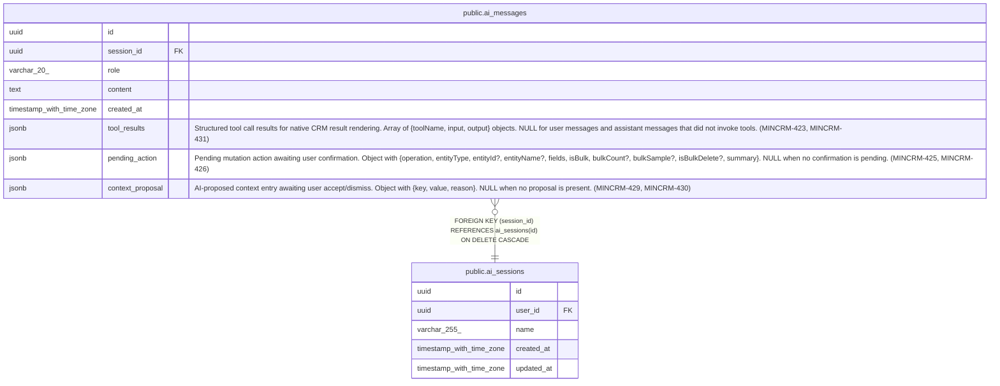

# public.ai_messages

## Columns

| Name | Type | Default | Nullable | Children | Parents | Comment |
| ---- | ---- | ------- | -------- | -------- | ------- | ------- |
| id | uuid | gen_random_uuid() | false |  |  |  |
| session_id | uuid |  | false |  | [public.ai_sessions](public.ai_sessions.md) |  |
| role | varchar(20) |  | false |  |  |  |
| content | text |  | false |  |  |  |
| created_at | timestamp with time zone | now() | false |  |  |  |
| tool_results | jsonb |  | true |  |  | Structured tool call results for native CRM result rendering. Array of {toolName, input, output} objects. NULL for user messages and assistant messages that did not invoke tools. (MINCRM-423, MINCRM-431) |
| pending_action | jsonb |  | true |  |  | Pending mutation action awaiting user confirmation. Object with {operation, entityType, entityId?, entityName?, fields, isBulk, bulkCount?, bulkSample?, isBulkDelete?, summary}. NULL when no confirmation is pending. (MINCRM-425, MINCRM-426) |
| context_proposal | jsonb |  | true |  |  | AI-proposed context entry awaiting user accept/dismiss. Object with {key, value, reason}. NULL when no proposal is present. (MINCRM-429, MINCRM-430) |

## Constraints

| Name | Type | Definition |
| ---- | ---- | ---------- |
| ai_messages_role_check | CHECK | CHECK (((role)::text = ANY ((ARRAY['user'::character varying, 'assistant'::character varying])::text[]))) |
| ai_messages_session_id_fkey | FOREIGN KEY | FOREIGN KEY (session_id) REFERENCES ai_sessions(id) ON DELETE CASCADE |
| ai_messages_pkey | PRIMARY KEY | PRIMARY KEY (id) |

## Indexes

| Name | Definition |
| ---- | ---------- |
| ai_messages_pkey | CREATE UNIQUE INDEX ai_messages_pkey ON public.ai_messages USING btree (id) |
| ai_messages_session_id_index | CREATE INDEX ai_messages_session_id_index ON public.ai_messages USING btree (session_id) |
| ai_messages_session_id_created_at_index | CREATE INDEX ai_messages_session_id_created_at_index ON public.ai_messages USING btree (session_id, created_at) |

## Relations

---

> Generated by [tbls](https://github.com/k1LoW/tbls)
