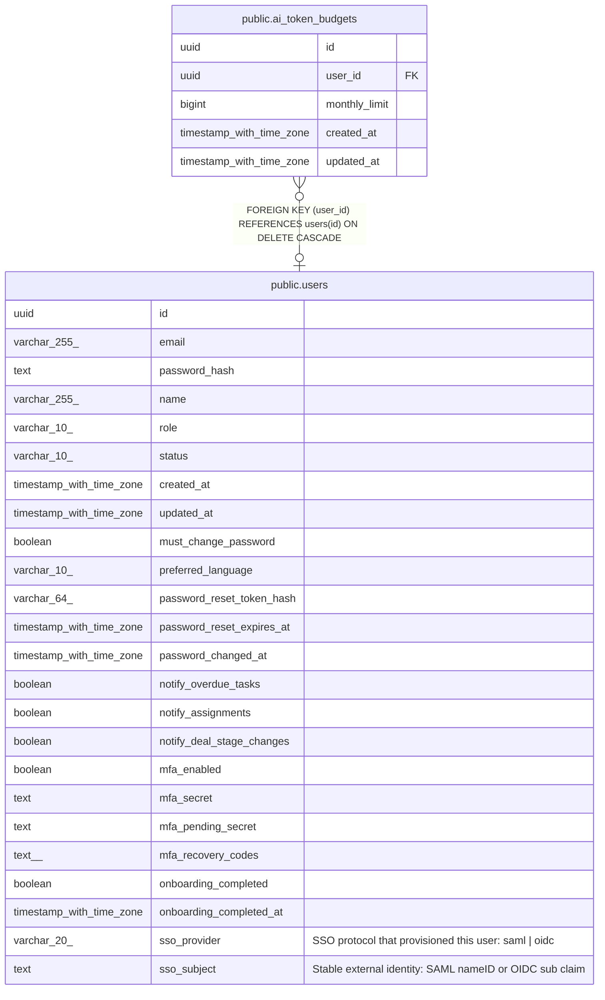

# public.ai_token_budgets

## Columns

| Name | Type | Default | Nullable | Children | Parents | Comment |
| ---- | ---- | ------- | -------- | -------- | ------- | ------- |
| id | uuid | gen_random_uuid() | false |  |  |  |
| user_id | uuid |  | true |  | [public.users](public.users.md) |  |
| monthly_limit | bigint |  | false |  |  |  |
| created_at | timestamp with time zone | now() | false |  |  |  |
| updated_at | timestamp with time zone | now() | false |  |  |  |

## Constraints

| Name | Type | Definition |
| ---- | ---- | ---------- |
| ai_token_budgets_user_id_fkey | FOREIGN KEY | FOREIGN KEY (user_id) REFERENCES users(id) ON DELETE CASCADE |
| ai_token_budgets_pkey | PRIMARY KEY | PRIMARY KEY (id) |

## Indexes

| Name | Definition |
| ---- | ---------- |
| ai_token_budgets_pkey | CREATE UNIQUE INDEX ai_token_budgets_pkey ON public.ai_token_budgets USING btree (id) |
| ai_token_budgets_user_id_idx | CREATE UNIQUE INDEX ai_token_budgets_user_id_idx ON public.ai_token_budgets USING btree (user_id) WHERE (user_id IS NOT NULL) |
| ai_token_budgets_org_default_idx | CREATE UNIQUE INDEX ai_token_budgets_org_default_idx ON public.ai_token_budgets USING btree (((user_id IS NULL))) WHERE (user_id IS NULL) |

## Triggers

| Name | Definition |
| ---- | ---------- |
| ai_token_budgets_set_updated_at | CREATE TRIGGER ai_token_budgets_set_updated_at BEFORE UPDATE ON public.ai_token_budgets FOR EACH ROW EXECUTE FUNCTION set_updated_at() |

## Relations

---

> Generated by [tbls](https://github.com/k1LoW/tbls)
