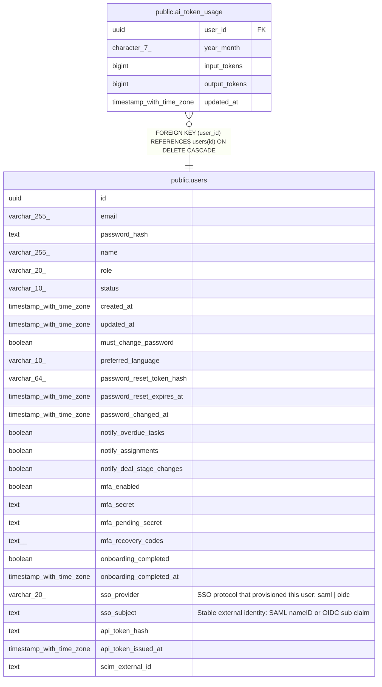

# public.ai_token_usage

## Columns

| Name | Type | Default | Nullable | Children | Parents | Comment |
| ---- | ---- | ------- | -------- | -------- | ------- | ------- |
| user_id | uuid |  | false |  | [public.users](public.users.md) |  |
| year_month | character(7) |  | false |  |  |  |
| input_tokens | bigint | 0 | false |  |  |  |
| output_tokens | bigint | 0 | false |  |  |  |
| updated_at | timestamp with time zone | now() | false |  |  |  |

## Constraints

| Name | Type | Definition |
| ---- | ---- | ---------- |
| ai_token_usage_user_id_fkey | FOREIGN KEY | FOREIGN KEY (user_id) REFERENCES users(id) ON DELETE CASCADE |
| ai_token_usage_pkey | PRIMARY KEY | PRIMARY KEY (user_id, year_month) |

## Indexes

| Name | Definition |
| ---- | ---------- |
| ai_token_usage_pkey | CREATE UNIQUE INDEX ai_token_usage_pkey ON public.ai_token_usage USING btree (user_id, year_month) |
| ai_token_usage_year_month_index | CREATE INDEX ai_token_usage_year_month_index ON public.ai_token_usage USING btree (year_month) |

## Triggers

| Name | Definition |
| ---- | ---------- |
| ai_token_usage_set_updated_at | CREATE TRIGGER ai_token_usage_set_updated_at BEFORE UPDATE ON public.ai_token_usage FOR EACH ROW EXECUTE FUNCTION set_updated_at() |

## Relations

---

> Generated by [tbls](https://github.com/k1LoW/tbls)
