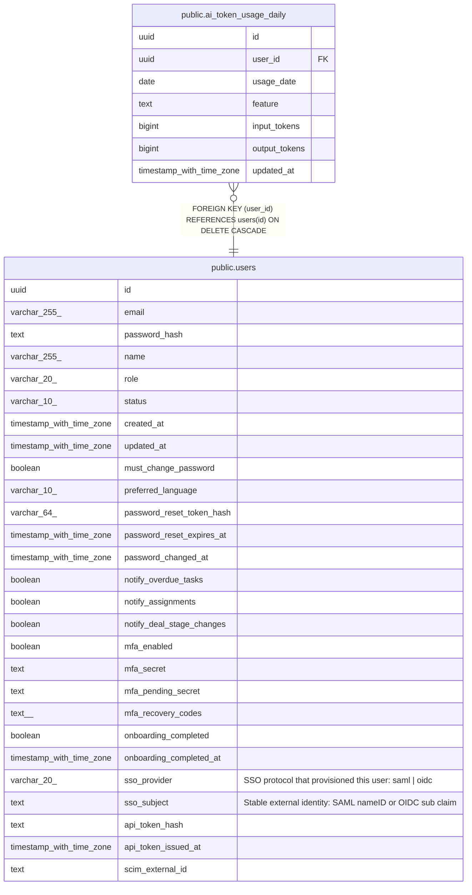

# public.ai_token_usage_daily

## Description

Per-day, per-feature token usage for the AI usage/cost dashboard. Additive to ai_token_usage, which remains the source of truth for monthly budget enforcement. (MINCRM-459)

## Columns

| Name | Type | Default | Nullable | Children | Parents | Comment |
| ---- | ---- | ------- | -------- | -------- | ------- | ------- |
| id | uuid | gen_random_uuid() | false |  |  |  |
| user_id | uuid |  | false |  | [public.users](public.users.md) |  |
| usage_date | date |  | false |  |  |  |
| feature | text | 'nli_chat'::text | false |  |  |  |
| input_tokens | bigint | 0 | false |  |  |  |
| output_tokens | bigint | 0 | false |  |  |  |
| updated_at | timestamp with time zone | now() | false |  |  |  |

## Constraints

| Name | Type | Definition |
| ---- | ---- | ---------- |
| ai_token_usage_daily_user_id_fkey | FOREIGN KEY | FOREIGN KEY (user_id) REFERENCES users(id) ON DELETE CASCADE |
| ai_token_usage_daily_pkey | PRIMARY KEY | PRIMARY KEY (id) |

## Indexes

| Name | Definition |
| ---- | ---------- |
| ai_token_usage_daily_pkey | CREATE UNIQUE INDEX ai_token_usage_daily_pkey ON public.ai_token_usage_daily USING btree (id) |
| ai_token_usage_daily_user_date_feature_idx | CREATE UNIQUE INDEX ai_token_usage_daily_user_date_feature_idx ON public.ai_token_usage_daily USING btree (user_id, usage_date, feature) |
| ai_token_usage_daily_usage_date_idx | CREATE INDEX ai_token_usage_daily_usage_date_idx ON public.ai_token_usage_daily USING btree (usage_date) |
| ai_token_usage_daily_feature_idx | CREATE INDEX ai_token_usage_daily_feature_idx ON public.ai_token_usage_daily USING btree (feature) |

## Relations

---

> Generated by [tbls](https://github.com/k1LoW/tbls)
