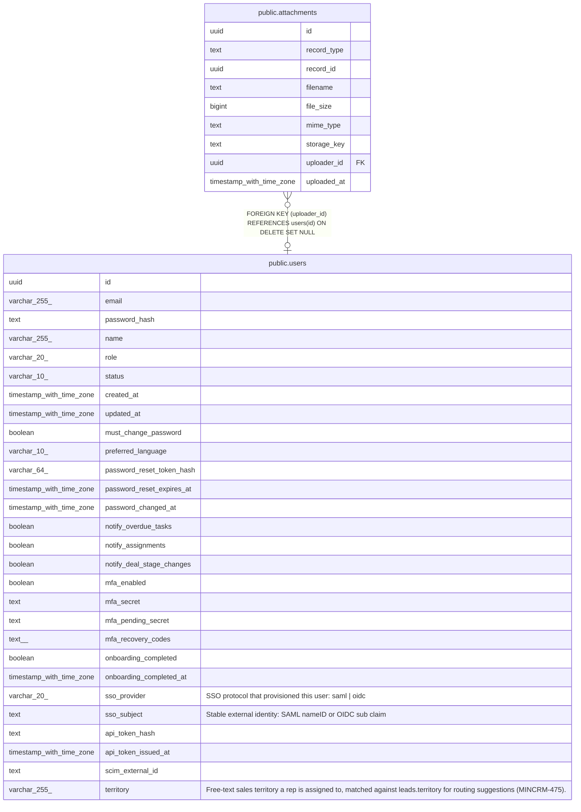

# public.attachments

## Description

File attachment metadata for CRM entity records. record_type + record_id form a polymorphic reference — no FK constraint exists because PostgreSQL FKs cannot span multiple parent tables. Valid record_type values: 'contact', 'account', 'deal', 'lead' (extended in migration 047). Orphan cleanup is the application's responsibility: rows whose record_id no longer exists in the referenced entity table should be deleted when the parent is removed. The physical file (storage_key) must be deleted from object storage before or alongside the row. See CLAUDE.md — Polymorphic FK Pattern. (MINCRM-510)

## Columns

| Name | Type | Default | Nullable | Children | Parents | Comment |
| ---- | ---- | ------- | -------- | -------- | ------- | ------- |
| id | uuid | gen_random_uuid() | false |  |  |  |
| record_type | text |  | false |  |  |  |
| record_id | uuid |  | false |  |  |  |
| filename | text |  | false |  |  |  |
| file_size | bigint |  | false |  |  |  |
| mime_type | text |  | false |  |  |  |
| storage_key | text |  | false |  |  |  |
| uploader_id | uuid |  | true |  | [public.users](public.users.md) |  |
| uploaded_at | timestamp with time zone | now() | false |  |  |  |

## Constraints

| Name | Type | Definition |
| ---- | ---- | ---------- |
| attachments_record_type_check | CHECK | CHECK ((record_type = ANY (ARRAY['contact'::text, 'account'::text, 'deal'::text, 'lead'::text]))) |
| attachments_uploader_id_fkey | FOREIGN KEY | FOREIGN KEY (uploader_id) REFERENCES users(id) ON DELETE SET NULL |
| attachments_pkey | PRIMARY KEY | PRIMARY KEY (id) |
| attachments_storage_key_key | UNIQUE | UNIQUE (storage_key) |

## Indexes

| Name | Definition |
| ---- | ---------- |
| attachments_pkey | CREATE UNIQUE INDEX attachments_pkey ON public.attachments USING btree (id) |
| attachments_storage_key_key | CREATE UNIQUE INDEX attachments_storage_key_key ON public.attachments USING btree (storage_key) |
| attachments_record_type_record_id_index | CREATE INDEX attachments_record_type_record_id_index ON public.attachments USING btree (record_type, record_id) |

## Relations

---

> Generated by [tbls](https://github.com/k1LoW/tbls)
