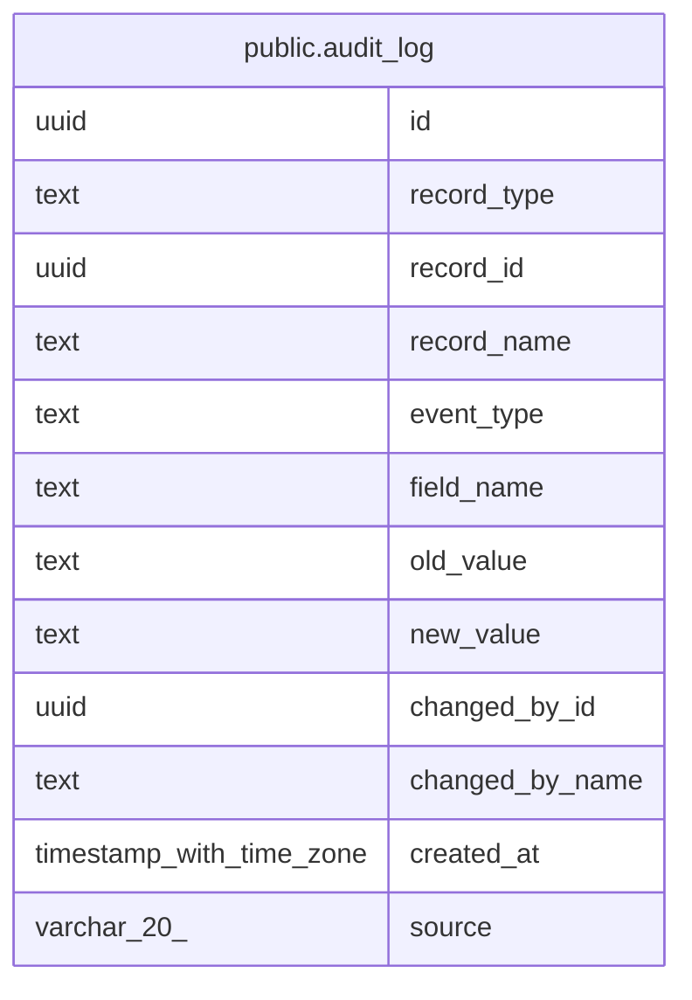

# public.audit_log

## Description

Append-only audit trail, partitioned monthly by created_at (MINCRM-521). Valid record_type values: contact, account, deal, lead, activity, user, system_settings, custom_report, sequence, sequence_enrollment, feature_flag, ai_settings. Valid event_type values: created, updated, deleted, login, logout, password_changed, role_changed, deactivated, reactivated, ownership_reassigned, merged, note_created, note_updated, note_deleted, note_visibility_changed, gdpr_erasure, mfa_enabled, mfa_disabled, sso_login, sso_provisioned, sso_linked, sso_unlinked. Enforced at service layer via AuditRecordType and AuditEventType TypeScript unions in server/src/services/auditService.ts. Partition naming: audit_log_y{YYYY}m{MM}. Default partition: audit_log_default. Future partitions created by auditPartitionService.ensureAuditLogPartitions().

## Columns

| Name | Type | Default | Nullable | Children | Parents | Comment |
| ---- | ---- | ------- | -------- | -------- | ------- | ------- |
| id | uuid | gen_random_uuid() | false |  |  |  |
| record_type | text |  | false |  |  |  |
| record_id | uuid |  | true |  |  |  |
| record_name | text |  | true |  |  |  |
| event_type | text |  | false |  |  |  |
| field_name | text |  | true |  |  |  |
| old_value | text |  | true |  |  |  |
| new_value | text |  | true |  |  |  |
| changed_by_id | uuid |  | true |  |  |  |
| changed_by_name | text |  | true |  |  |  |
| created_at | timestamp with time zone | now() | false |  |  |  |
| source | varchar(20) | NULL::character varying | true |  |  |  |

## Constraints

| Name | Type | Definition |
| ---- | ---- | ---------- |
| audit_log_source_check | CHECK | CHECK (((source)::text = ANY ((ARRAY['AI (NLI)'::character varying, 'AI (context)'::character varying])::text[]))) |
| audit_log_pkey | PRIMARY KEY | PRIMARY KEY (id, created_at) |

## Indexes

| Name | Definition |
| ---- | ---------- |
| audit_log_pkey | CREATE UNIQUE INDEX audit_log_pkey ON ONLY public.audit_log USING btree (id, created_at) |
| audit_log_record_type_record_id_index | CREATE INDEX audit_log_record_type_record_id_index ON ONLY public.audit_log USING btree (record_type, record_id) |
| audit_log_event_type_index | CREATE INDEX audit_log_event_type_index ON ONLY public.audit_log USING btree (event_type) |
| audit_log_created_at_index | CREATE INDEX audit_log_created_at_index ON ONLY public.audit_log USING btree (created_at) |
| audit_log_changed_by_id_index | CREATE INDEX audit_log_changed_by_id_index ON ONLY public.audit_log USING btree (changed_by_id) |

## Triggers

| Name | Definition |
| ---- | ---------- |
| audit_log_after_insert | CREATE TRIGGER audit_log_after_insert AFTER INSERT ON public.audit_log FOR EACH ROW EXECUTE FUNCTION audit_log_notify() |
| audit_log_no_modify | CREATE TRIGGER audit_log_no_modify BEFORE DELETE OR UPDATE ON public.audit_log FOR EACH ROW EXECUTE FUNCTION audit_log_immutable() |

## Relations

---

> Generated by [tbls](https://github.com/k1LoW/tbls)
