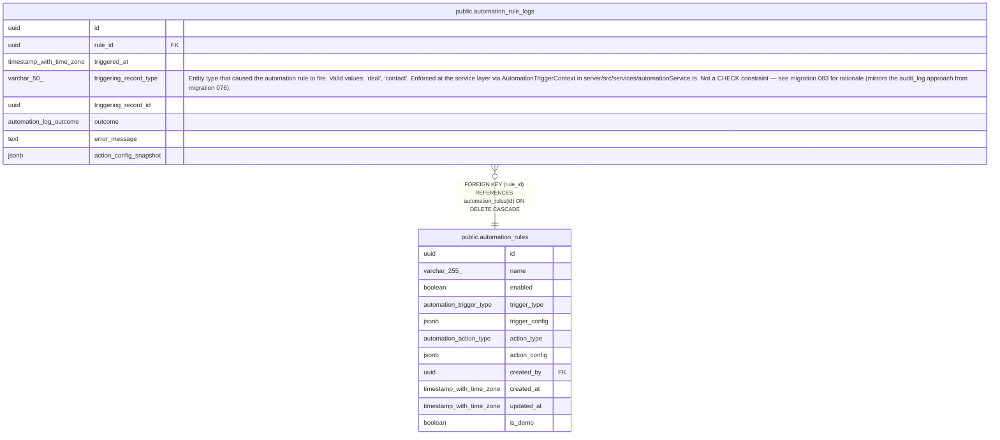

# public.automation_rule_logs

## Columns

| Name | Type | Default | Nullable | Children | Parents | Comment |
| ---- | ---- | ------- | -------- | -------- | ------- | ------- |
| id | uuid | gen_random_uuid() | false |  |  |  |
| rule_id | uuid |  | false |  | [public.automation_rules](public.automation_rules.md) |  |
| triggered_at | timestamp with time zone | now() | false |  |  |  |
| triggering_record_type | varchar(50) |  | false |  |  | Entity type that caused the automation rule to fire. Valid values: 'deal', 'contact'. Enforced at the service layer via AutomationTriggerContext in server/src/services/automationService.ts. Not a CHECK constraint — see migration 083 for rationale (mirrors the audit_log approach from migration 076). |
| triggering_record_id | uuid |  | false |  |  |  |
| outcome | automation_log_outcome |  | false |  |  |  |
| error_message | text |  | true |  |  |  |
| action_config_snapshot | jsonb |  | true |  |  |  |

## Constraints

| Name | Type | Definition |
| ---- | ---- | ---------- |
| automation_rule_logs_rule_id_fkey | FOREIGN KEY | FOREIGN KEY (rule_id) REFERENCES automation_rules(id) ON DELETE CASCADE |
| automation_rule_logs_pkey | PRIMARY KEY | PRIMARY KEY (id) |

## Indexes

| Name | Definition |
| ---- | ---------- |
| automation_rule_logs_pkey | CREATE UNIQUE INDEX automation_rule_logs_pkey ON public.automation_rule_logs USING btree (id) |
| automation_rule_logs_rule_id_triggered_at_index | CREATE INDEX automation_rule_logs_rule_id_triggered_at_index ON public.automation_rule_logs USING btree (rule_id, triggered_at) |
| automation_rule_logs_triggered_at_idx | CREATE INDEX automation_rule_logs_triggered_at_idx ON public.automation_rule_logs USING btree (triggered_at) |
| automation_rule_logs_outcome_idx | CREATE INDEX automation_rule_logs_outcome_idx ON public.automation_rule_logs USING btree (outcome) WHERE (outcome = 'error'::automation_log_outcome) |

## Relations

---

> Generated by [tbls](https://github.com/k1LoW/tbls)
