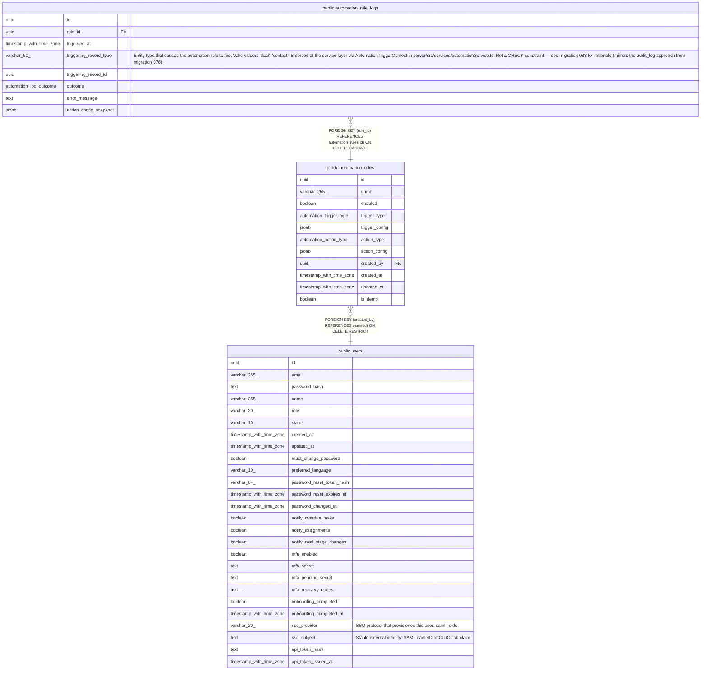

# public.automation_rules

## Columns

| Name | Type | Default | Nullable | Children | Parents | Comment |
| ---- | ---- | ------- | -------- | -------- | ------- | ------- |
| id | uuid | gen_random_uuid() | false | [public.automation_rule_logs](public.automation_rule_logs.md) |  |  |
| name | varchar(255) |  | false |  |  |  |
| enabled | boolean | true | false |  |  |  |
| trigger_type | automation_trigger_type |  | false |  |  |  |
| trigger_config | jsonb | '{}'::jsonb | false |  |  |  |
| action_type | automation_action_type |  | false |  |  |  |
| action_config | jsonb | '{}'::jsonb | false |  |  |  |
| created_by | uuid |  | false |  | [public.users](public.users.md) |  |
| created_at | timestamp with time zone | now() | false |  |  |  |
| updated_at | timestamp with time zone | now() | false |  |  |  |
| is_demo | boolean | false | false |  |  |  |

## Constraints

| Name | Type | Definition |
| ---- | ---- | ---------- |
| automation_rules_created_by_fkey | FOREIGN KEY | FOREIGN KEY (created_by) REFERENCES users(id) ON DELETE RESTRICT |
| automation_rules_pkey | PRIMARY KEY | PRIMARY KEY (id) |

## Indexes

| Name | Definition |
| ---- | ---------- |
| automation_rules_pkey | CREATE UNIQUE INDEX automation_rules_pkey ON public.automation_rules USING btree (id) |
| automation_rules_trigger_type_index | CREATE INDEX automation_rules_trigger_type_index ON public.automation_rules USING btree (trigger_type) |
| automation_rules_enabled_index | CREATE INDEX automation_rules_enabled_index ON public.automation_rules USING btree (enabled) |
| automation_rules_is_demo_index | CREATE INDEX automation_rules_is_demo_index ON public.automation_rules USING btree (is_demo) |

## Triggers

| Name | Definition |
| ---- | ---------- |
| automation_rules_set_updated_at | CREATE TRIGGER automation_rules_set_updated_at BEFORE UPDATE ON public.automation_rules FOR EACH ROW EXECUTE FUNCTION set_updated_at() |

## Relations

---

> Generated by [tbls](https://github.com/k1LoW/tbls)
