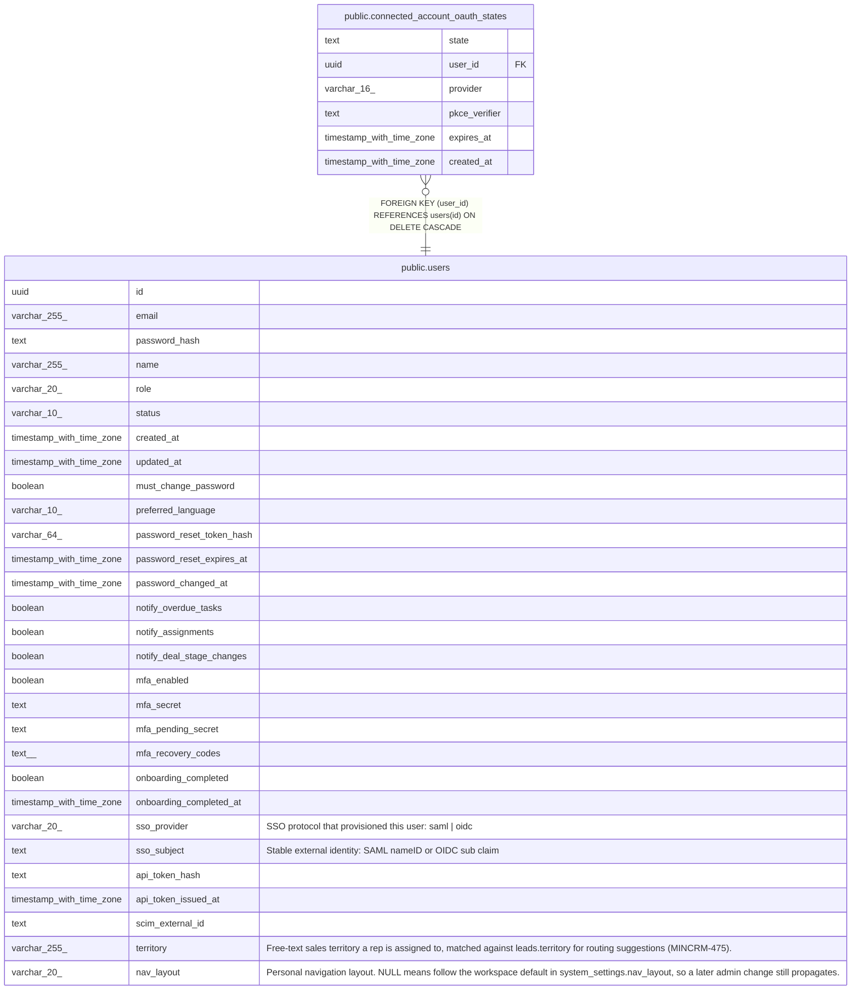

# public.connected_account_oauth_states

## Description

Single-use OAuth authorization-code state. Binds a flow to the user who started it and holds that flow PKCE verifier until the callback consumes the row.

## Columns

| Name | Type | Default | Nullable | Children | Parents | Comment |
| ---- | ---- | ------- | -------- | -------- | ------- | ------- |
| state | text |  | false |  |  |  |
| user_id | uuid |  | false |  | [public.users](public.users.md) |  |
| provider | varchar(16) |  | false |  |  |  |
| pkce_verifier | text |  | false |  |  |  |
| expires_at | timestamp with time zone |  | false |  |  |  |
| created_at | timestamp with time zone | now() | false |  |  |  |

## Constraints

| Name | Type | Definition |
| ---- | ---- | ---------- |
| connected_account_oauth_states_provider_check | CHECK | CHECK (((provider)::text = ANY ((ARRAY['google'::character varying, 'microsoft'::character varying])::text[]))) |
| connected_account_oauth_states_user_id_fkey | FOREIGN KEY | FOREIGN KEY (user_id) REFERENCES users(id) ON DELETE CASCADE |
| connected_account_oauth_states_pkey | PRIMARY KEY | PRIMARY KEY (state) |

## Indexes

| Name | Definition |
| ---- | ---------- |
| connected_account_oauth_states_pkey | CREATE UNIQUE INDEX connected_account_oauth_states_pkey ON public.connected_account_oauth_states USING btree (state) |
| connected_account_oauth_states_expires_at_idx | CREATE INDEX connected_account_oauth_states_expires_at_idx ON public.connected_account_oauth_states USING btree (expires_at) |

## Relations

---

> Generated by [tbls](https://github.com/k1LoW/tbls)
