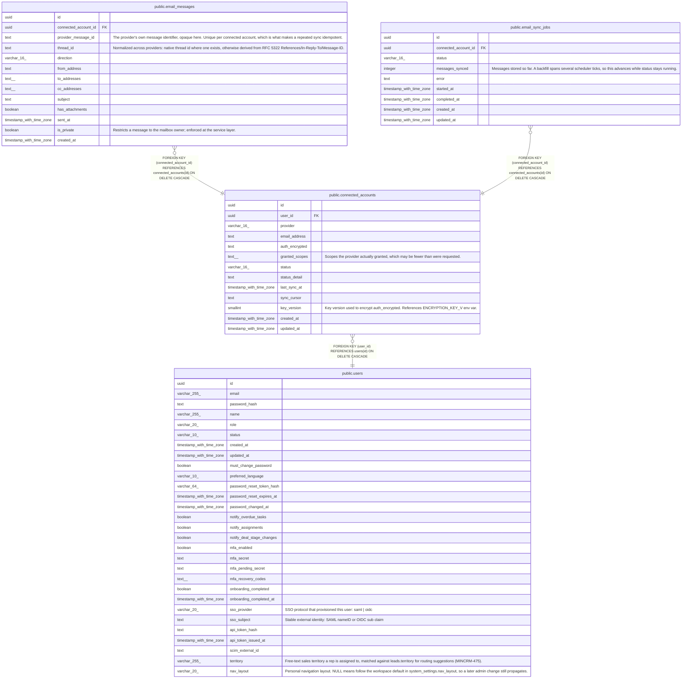

# public.connected_accounts

## Description

Per-user linked mailboxes. auth_encrypted is AES-256-GCM ciphertext (OAuth tokens or IMAP credentials as JSON); it is never returned by any API.

## Columns

| Name | Type | Default | Nullable | Children | Parents | Comment |
| ---- | ---- | ------- | -------- | -------- | ------- | ------- |
| id | uuid | gen_random_uuid() | false | [public.email_messages](public.email_messages.md) [public.email_sync_jobs](public.email_sync_jobs.md) |  |  |
| user_id | uuid |  | false |  | [public.users](public.users.md) |  |
| provider | varchar(16) |  | false |  |  |  |
| email_address | text |  | false |  |  |  |
| auth_encrypted | text |  | false |  |  |  |
| granted_scopes | text[] | '{}'::text[] | false |  |  | Scopes the provider actually granted, which may be fewer than were requested. |
| status | varchar(16) | 'active'::character varying | false |  |  |  |
| status_detail | text |  | true |  |  |  |
| last_sync_at | timestamp with time zone |  | true |  |  |  |
| sync_cursor | text |  | true |  |  |  |
| key_version | smallint | 1 | false |  |  | Key version used to encrypt auth_encrypted. References ENCRYPTION_KEY_V\<n\> env var. |
| created_at | timestamp with time zone | now() | false |  |  |  |
| updated_at | timestamp with time zone | now() | false |  |  |  |

## Constraints

| Name | Type | Definition |
| ---- | ---- | ---------- |
| connected_accounts_provider_check | CHECK | CHECK (((provider)::text = ANY ((ARRAY['google'::character varying, 'microsoft'::character varying, 'imap'::character varying])::text[]))) |
| connected_accounts_status_check | CHECK | CHECK (((status)::text = ANY ((ARRAY['active'::character varying, 'error'::character varying, 'disconnected'::character varying])::text[]))) |
| connected_accounts_user_id_fkey | FOREIGN KEY | FOREIGN KEY (user_id) REFERENCES users(id) ON DELETE CASCADE |
| connected_accounts_pkey | PRIMARY KEY | PRIMARY KEY (id) |
| connected_accounts_user_provider_email_unique | UNIQUE | UNIQUE (user_id, provider, email_address) |

## Indexes

| Name | Definition |
| ---- | ---------- |
| connected_accounts_pkey | CREATE UNIQUE INDEX connected_accounts_pkey ON public.connected_accounts USING btree (id) |
| connected_accounts_user_provider_email_unique | CREATE UNIQUE INDEX connected_accounts_user_provider_email_unique ON public.connected_accounts USING btree (user_id, provider, email_address) |
| connected_accounts_user_id_idx | CREATE INDEX connected_accounts_user_id_idx ON public.connected_accounts USING btree (user_id) |

## Triggers

| Name | Definition |
| ---- | ---------- |
| connected_accounts_set_updated_at | CREATE TRIGGER connected_accounts_set_updated_at BEFORE UPDATE ON public.connected_accounts FOR EACH ROW EXECUTE FUNCTION set_updated_at() |

## Relations

---

> Generated by [tbls](https://github.com/k1LoW/tbls)
