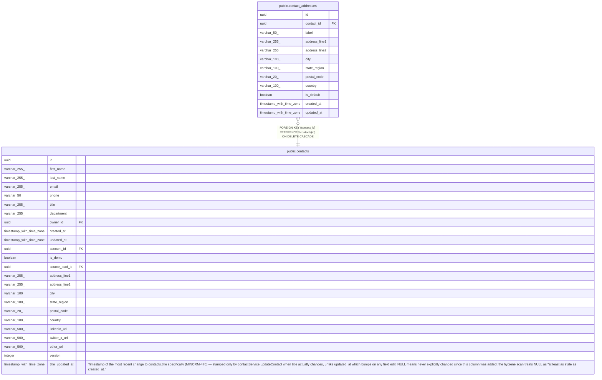

# public.contact_addresses

## Columns

| Name | Type | Default | Nullable | Children | Parents | Comment |
| ---- | ---- | ------- | -------- | -------- | ------- | ------- |
| id | uuid | gen_random_uuid() | false |  |  |  |
| contact_id | uuid |  | false |  | [public.contacts](public.contacts.md) |  |
| label | varchar(50) |  | true |  |  |  |
| address_line1 | varchar(255) |  | true |  |  |  |
| address_line2 | varchar(255) |  | true |  |  |  |
| city | varchar(100) |  | true |  |  |  |
| state_region | varchar(100) |  | true |  |  |  |
| postal_code | varchar(20) |  | true |  |  |  |
| country | varchar(100) |  | true |  |  |  |
| is_default | boolean | false | false |  |  |  |
| created_at | timestamp with time zone | now() | false |  |  |  |
| updated_at | timestamp with time zone | now() | false |  |  |  |

## Constraints

| Name | Type | Definition |
| ---- | ---- | ---------- |
| contact_addresses_contact_id_fkey | FOREIGN KEY | FOREIGN KEY (contact_id) REFERENCES contacts(id) ON DELETE CASCADE |
| contact_addresses_pkey | PRIMARY KEY | PRIMARY KEY (id) |

## Indexes

| Name | Definition |
| ---- | ---------- |
| contact_addresses_pkey | CREATE UNIQUE INDEX contact_addresses_pkey ON public.contact_addresses USING btree (id) |
| contact_addresses_contact_id_index | CREATE INDEX contact_addresses_contact_id_index ON public.contact_addresses USING btree (contact_id) |
| contact_addresses_one_default_per_contact | CREATE UNIQUE INDEX contact_addresses_one_default_per_contact ON public.contact_addresses USING btree (contact_id) WHERE (is_default = true) |

## Triggers

| Name | Definition |
| ---- | ---------- |
| contact_addresses_set_updated_at | CREATE TRIGGER contact_addresses_set_updated_at BEFORE UPDATE ON public.contact_addresses FOR EACH ROW EXECUTE FUNCTION set_updated_at() |

## Relations

---

> Generated by [tbls](https://github.com/k1LoW/tbls)
