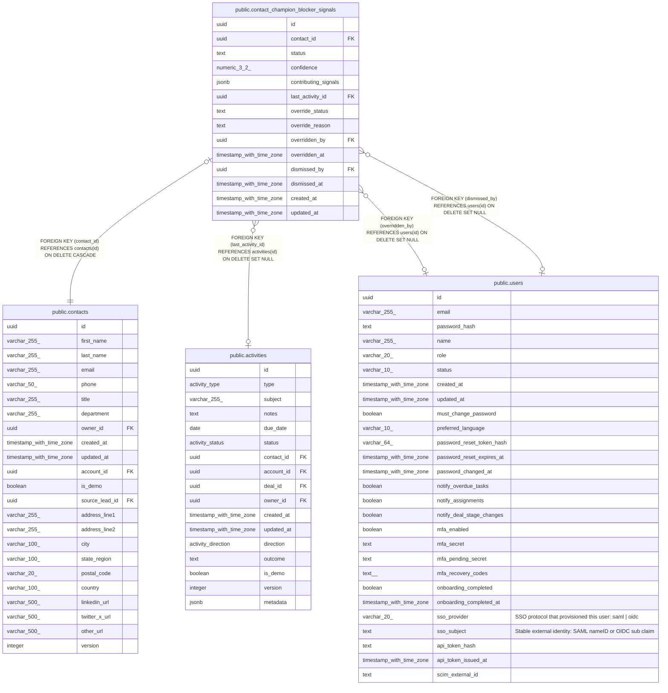

# public.contact_champion_blocker_signals

## Description

Per-contact AI champion/blocker classification (MINCRM-466). One row per contact — replaced/updated after each new activity, not appended.

## Columns

| Name | Type | Default | Nullable | Children | Parents | Comment |
| ---- | ---- | ------- | -------- | -------- | ------- | ------- |
| id | uuid | gen_random_uuid() | false |  |  |  |
| contact_id | uuid |  | false |  | [public.contacts](public.contacts.md) |  |
| status | text | 'neutral'::text | false |  |  |  |
| confidence | numeric(3,2) | 0 | false |  |  |  |
| contributing_signals | jsonb | '[]'::jsonb | false |  |  |  |
| last_activity_id | uuid |  | true |  | [public.activities](public.activities.md) |  |
| override_status | text |  | true |  |  |  |
| override_reason | text |  | true |  |  |  |
| overridden_by | uuid |  | true |  | [public.users](public.users.md) |  |
| overridden_at | timestamp with time zone |  | true |  |  |  |
| dismissed_by | uuid |  | true |  | [public.users](public.users.md) |  |
| dismissed_at | timestamp with time zone |  | true |  |  |  |
| created_at | timestamp with time zone | now() | false |  |  |  |
| updated_at | timestamp with time zone | now() | false |  |  |  |

## Constraints

| Name | Type | Definition |
| ---- | ---- | ---------- |
| contact_champion_blocker_signals_override_status_check | CHECK | CHECK (((override_status IS NULL) OR (override_status = ANY (ARRAY['champion'::text, 'likely_champion'::text, 'neutral'::text, 'likely_blocker'::text, 'blocker'::text])))) |
| contact_champion_blocker_signals_status_check | CHECK | CHECK ((status = ANY (ARRAY['champion'::text, 'likely_champion'::text, 'neutral'::text, 'likely_blocker'::text, 'blocker'::text]))) |
| contact_champion_blocker_signals_dismissed_by_fkey | FOREIGN KEY | FOREIGN KEY (dismissed_by) REFERENCES users(id) ON DELETE SET NULL |
| contact_champion_blocker_signals_overridden_by_fkey | FOREIGN KEY | FOREIGN KEY (overridden_by) REFERENCES users(id) ON DELETE SET NULL |
| contact_champion_blocker_signals_contact_id_fkey | FOREIGN KEY | FOREIGN KEY (contact_id) REFERENCES contacts(id) ON DELETE CASCADE |
| contact_champion_blocker_signals_last_activity_id_fkey | FOREIGN KEY | FOREIGN KEY (last_activity_id) REFERENCES activities(id) ON DELETE SET NULL |
| contact_champion_blocker_signals_pkey | PRIMARY KEY | PRIMARY KEY (id) |
| contact_champion_blocker_signals_contact_id_unique | UNIQUE | UNIQUE (contact_id) |

## Indexes

| Name | Definition |
| ---- | ---------- |
| contact_champion_blocker_signals_pkey | CREATE UNIQUE INDEX contact_champion_blocker_signals_pkey ON public.contact_champion_blocker_signals USING btree (id) |
| contact_champion_blocker_signals_contact_id_unique | CREATE UNIQUE INDEX contact_champion_blocker_signals_contact_id_unique ON public.contact_champion_blocker_signals USING btree (contact_id) |
| contact_champion_blocker_signals_status_idx | CREATE INDEX contact_champion_blocker_signals_status_idx ON public.contact_champion_blocker_signals USING btree (status) |

## Relations

---

> Generated by [tbls](https://github.com/k1LoW/tbls)
