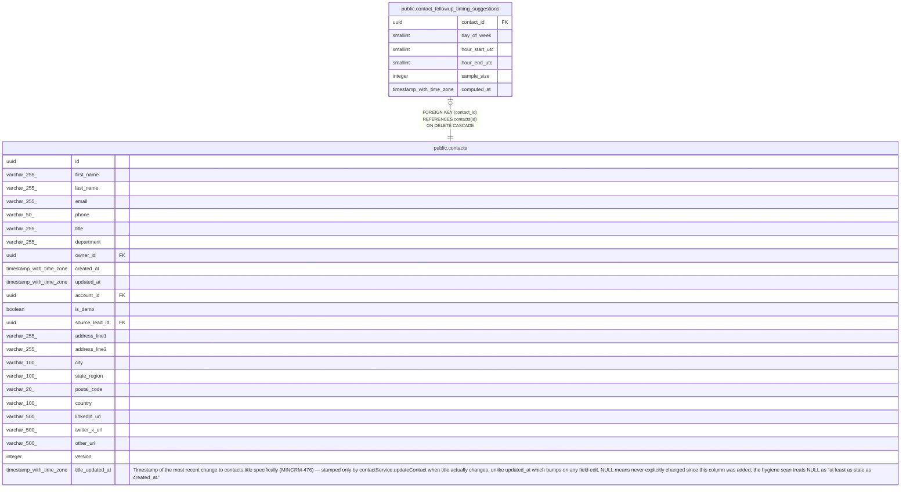

# public.contact_followup_timing_suggestions

## Description

Cached best-time-to-contact suggestion per contact (MINCRM-470). day_of_week/hour_start_utc/hour_end_utc are UTC-anchored; project to a display timezone at read time, never store localized values. Absence of a row means fewer than 5 logged interactions (insufficient data).

## Columns

| Name | Type | Default | Nullable | Children | Parents | Comment |
| ---- | ---- | ------- | -------- | -------- | ------- | ------- |
| contact_id | uuid |  | false |  | [public.contacts](public.contacts.md) |  |
| day_of_week | smallint |  | false |  |  |  |
| hour_start_utc | smallint |  | false |  |  |  |
| hour_end_utc | smallint |  | false |  |  |  |
| sample_size | integer |  | false |  |  |  |
| computed_at | timestamp with time zone | now() | false |  |  |  |

## Constraints

| Name | Type | Definition |
| ---- | ---- | ---------- |
| contact_followup_timing_suggestions_day_check | CHECK | CHECK (((day_of_week >= 0) AND (day_of_week <= 6))) |
| contact_followup_timing_suggestions_hour_end_check | CHECK | CHECK (((hour_end_utc >= 1) AND (hour_end_utc <= 24))) |
| contact_followup_timing_suggestions_hour_order_check | CHECK | CHECK ((hour_end_utc > hour_start_utc)) |
| contact_followup_timing_suggestions_hour_start_check | CHECK | CHECK (((hour_start_utc >= 0) AND (hour_start_utc <= 23))) |
| contact_followup_timing_suggestions_sample_size_check | CHECK | CHECK ((sample_size >= 5)) |
| contact_followup_timing_suggestions_contact_id_fkey | FOREIGN KEY | FOREIGN KEY (contact_id) REFERENCES contacts(id) ON DELETE CASCADE |
| contact_followup_timing_suggestions_pkey | PRIMARY KEY | PRIMARY KEY (contact_id) |

## Indexes

| Name | Definition |
| ---- | ---------- |
| contact_followup_timing_suggestions_pkey | CREATE UNIQUE INDEX contact_followup_timing_suggestions_pkey ON public.contact_followup_timing_suggestions USING btree (contact_id) |

## Relations

---

> Generated by [tbls](https://github.com/k1LoW/tbls)
