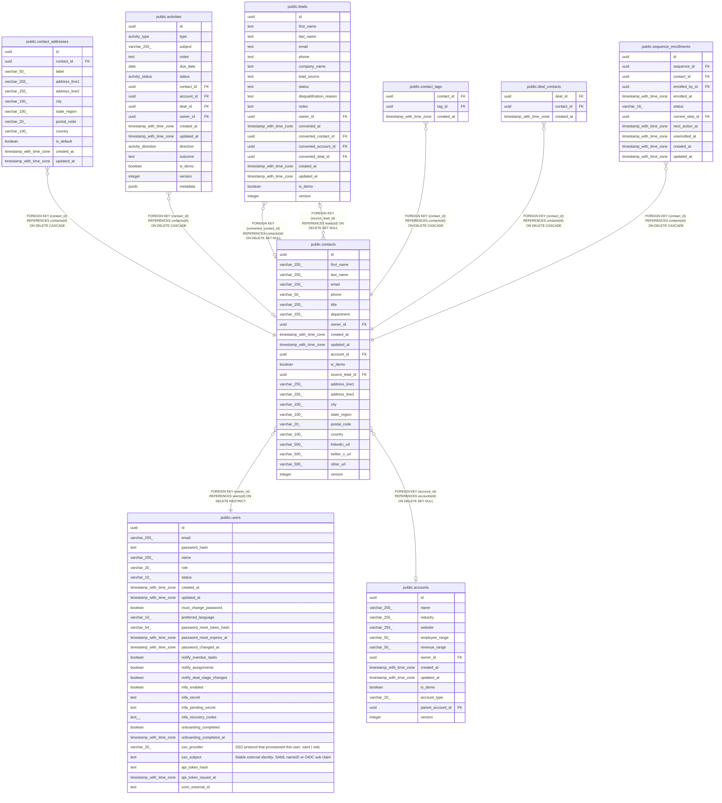

# public.contacts

## Columns

| Name | Type | Default | Nullable | Children | Parents | Comment |
| ---- | ---- | ------- | -------- | -------- | ------- | ------- |
| id | uuid | gen_random_uuid() | false | [public.leads](public.leads.md) [public.contact_addresses](public.contact_addresses.md) [public.activities](public.activities.md) [public.contact_tags](public.contact_tags.md) [public.deal_contacts](public.deal_contacts.md) [public.sequence_enrollments](public.sequence_enrollments.md) |  |  |
| first_name | varchar(255) |  | false |  |  |  |
| last_name | varchar(255) |  | false |  |  |  |
| email | varchar(255) |  | false |  |  |  |
| phone | varchar(50) |  | true |  |  |  |
| title | varchar(255) |  | true |  |  |  |
| department | varchar(255) |  | true |  |  |  |
| owner_id | uuid |  | false |  | [public.users](public.users.md) |  |
| created_at | timestamp with time zone | now() | false |  |  |  |
| updated_at | timestamp with time zone | now() | false |  |  |  |
| account_id | uuid |  | true |  | [public.accounts](public.accounts.md) |  |
| is_demo | boolean | false | false |  |  |  |
| source_lead_id | uuid |  | true |  | [public.leads](public.leads.md) |  |
| address_line1 | varchar(255) |  | true |  |  |  |
| address_line2 | varchar(255) |  | true |  |  |  |
| city | varchar(100) |  | true |  |  |  |
| state_region | varchar(100) |  | true |  |  |  |
| postal_code | varchar(20) |  | true |  |  |  |
| country | varchar(100) |  | true |  |  |  |
| linkedin_url | varchar(500) |  | true |  |  |  |
| twitter_x_url | varchar(500) |  | true |  |  |  |
| other_url | varchar(500) |  | true |  |  |  |
| version | integer | 1 | false |  |  |  |

## Constraints

| Name | Type | Definition |
| ---- | ---- | ---------- |
| contacts_owner_id_fkey | FOREIGN KEY | FOREIGN KEY (owner_id) REFERENCES users(id) ON DELETE RESTRICT |
| contacts_source_lead_id_fkey | FOREIGN KEY | FOREIGN KEY (source_lead_id) REFERENCES leads(id) ON DELETE SET NULL |
| contacts_account_id_fkey | FOREIGN KEY | FOREIGN KEY (account_id) REFERENCES accounts(id) ON DELETE SET NULL |
| contacts_pkey | PRIMARY KEY | PRIMARY KEY (id) |

## Indexes

| Name | Definition |
| ---- | ---------- |
| contacts_pkey | CREATE UNIQUE INDEX contacts_pkey ON public.contacts USING btree (id) |
| contacts_email_unique_index | CREATE UNIQUE INDEX contacts_email_unique_index ON public.contacts USING btree (email) |
| contacts_owner_id_index | CREATE INDEX contacts_owner_id_index ON public.contacts USING btree (owner_id) |
| contacts_account_id_index | CREATE INDEX contacts_account_id_index ON public.contacts USING btree (account_id) |
| contacts_is_demo_index | CREATE INDEX contacts_is_demo_index ON public.contacts USING btree (is_demo) |
| contacts_first_name_trgm_idx | CREATE INDEX contacts_first_name_trgm_idx ON public.contacts USING gin (first_name gin_trgm_ops) |
| contacts_last_name_trgm_idx | CREATE INDEX contacts_last_name_trgm_idx ON public.contacts USING gin (last_name gin_trgm_ops) |
| contacts_email_trgm_idx | CREATE INDEX contacts_email_trgm_idx ON public.contacts USING gin (email gin_trgm_ops) |

## Triggers

| Name | Definition |
| ---- | ---------- |
| contacts_set_updated_at | CREATE TRIGGER contacts_set_updated_at BEFORE UPDATE ON public.contacts FOR EACH ROW EXECUTE FUNCTION set_updated_at() |

## Relations

---

> Generated by [tbls](https://github.com/k1LoW/tbls)
