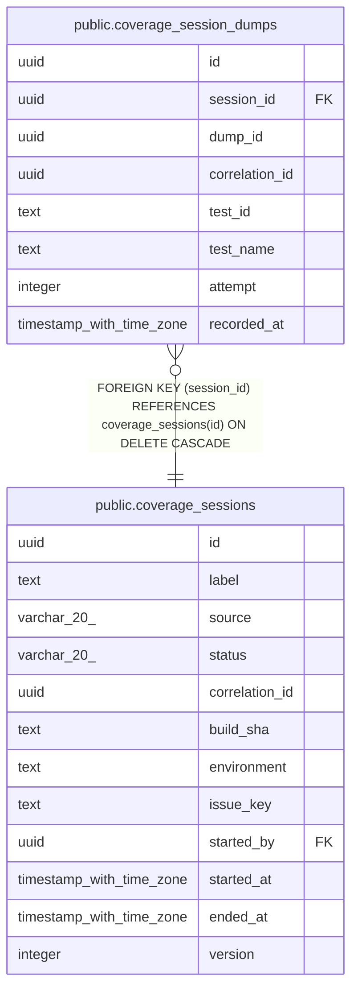

# public.coverage_session_dumps

## Description

Attributes a single coverage dump (dump_id — a crypto.randomUUID() minted by NodeV8CoverageAgent/coverageDumpService, not FK'd since dump metadata itself stays file-based per Phase 1) to the coverage_sessions row that produced it. test_id/test_name/attempt support MINCRM-612's retry-attribution requirement: a Playwright retry re-runs the same test_id with attempt incremented, so retried/flaky tests are distinguishable in the record rather than silently overwriting or double-counting the prior attempt's dump.

## Columns

| Name | Type | Default | Nullable | Children | Parents | Comment |
| ---- | ---- | ------- | -------- | -------- | ------- | ------- |
| id | uuid | gen_random_uuid() | false |  |  |  |
| session_id | uuid |  | false |  | [public.coverage_sessions](public.coverage_sessions.md) |  |
| dump_id | uuid |  | false |  |  |  |
| correlation_id | uuid |  | false |  |  |  |
| test_id | text |  | true |  |  |  |
| test_name | text |  | true |  |  |  |
| attempt | integer | 1 | false |  |  |  |
| recorded_at | timestamp with time zone | now() | false |  |  |  |

## Constraints

| Name | Type | Definition |
| ---- | ---- | ---------- |
| coverage_session_dumps_attempt_check | CHECK | CHECK ((attempt >= 1)) |
| coverage_session_dumps_session_id_fkey | FOREIGN KEY | FOREIGN KEY (session_id) REFERENCES coverage_sessions(id) ON DELETE CASCADE |
| coverage_session_dumps_pkey | PRIMARY KEY | PRIMARY KEY (id) |
| coverage_session_dumps_dump_id_unique | UNIQUE | UNIQUE (dump_id) |

## Indexes

| Name | Definition |
| ---- | ---------- |
| coverage_session_dumps_pkey | CREATE UNIQUE INDEX coverage_session_dumps_pkey ON public.coverage_session_dumps USING btree (id) |
| coverage_session_dumps_dump_id_unique | CREATE UNIQUE INDEX coverage_session_dumps_dump_id_unique ON public.coverage_session_dumps USING btree (dump_id) |
| coverage_session_dumps_session_id_idx | CREATE INDEX coverage_session_dumps_session_id_idx ON public.coverage_session_dumps USING btree (session_id) |
| coverage_session_dumps_correlation_id_idx | CREATE INDEX coverage_session_dumps_correlation_id_idx ON public.coverage_session_dumps USING btree (correlation_id) |

## Relations

---

> Generated by [tbls](https://github.com/k1LoW/tbls)
