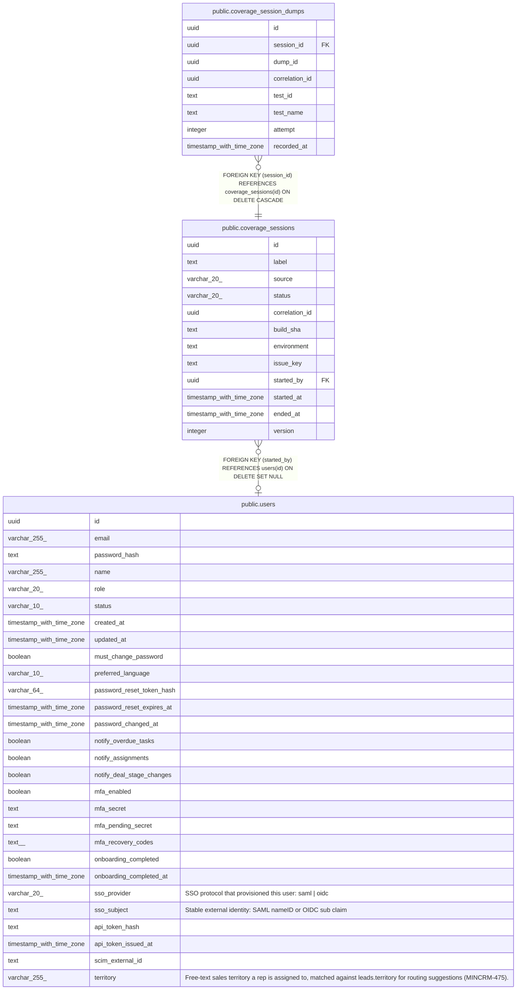

# public.coverage_sessions

## Description

Coverage/TIA testing sessions (MINCRM-609..612) — a logical grouping of one or more coverage dumps attributed to a single automated test run or manual-exploratory-testing session. correlation_id is the value propagated via the x-coverage-correlation-id header (see correlationId middleware) and stamped onto dumps in coverage_session_dumps; it is NOT a physically isolated V8 counter scope — the backend coverage agent remains a single process-wide counter set (see NodeV8CoverageAgent), so overlapping sessions on the same server instance still share the same underlying counters. version supports optimistic locking against concurrent end-session requests.

## Columns

| Name | Type | Default | Nullable | Children | Parents | Comment |
| ---- | ---- | ------- | -------- | -------- | ------- | ------- |
| id | uuid | gen_random_uuid() | false | [public.coverage_session_dumps](public.coverage_session_dumps.md) |  |  |
| label | text |  | false |  |  |  |
| source | varchar(20) |  | false |  |  |  |
| status | varchar(20) | 'active'::character varying | false |  |  |  |
| correlation_id | uuid | gen_random_uuid() | false |  |  |  |
| build_sha | text |  | false |  |  |  |
| environment | text |  | false |  |  |  |
| issue_key | text |  | true |  |  |  |
| started_by | uuid |  | true |  | [public.users](public.users.md) |  |
| started_at | timestamp with time zone | now() | false |  |  |  |
| ended_at | timestamp with time zone |  | true |  |  |  |
| version | integer | 1 | false |  |  |  |

## Constraints

| Name | Type | Definition |
| ---- | ---- | ---------- |
| coverage_sessions_ended_at_check | CHECK | CHECK (((((status)::text = 'active'::text) AND (ended_at IS NULL)) OR (((status)::text = 'ended'::text) AND (ended_at IS NOT NULL)))) |
| coverage_sessions_source_check | CHECK | CHECK (((source)::text = ANY ((ARRAY['automated-e2e'::character varying, 'manual'::character varying])::text[]))) |
| coverage_sessions_status_check | CHECK | CHECK (((status)::text = ANY ((ARRAY['active'::character varying, 'ended'::character varying])::text[]))) |
| coverage_sessions_started_by_fkey | FOREIGN KEY | FOREIGN KEY (started_by) REFERENCES users(id) ON DELETE SET NULL |
| coverage_sessions_pkey | PRIMARY KEY | PRIMARY KEY (id) |
| coverage_sessions_correlation_id_unique | UNIQUE | UNIQUE (correlation_id) |

## Indexes

| Name | Definition |
| ---- | ---------- |
| coverage_sessions_pkey | CREATE UNIQUE INDEX coverage_sessions_pkey ON public.coverage_sessions USING btree (id) |
| coverage_sessions_correlation_id_unique | CREATE UNIQUE INDEX coverage_sessions_correlation_id_unique ON public.coverage_sessions USING btree (correlation_id) |
| coverage_sessions_status_idx | CREATE INDEX coverage_sessions_status_idx ON public.coverage_sessions USING btree (status) |
| coverage_sessions_started_by_idx | CREATE INDEX coverage_sessions_started_by_idx ON public.coverage_sessions USING btree (started_by) |

## Relations

---

> Generated by [tbls](https://github.com/k1LoW/tbls)
