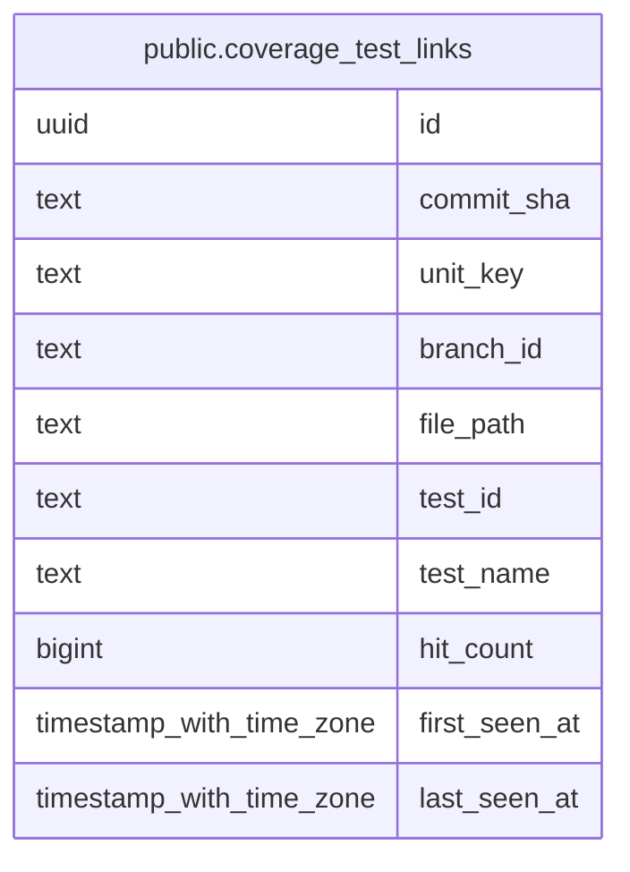

# public.coverage_test_links

## Description

Coverage/TIA bidirectional code<->test index (MINCRM-618) — attributes coverage_units hits to the specific test(s) that produced them, joined at ingestion time from coverage_session_dumps (migration 157) test_id/test_name attribution. coverage_units itself only carries a commit-wide aggregate hit_count with no per-test breakdown; this table is the derived per-test layer coverageMappingService queries from. Re-ingesting the same dump for the same test merges into the existing row (hit_count accumulated) rather than duplicating, mirroring coverage_units own dedup/compaction behavior.

## Columns

| Name | Type | Default | Nullable | Children | Parents | Comment |
| ---- | ---- | ------- | -------- | -------- | ------- | ------- |
| id | uuid | gen_random_uuid() | false |  |  |  |
| commit_sha | text |  | false |  |  |  |
| unit_key | text |  | false |  |  |  |
| branch_id | text |  | true |  |  |  |
| file_path | text |  | false |  |  |  |
| test_id | text |  | false |  |  |  |
| test_name | text |  | true |  |  |  |
| hit_count | bigint | 0 | false |  |  |  |
| first_seen_at | timestamp with time zone | now() | false |  |  |  |
| last_seen_at | timestamp with time zone | now() | false |  |  |  |

## Constraints

| Name | Type | Definition |
| ---- | ---- | ---------- |
| coverage_test_links_branch_id_not_empty_check | CHECK | CHECK (((branch_id IS NULL) OR (branch_id <> ''::text))) |
| coverage_test_links_hit_count_check | CHECK | CHECK ((hit_count >= 0)) |
| coverage_test_links_pkey | PRIMARY KEY | PRIMARY KEY (id) |

## Indexes

| Name | Definition |
| ---- | ---------- |
| coverage_test_links_pkey | CREATE UNIQUE INDEX coverage_test_links_pkey ON public.coverage_test_links USING btree (id) |
| coverage_test_links_identity_idx | CREATE UNIQUE INDEX coverage_test_links_identity_idx ON public.coverage_test_links USING btree (commit_sha, unit_key, COALESCE(branch_id, ''::text), test_id) |
| coverage_test_links_unit_idx | CREATE INDEX coverage_test_links_unit_idx ON public.coverage_test_links USING btree (commit_sha, unit_key) |
| coverage_test_links_test_idx | CREATE INDEX coverage_test_links_test_idx ON public.coverage_test_links USING btree (commit_sha, test_id) |

## Relations

---

> Generated by [tbls](https://github.com/k1LoW/tbls)
