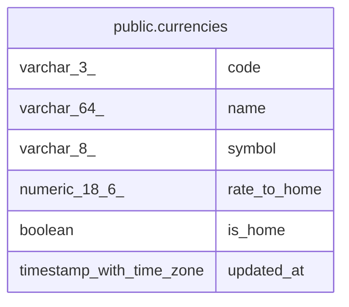

# public.currencies

## Columns

| Name | Type | Default | Nullable | Children | Parents | Comment |
| ---- | ---- | ------- | -------- | -------- | ------- | ------- |
| code | varchar(3) |  | false |  |  |  |
| name | varchar(64) |  | false |  |  |  |
| symbol | varchar(8) |  | false |  |  |  |
| rate_to_home | numeric(18,6) |  | false |  |  |  |
| is_home | boolean | false | false |  |  |  |
| updated_at | timestamp with time zone | now() | false |  |  |  |

## Constraints

| Name | Type | Definition |
| ---- | ---- | ---------- |
| currencies_rate_to_home_positive | CHECK | CHECK ((rate_to_home > (0)::numeric)) |
| currencies_pkey | PRIMARY KEY | PRIMARY KEY (code) |

## Indexes

| Name | Definition |
| ---- | ---------- |
| currencies_pkey | CREATE UNIQUE INDEX currencies_pkey ON public.currencies USING btree (code) |
| currencies_home_idx | CREATE UNIQUE INDEX currencies_home_idx ON public.currencies USING btree (is_home) WHERE (is_home = true) |

## Triggers

| Name | Definition |
| ---- | ---------- |
| currencies_set_updated_at | CREATE TRIGGER currencies_set_updated_at BEFORE UPDATE ON public.currencies FOR EACH ROW EXECUTE FUNCTION set_updated_at() |

## Relations

---

> Generated by [tbls](https://github.com/k1LoW/tbls)
