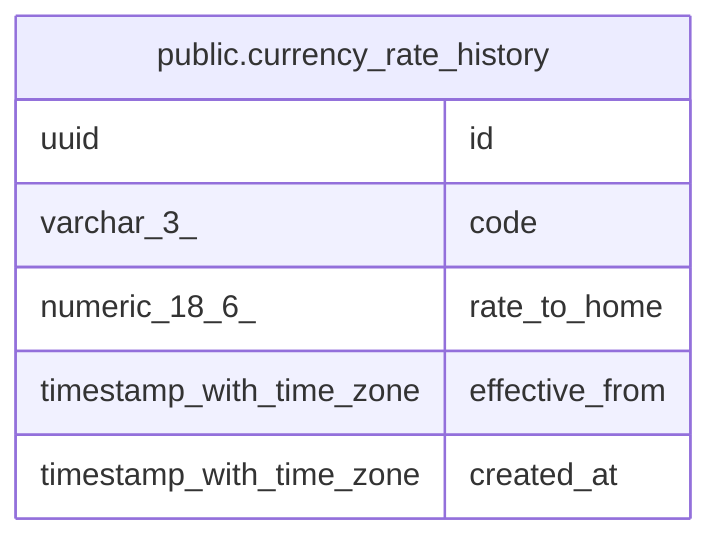

# public.currency_rate_history

## Columns

| Name | Type | Default | Nullable | Children | Parents | Comment |
| ---- | ---- | ------- | -------- | -------- | ------- | ------- |
| id | uuid | gen_random_uuid() | false |  |  |  |
| code | varchar(3) |  | false |  |  |  |
| rate_to_home | numeric(18,6) |  | false |  |  |  |
| effective_from | timestamp with time zone |  | false |  |  |  |
| created_at | timestamp with time zone | now() | false |  |  |  |

## Constraints

| Name | Type | Definition |
| ---- | ---- | ---------- |
| currency_rate_history_rate_positive | CHECK | CHECK ((rate_to_home > (0)::numeric)) |
| currency_rate_history_pkey | PRIMARY KEY | PRIMARY KEY (id) |

## Indexes

| Name | Definition |
| ---- | ---------- |
| currency_rate_history_pkey | CREATE UNIQUE INDEX currency_rate_history_pkey ON public.currency_rate_history USING btree (id) |
| currency_rate_history_code_effective_from_idx | CREATE INDEX currency_rate_history_code_effective_from_idx ON public.currency_rate_history USING btree (code, effective_from DESC) |

## Relations

---

> Generated by [tbls](https://github.com/k1LoW/tbls)
