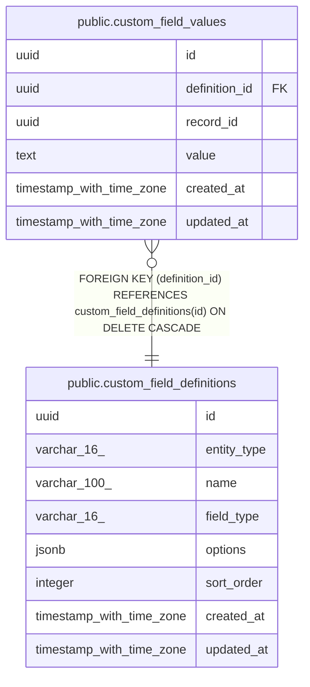

# public.custom_field_definitions

## Columns

| Name | Type | Default | Nullable | Children | Parents | Comment |
| ---- | ---- | ------- | -------- | -------- | ------- | ------- |
| id | uuid | gen_random_uuid() | false | [public.custom_field_values](public.custom_field_values.md) |  |  |
| entity_type | varchar(16) |  | false |  |  |  |
| name | varchar(100) |  | false |  |  |  |
| field_type | varchar(16) |  | false |  |  |  |
| options | jsonb |  | true |  |  |  |
| sort_order | integer | 0 | false |  |  |  |
| created_at | timestamp with time zone | now() | false |  |  |  |
| updated_at | timestamp with time zone | now() | false |  |  |  |

## Constraints

| Name | Type | Definition |
| ---- | ---- | ---------- |
| custom_field_definitions_entity_type_check | CHECK | CHECK (((entity_type)::text = ANY (ARRAY[('contact'::character varying)::text, ('account'::character varying)::text, ('deal'::character varying)::text]))) |
| custom_field_definitions_field_type_check | CHECK | CHECK (((field_type)::text = ANY (ARRAY[('text'::character varying)::text, ('number'::character varying)::text, ('date'::character varying)::text, ('boolean'::character varying)::text, ('select'::character varying)::text]))) |
| custom_field_definitions_pkey | PRIMARY KEY | PRIMARY KEY (id) |
| custom_field_definitions_entity_type_name_key | UNIQUE | UNIQUE (entity_type, name) |

## Indexes

| Name | Definition |
| ---- | ---------- |
| custom_field_definitions_pkey | CREATE UNIQUE INDEX custom_field_definitions_pkey ON public.custom_field_definitions USING btree (id) |
| custom_field_definitions_entity_type_name_key | CREATE UNIQUE INDEX custom_field_definitions_entity_type_name_key ON public.custom_field_definitions USING btree (entity_type, name) |

## Triggers

| Name | Definition |
| ---- | ---------- |
| custom_field_definitions_set_updated_at | CREATE TRIGGER custom_field_definitions_set_updated_at BEFORE UPDATE ON public.custom_field_definitions FOR EACH ROW EXECUTE FUNCTION set_updated_at() |

## Relations

---

> Generated by [tbls](https://github.com/k1LoW/tbls)
