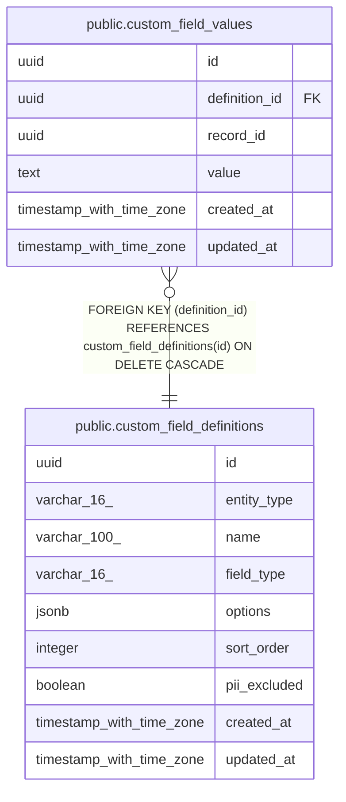

# public.custom_field_values

## Description

Values for admin-defined custom fields on CRM entity records. record_id is a polymorphic reference to the entity row identified by the associated custom_field_definitions.entity_type — no FK constraint is possible because the parent table varies per definition. Valid entity_type values (on custom_field_definitions): 'contact', 'account', 'deal'. definition_id has a real FK with ON DELETE CASCADE — deleting a field definition removes all its values automatically. Orphan cleanup: rows whose record_id no longer exists in the parent entity table accumulate silently when the entity is deleted. Application must delete custom_field_values rows alongside entity deletion. See CLAUDE.md — Polymorphic FK Pattern. (MINCRM-510)

## Columns

| Name | Type | Default | Nullable | Children | Parents | Comment |
| ---- | ---- | ------- | -------- | -------- | ------- | ------- |
| id | uuid | gen_random_uuid() | false |  |  |  |
| definition_id | uuid |  | false |  | [public.custom_field_definitions](public.custom_field_definitions.md) |  |
| record_id | uuid |  | false |  |  |  |
| value | text |  | true |  |  |  |
| created_at | timestamp with time zone | now() | false |  |  |  |
| updated_at | timestamp with time zone | now() | false |  |  |  |

## Constraints

| Name | Type | Definition |
| ---- | ---- | ---------- |
| custom_field_values_definition_id_fkey | FOREIGN KEY | FOREIGN KEY (definition_id) REFERENCES custom_field_definitions(id) ON DELETE CASCADE |
| custom_field_values_pkey | PRIMARY KEY | PRIMARY KEY (id) |
| custom_field_values_definition_id_record_id_key | UNIQUE | UNIQUE (definition_id, record_id) |

## Indexes

| Name | Definition |
| ---- | ---------- |
| custom_field_values_pkey | CREATE UNIQUE INDEX custom_field_values_pkey ON public.custom_field_values USING btree (id) |
| custom_field_values_definition_id_record_id_key | CREATE UNIQUE INDEX custom_field_values_definition_id_record_id_key ON public.custom_field_values USING btree (definition_id, record_id) |
| custom_field_values_record_id_index | CREATE INDEX custom_field_values_record_id_index ON public.custom_field_values USING btree (record_id) |

## Triggers

| Name | Definition |
| ---- | ---------- |
| custom_field_values_set_updated_at | CREATE TRIGGER custom_field_values_set_updated_at BEFORE UPDATE ON public.custom_field_values FOR EACH ROW EXECUTE FUNCTION set_updated_at() |

## Relations

---

> Generated by [tbls](https://github.com/k1LoW/tbls)
