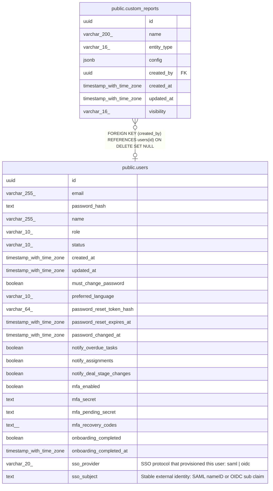

# public.custom_reports

## Columns

| Name | Type | Default | Nullable | Children | Parents | Comment |
| ---- | ---- | ------- | -------- | -------- | ------- | ------- |
| id | uuid | gen_random_uuid() | false |  |  |  |
| name | varchar(200) |  | false |  |  |  |
| entity_type | varchar(16) |  | false |  |  |  |
| config | jsonb |  | false |  |  |  |
| created_by | uuid |  | true |  | [public.users](public.users.md) |  |
| created_at | timestamp with time zone | now() | false |  |  |  |
| updated_at | timestamp with time zone | now() | false |  |  |  |
| visibility | varchar(16) | 'public'::character varying | false |  |  |  |

## Constraints

| Name | Type | Definition |
| ---- | ---- | ---------- |
| custom_reports_entity_type_check | CHECK | CHECK (((entity_type)::text = ANY ((ARRAY['contact'::character varying, 'account'::character varying, 'deal'::character varying, 'lead'::character varying, 'activity'::character varying])::text[]))) |
| custom_reports_visibility_check | CHECK | CHECK (((visibility)::text = ANY ((ARRAY['private'::character varying, 'public_read_only'::character varying, 'public'::character varying])::text[]))) |
| custom_reports_created_by_fkey | FOREIGN KEY | FOREIGN KEY (created_by) REFERENCES users(id) ON DELETE SET NULL |
| custom_reports_pkey | PRIMARY KEY | PRIMARY KEY (id) |
| custom_reports_name_key | UNIQUE | UNIQUE (name) |

## Indexes

| Name | Definition |
| ---- | ---------- |
| custom_reports_pkey | CREATE UNIQUE INDEX custom_reports_pkey ON public.custom_reports USING btree (id) |
| custom_reports_name_key | CREATE UNIQUE INDEX custom_reports_name_key ON public.custom_reports USING btree (name) |
| custom_reports_created_by_index | CREATE INDEX custom_reports_created_by_index ON public.custom_reports USING btree (created_by) |

## Triggers

| Name | Definition |
| ---- | ---------- |
| custom_reports_set_updated_at | CREATE TRIGGER custom_reports_set_updated_at BEFORE UPDATE ON public.custom_reports FOR EACH ROW EXECUTE FUNCTION set_updated_at() |

## Relations

---

> Generated by [tbls](https://github.com/k1LoW/tbls)
