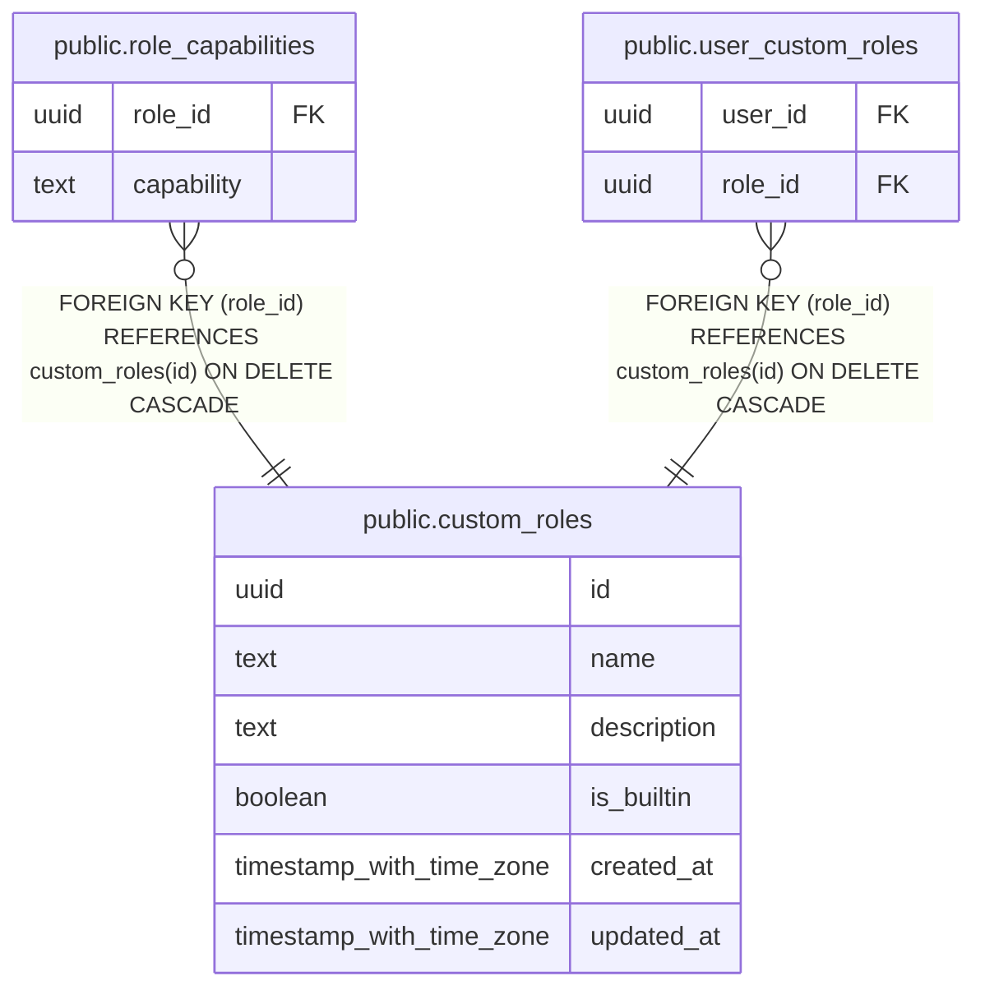

# public.custom_roles

## Description

Named role definitions for capability-based RBAC (MINCRM-542). Rows with is_builtin = true correspond to the five built-in roles (admin, manager, rep, viewer, service_account) and cannot be deleted or renamed via the REST API. Custom roles (is_builtin = false) are admin-configurable.

## Columns

| Name | Type | Default | Nullable | Children | Parents | Comment |
| ---- | ---- | ------- | -------- | -------- | ------- | ------- |
| id | uuid | gen_random_uuid() | false | [public.role_capabilities](public.role_capabilities.md) [public.user_custom_roles](public.user_custom_roles.md) |  |  |
| name | text |  | false |  |  |  |
| description | text |  | true |  |  |  |
| is_builtin | boolean | false | false |  |  |  |
| created_at | timestamp with time zone | now() | false |  |  |  |
| updated_at | timestamp with time zone | now() | false |  |  |  |

## Constraints

| Name | Type | Definition |
| ---- | ---- | ---------- |
| custom_roles_pkey | PRIMARY KEY | PRIMARY KEY (id) |
| custom_roles_name_key | UNIQUE | UNIQUE (name) |

## Indexes

| Name | Definition |
| ---- | ---------- |
| custom_roles_pkey | CREATE UNIQUE INDEX custom_roles_pkey ON public.custom_roles USING btree (id) |
| custom_roles_name_key | CREATE UNIQUE INDEX custom_roles_name_key ON public.custom_roles USING btree (name) |

## Triggers

| Name | Definition |
| ---- | ---------- |
| custom_roles_set_updated_at | CREATE TRIGGER custom_roles_set_updated_at BEFORE UPDATE ON public.custom_roles FOR EACH ROW EXECUTE FUNCTION set_updated_at() |

## Relations

---

> Generated by [tbls](https://github.com/k1LoW/tbls)
