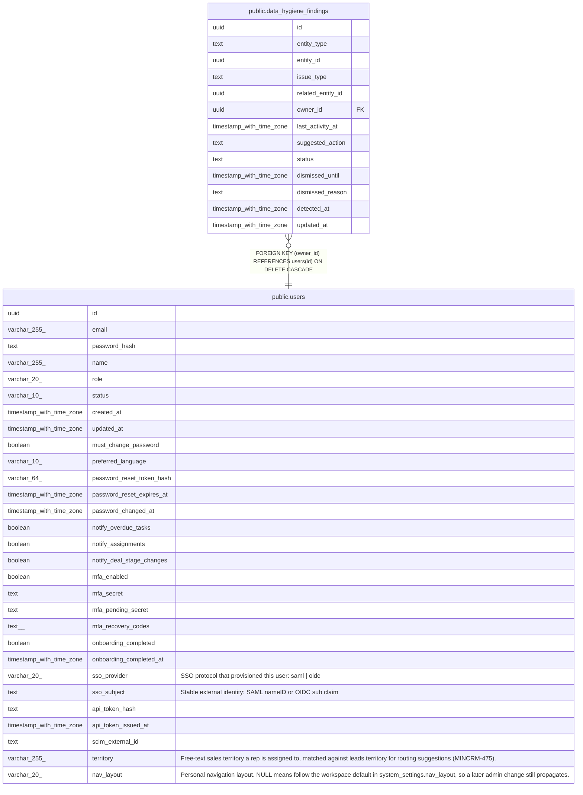

# public.data_hygiene_findings

## Description

Current data hygiene queue (MINCRM-476), one row per flagged record per issue type. Upserted nightly by dataHygieneService; mutated in place by update/merge/archive/dismiss actions rather than appended — reflects current state, not a history log. A finding is cleared (deleted) once the nightly scan no longer detects the issue, or the underlying record is deleted/archived. dismissed_until implements the 90-day (admin-configurable) dismiss suppression window.

## Columns

| Name | Type | Default | Nullable | Children | Parents | Comment |
| ---- | ---- | ------- | -------- | -------- | ------- | ------- |
| id | uuid | gen_random_uuid() | false |  |  |  |
| entity_type | text |  | false |  |  |  |
| entity_id | uuid |  | false |  |  |  |
| issue_type | text |  | false |  |  |  |
| related_entity_id | uuid |  | true |  |  |  |
| owner_id | uuid |  | false |  | [public.users](public.users.md) |  |
| last_activity_at | timestamp with time zone |  | true |  |  |  |
| suggested_action | text |  | false |  |  |  |
| status | text | 'open'::text | false |  |  |  |
| dismissed_until | timestamp with time zone |  | true |  |  |  |
| dismissed_reason | text |  | true |  |  |  |
| detected_at | timestamp with time zone | now() | false |  |  |  |
| updated_at | timestamp with time zone | now() | false |  |  |  |

## Constraints

| Name | Type | Definition |
| ---- | ---- | ---------- |
| data_hygiene_findings_entity_type_check | CHECK | CHECK ((entity_type = ANY (ARRAY['contact'::text, 'account'::text, 'opportunity'::text]))) |
| data_hygiene_findings_status_check | CHECK | CHECK ((status = ANY (ARRAY['open'::text, 'dismissed'::text]))) |
| data_hygiene_findings_owner_id_fkey | FOREIGN KEY | FOREIGN KEY (owner_id) REFERENCES users(id) ON DELETE CASCADE |
| data_hygiene_findings_pkey | PRIMARY KEY | PRIMARY KEY (id) |
| data_hygiene_findings_entity_issue_unique | UNIQUE | UNIQUE (entity_type, entity_id, issue_type) |

## Indexes

| Name | Definition |
| ---- | ---------- |
| data_hygiene_findings_pkey | CREATE UNIQUE INDEX data_hygiene_findings_pkey ON public.data_hygiene_findings USING btree (id) |
| data_hygiene_findings_entity_issue_unique | CREATE UNIQUE INDEX data_hygiene_findings_entity_issue_unique ON public.data_hygiene_findings USING btree (entity_type, entity_id, issue_type) |
| data_hygiene_findings_owner_id_idx | CREATE INDEX data_hygiene_findings_owner_id_idx ON public.data_hygiene_findings USING btree (owner_id) |
| data_hygiene_findings_entity_idx | CREATE INDEX data_hygiene_findings_entity_idx ON public.data_hygiene_findings USING btree (entity_type, entity_id) |
| data_hygiene_findings_related_entity_idx | CREATE INDEX data_hygiene_findings_related_entity_idx ON public.data_hygiene_findings USING btree (related_entity_id) WHERE (related_entity_id IS NOT NULL) |

## Relations

---

> Generated by [tbls](https://github.com/k1LoW/tbls)
