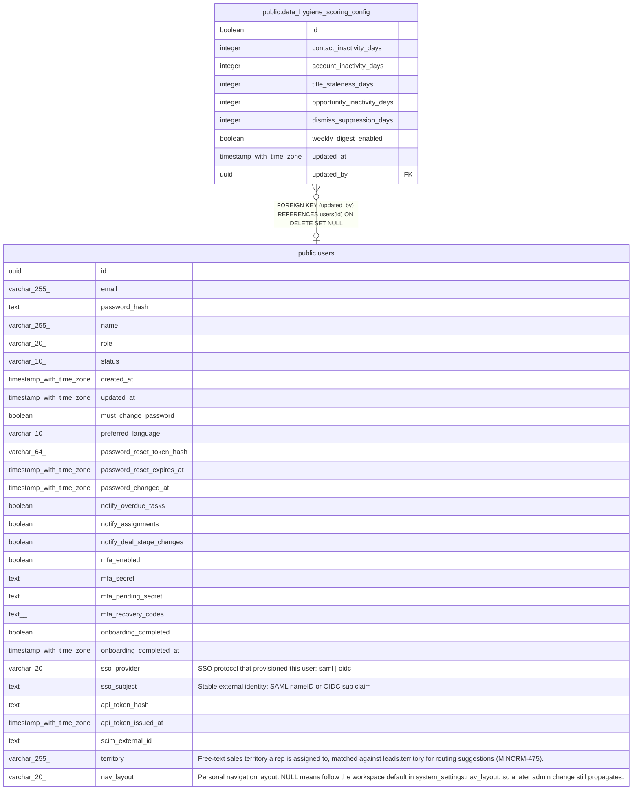

# public.data_hygiene_scoring_config

## Description

Singleton admin-editable thresholds for the data hygiene scan (MINCRM-476). id is a boolean-typed singleton key (id = true) following the single-row-config convention (see account_health_scoring_config, migration 151).

## Columns

| Name | Type | Default | Nullable | Children | Parents | Comment |
| ---- | ---- | ------- | -------- | -------- | ------- | ------- |
| id | boolean | true | false |  |  |  |
| contact_inactivity_days | integer | 365 | false |  |  |  |
| account_inactivity_days | integer | 365 | false |  |  |  |
| title_staleness_days | integer | 1095 | false |  |  |  |
| opportunity_inactivity_days | integer | 30 | false |  |  |  |
| dismiss_suppression_days | integer | 90 | false |  |  |  |
| weekly_digest_enabled | boolean | false | false |  |  |  |
| updated_at | timestamp with time zone | now() | false |  |  |  |
| updated_by | uuid |  | true |  | [public.users](public.users.md) |  |

## Constraints

| Name | Type | Definition |
| ---- | ---- | ---------- |
| data_hygiene_scoring_config_account_inactivity_check | CHECK | CHECK ((account_inactivity_days >= 1)) |
| data_hygiene_scoring_config_contact_inactivity_check | CHECK | CHECK ((contact_inactivity_days >= 1)) |
| data_hygiene_scoring_config_dismiss_suppression_check | CHECK | CHECK ((dismiss_suppression_days >= 1)) |
| data_hygiene_scoring_config_opportunity_inactivity_check | CHECK | CHECK ((opportunity_inactivity_days >= 1)) |
| data_hygiene_scoring_config_singleton | CHECK | CHECK ((id = true)) |
| data_hygiene_scoring_config_title_staleness_check | CHECK | CHECK ((title_staleness_days >= 1)) |
| data_hygiene_scoring_config_updated_by_fkey | FOREIGN KEY | FOREIGN KEY (updated_by) REFERENCES users(id) ON DELETE SET NULL |
| data_hygiene_scoring_config_pkey | PRIMARY KEY | PRIMARY KEY (id) |

## Indexes

| Name | Definition |
| ---- | ---------- |
| data_hygiene_scoring_config_pkey | CREATE UNIQUE INDEX data_hygiene_scoring_config_pkey ON public.data_hygiene_scoring_config USING btree (id) |

## Relations

---

> Generated by [tbls](https://github.com/k1LoW/tbls)
