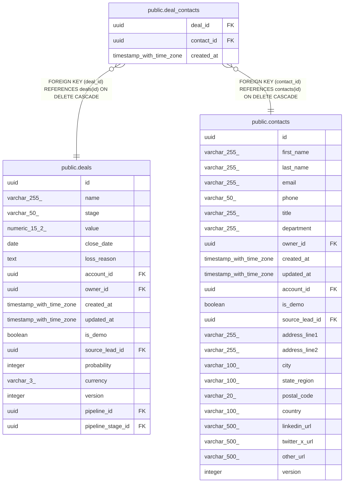

# public.deal_contacts

## Columns

| Name | Type | Default | Nullable | Children | Parents | Comment |
| ---- | ---- | ------- | -------- | -------- | ------- | ------- |
| deal_id | uuid |  | false |  | [public.deals](public.deals.md) |  |
| contact_id | uuid |  | false |  | [public.contacts](public.contacts.md) |  |
| created_at | timestamp with time zone | now() | false |  |  |  |

## Constraints

| Name | Type | Definition |
| ---- | ---- | ---------- |
| deal_contacts_contact_id_fkey | FOREIGN KEY | FOREIGN KEY (contact_id) REFERENCES contacts(id) ON DELETE CASCADE |
| deal_contacts_deal_id_fkey | FOREIGN KEY | FOREIGN KEY (deal_id) REFERENCES deals(id) ON DELETE CASCADE |
| deal_contacts_pkey | PRIMARY KEY | PRIMARY KEY (deal_id, contact_id) |

## Indexes

| Name | Definition |
| ---- | ---------- |
| deal_contacts_pkey | CREATE UNIQUE INDEX deal_contacts_pkey ON public.deal_contacts USING btree (deal_id, contact_id) |
| deal_contacts_contact_id_index | CREATE INDEX deal_contacts_contact_id_index ON public.deal_contacts USING btree (contact_id) |

## Relations

---

> Generated by [tbls](https://github.com/k1LoW/tbls)
