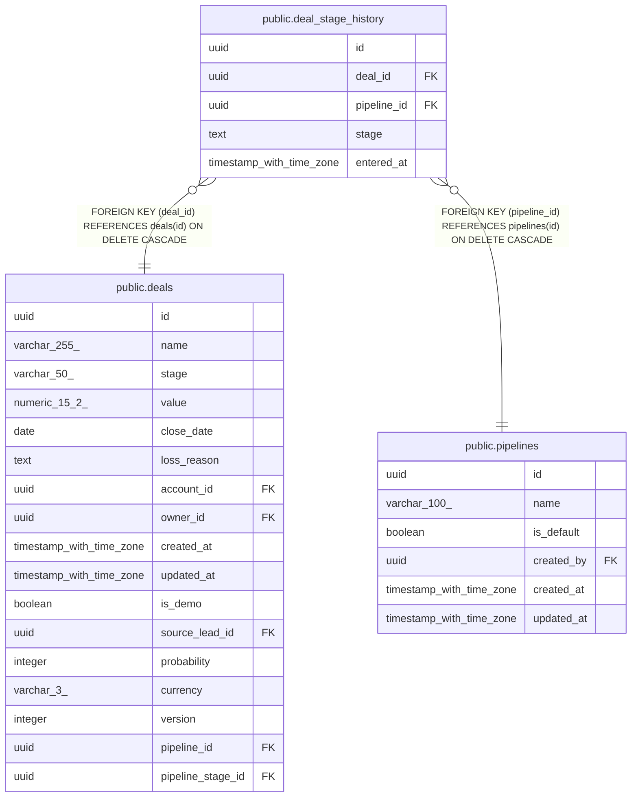

# public.deal_stage_history

## Description

Append-only log of real deal stage transitions (MINCRM-474). One row per deal per stage entered, including a day-0 row on creation. Never updated, only inserted. Powers average-days-per-stage and stage-conversion-rate metrics for rep coaching insights.

## Columns

| Name | Type | Default | Nullable | Children | Parents | Comment |
| ---- | ---- | ------- | -------- | -------- | ------- | ------- |
| id | uuid | gen_random_uuid() | false |  |  |  |
| deal_id | uuid |  | false |  | [public.deals](public.deals.md) |  |
| pipeline_id | uuid |  | false |  | [public.pipelines](public.pipelines.md) |  |
| stage | text |  | false |  |  |  |
| entered_at | timestamp with time zone | now() | false |  |  |  |

## Constraints

| Name | Type | Definition |
| ---- | ---- | ---------- |
| deal_stage_history_pipeline_id_fkey | FOREIGN KEY | FOREIGN KEY (pipeline_id) REFERENCES pipelines(id) ON DELETE CASCADE |
| deal_stage_history_deal_id_fkey | FOREIGN KEY | FOREIGN KEY (deal_id) REFERENCES deals(id) ON DELETE CASCADE |
| deal_stage_history_pkey | PRIMARY KEY | PRIMARY KEY (id) |

## Indexes

| Name | Definition |
| ---- | ---------- |
| deal_stage_history_pkey | CREATE UNIQUE INDEX deal_stage_history_pkey ON public.deal_stage_history USING btree (id) |
| deal_stage_history_deal_id_entered_at_idx | CREATE INDEX deal_stage_history_deal_id_entered_at_idx ON public.deal_stage_history USING btree (deal_id, entered_at) |

## Relations

---

> Generated by [tbls](https://github.com/k1LoW/tbls)
