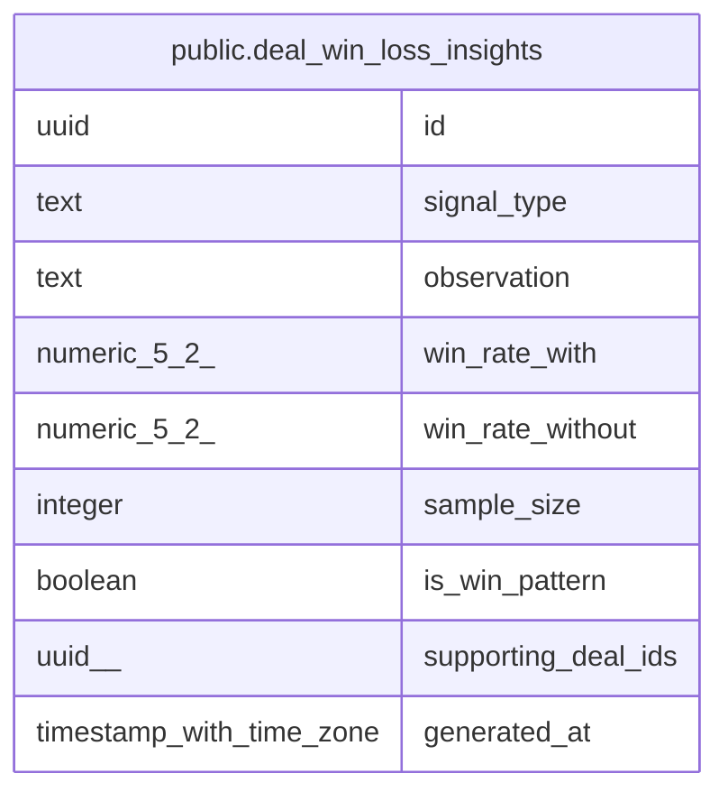

# public.deal_win_loss_insights

## Description

Cached nightly AI win/loss pattern analysis results (MINCRM-464). Fully replaced on each run of analyzeWinLossPatterns — not appended.

## Columns

| Name | Type | Default | Nullable | Children | Parents | Comment |
| ---- | ---- | ------- | -------- | -------- | ------- | ------- |
| id | uuid | gen_random_uuid() | false |  |  |  |
| signal_type | text |  | false |  |  |  |
| observation | text |  | false |  |  |  |
| win_rate_with | numeric(5,2) |  | false |  |  |  |
| win_rate_without | numeric(5,2) |  | false |  |  |  |
| sample_size | integer |  | false |  |  |  |
| is_win_pattern | boolean |  | false |  |  |  |
| supporting_deal_ids | uuid[] | '{}'::uuid[] | false |  |  |  |
| generated_at | timestamp with time zone | now() | false |  |  |  |

## Constraints

| Name | Type | Definition |
| ---- | ---- | ---------- |
| deal_win_loss_insights_sample_size_positive | CHECK | CHECK ((sample_size >= 0)) |
| deal_win_loss_insights_pkey | PRIMARY KEY | PRIMARY KEY (id) |

## Indexes

| Name | Definition |
| ---- | ---------- |
| deal_win_loss_insights_pkey | CREATE UNIQUE INDEX deal_win_loss_insights_pkey ON public.deal_win_loss_insights USING btree (id) |
| deal_win_loss_insights_generated_at_idx | CREATE INDEX deal_win_loss_insights_generated_at_idx ON public.deal_win_loss_insights USING btree (generated_at) |
| deal_win_loss_insights_is_win_pattern_idx | CREATE INDEX deal_win_loss_insights_is_win_pattern_idx ON public.deal_win_loss_insights USING btree (is_win_pattern) |

## Relations

---

> Generated by [tbls](https://github.com/k1LoW/tbls)
