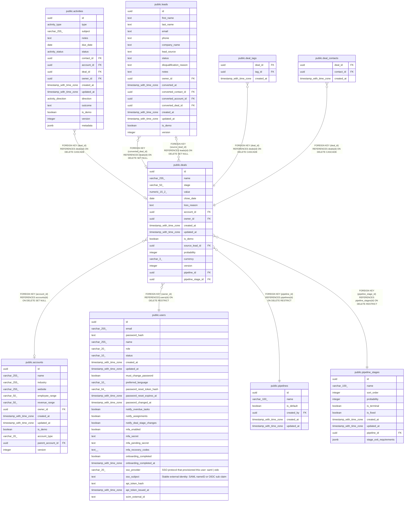

# public.deals

## Columns

| Name | Type | Default | Nullable | Children | Parents | Comment |
| ---- | ---- | ------- | -------- | -------- | ------- | ------- |
| id | uuid | gen_random_uuid() | false | [public.leads](public.leads.md) [public.activities](public.activities.md) [public.deal_tags](public.deal_tags.md) [public.deal_contacts](public.deal_contacts.md) |  |  |
| name | varchar(255) |  | false |  |  |  |
| stage | varchar(50) |  | false |  |  |  |
| value | numeric(15,2) |  | true |  |  |  |
| close_date | date |  | true |  |  |  |
| loss_reason | text |  | true |  |  |  |
| account_id | uuid |  | true |  | [public.accounts](public.accounts.md) |  |
| owner_id | uuid |  | false |  | [public.users](public.users.md) |  |
| created_at | timestamp with time zone | now() | false |  |  |  |
| updated_at | timestamp with time zone | now() | false |  |  |  |
| is_demo | boolean | false | false |  |  |  |
| source_lead_id | uuid |  | true |  | [public.leads](public.leads.md) |  |
| probability | integer |  | true |  |  |  |
| currency | varchar(3) | 'USD'::character varying | false |  |  |  |
| version | integer | 1 | false |  |  |  |
| pipeline_id | uuid |  | false |  | [public.pipelines](public.pipelines.md) |  |
| pipeline_stage_id | uuid |  | false |  | [public.pipeline_stages](public.pipeline_stages.md) |  |

## Constraints

| Name | Type | Definition |
| ---- | ---- | ---------- |
| deals_probability_check | CHECK | CHECK (((probability IS NULL) OR ((probability >= 0) AND (probability <= 100)))) |
| deals_owner_id_fkey | FOREIGN KEY | FOREIGN KEY (owner_id) REFERENCES users(id) ON DELETE RESTRICT |
| deals_pipeline_id_fkey | FOREIGN KEY | FOREIGN KEY (pipeline_id) REFERENCES pipelines(id) ON DELETE RESTRICT |
| deals_pipeline_stage_id_fkey | FOREIGN KEY | FOREIGN KEY (pipeline_stage_id) REFERENCES pipeline_stages(id) ON DELETE RESTRICT |
| deals_source_lead_id_fkey | FOREIGN KEY | FOREIGN KEY (source_lead_id) REFERENCES leads(id) ON DELETE SET NULL |
| deals_account_id_fkey | FOREIGN KEY | FOREIGN KEY (account_id) REFERENCES accounts(id) ON DELETE SET NULL |
| deals_pkey | PRIMARY KEY | PRIMARY KEY (id) |

## Indexes

| Name | Definition |
| ---- | ---------- |
| deals_pkey | CREATE UNIQUE INDEX deals_pkey ON public.deals USING btree (id) |
| deals_owner_id_index | CREATE INDEX deals_owner_id_index ON public.deals USING btree (owner_id) |
| deals_account_id_index | CREATE INDEX deals_account_id_index ON public.deals USING btree (account_id) |
| deals_is_demo_index | CREATE INDEX deals_is_demo_index ON public.deals USING btree (is_demo) |
| deals_stage_index | CREATE INDEX deals_stage_index ON public.deals USING btree (stage) |
| deals_close_date_index | CREATE INDEX deals_close_date_index ON public.deals USING btree (close_date) |
| deals_stage_close_date_idx | CREATE INDEX deals_stage_close_date_idx ON public.deals USING btree (stage, close_date) |
| deals_name_trgm_idx | CREATE INDEX deals_name_trgm_idx ON public.deals USING gin (name gin_trgm_ops) |
| deals_pipeline_id_idx | CREATE INDEX deals_pipeline_id_idx ON public.deals USING btree (pipeline_id) |
| deals_pipeline_stage_id_idx | CREATE INDEX deals_pipeline_stage_id_idx ON public.deals USING btree (pipeline_stage_id) |

## Triggers

| Name | Definition |
| ---- | ---------- |
| deals_set_updated_at | CREATE TRIGGER deals_set_updated_at BEFORE UPDATE ON public.deals FOR EACH ROW EXECUTE FUNCTION set_updated_at() |

## Relations

---

> Generated by [tbls](https://github.com/k1LoW/tbls)
