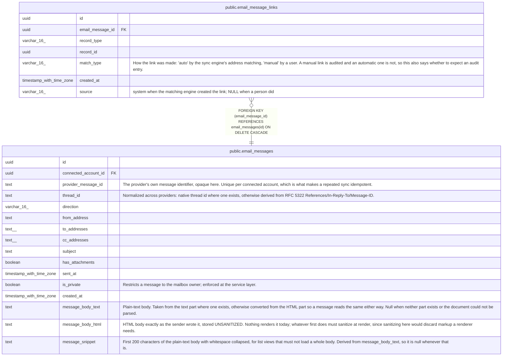

# public.email_message_links

## Description

Links a synced message to the CRM records its addresses name. record_type + record_id form a polymorphic reference with no FK constraint, because a PostgreSQL FK cannot span several parent tables. Valid record_type values: 'contact', 'lead', 'account', 'deal'. Orphan cleanup is the application's responsibility: a hard-delete of one of those records must clear its links in the same transaction, and a consolidating path — a contact merge, a lead conversion — must move them to the surviving record rather than drop them. See docs/dev/schema.md — Polymorphic FK Pattern.

## Columns

| Name | Type | Default | Nullable | Children | Parents | Comment |
| ---- | ---- | ------- | -------- | -------- | ------- | ------- |
| id | uuid | gen_random_uuid() | false |  |  |  |
| email_message_id | uuid |  | false |  | [public.email_messages](public.email_messages.md) |  |
| record_type | varchar(16) |  | false |  |  |  |
| record_id | uuid |  | false |  |  |  |
| match_type | varchar(16) |  | false |  |  | How the link was made: 'auto' by the sync engine's address matching, 'manual' by a user. A manual link is audited and an automatic one is not, so this also says whether to expect an audit entry. |
| created_at | timestamp with time zone | now() | false |  |  |  |
| source | varchar(16) |  | true |  |  | system when the matching engine created the link; NULL when a person did |

## Constraints

| Name | Type | Definition |
| ---- | ---- | ---------- |
| email_message_links_match_type_check | CHECK | CHECK (((match_type)::text = ANY ((ARRAY['auto'::character varying, 'manual'::character varying])::text[]))) |
| email_message_links_record_type_check | CHECK | CHECK (((record_type)::text = ANY ((ARRAY['contact'::character varying, 'lead'::character varying, 'account'::character varying, 'deal'::character varying])::text[]))) |
| email_message_links_source_check | CHECK | CHECK (((source IS NULL) OR ((source)::text = 'system'::text))) |
| email_message_links_email_message_id_fkey | FOREIGN KEY | FOREIGN KEY (email_message_id) REFERENCES email_messages(id) ON DELETE CASCADE |
| email_message_links_pkey | PRIMARY KEY | PRIMARY KEY (id) |
| email_message_links_message_record_unique | UNIQUE | UNIQUE (email_message_id, record_type, record_id) |

## Indexes

| Name | Definition |
| ---- | ---------- |
| email_message_links_pkey | CREATE UNIQUE INDEX email_message_links_pkey ON public.email_message_links USING btree (id) |
| email_message_links_message_record_unique | CREATE UNIQUE INDEX email_message_links_message_record_unique ON public.email_message_links USING btree (email_message_id, record_type, record_id) |
| email_message_links_record_idx | CREATE INDEX email_message_links_record_idx ON public.email_message_links USING btree (record_type, record_id) |

## Relations

---

> Generated by [tbls](https://github.com/k1LoW/tbls)
