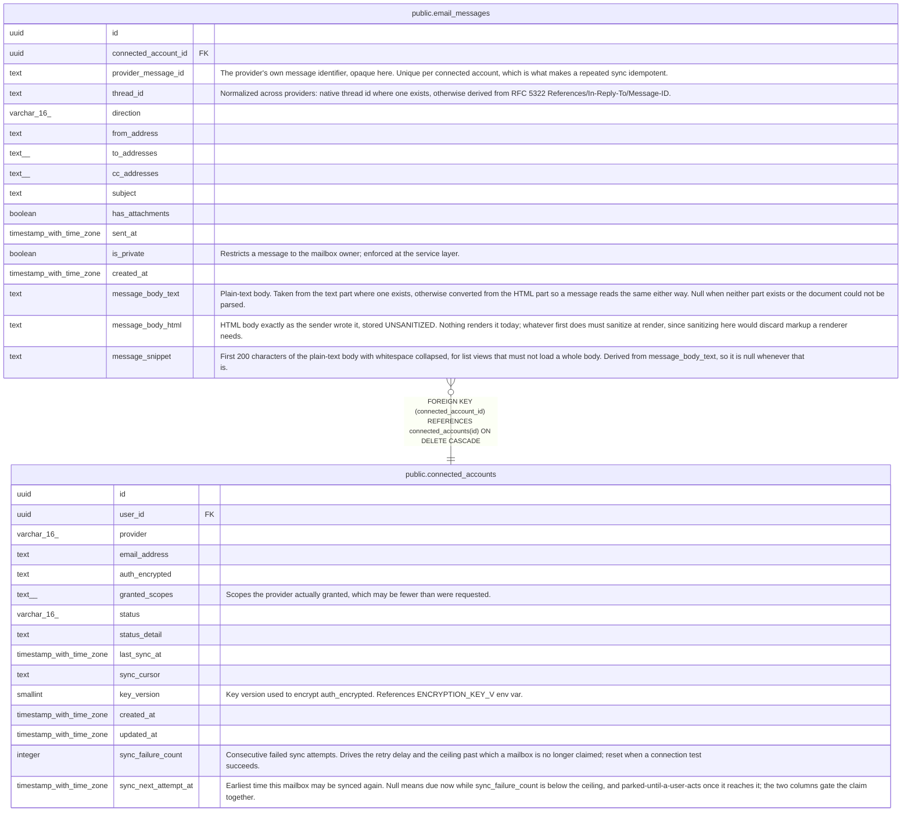

# public.email_messages

## Description

Messages synced from a connected mailbox. Headers, metadata, and body text. All three body columns are nullable: a message may store its headers with no body.

## Columns

| Name | Type | Default | Nullable | Children | Parents | Comment |
| ---- | ---- | ------- | -------- | -------- | ------- | ------- |
| id | uuid | gen_random_uuid() | false |  |  |  |
| connected_account_id | uuid |  | false |  | [public.connected_accounts](public.connected_accounts.md) |  |
| provider_message_id | text |  | false |  |  | The provider's own message identifier, opaque here. Unique per connected account, which is what makes a repeated sync idempotent. |
| thread_id | text |  | false |  |  | Normalized across providers: native thread id where one exists, otherwise derived from RFC 5322 References/In-Reply-To/Message-ID. |
| direction | varchar(16) |  | false |  |  |  |
| from_address | text |  | false |  |  |  |
| to_addresses | text[] | '{}'::text[] | false |  |  |  |
| cc_addresses | text[] | '{}'::text[] | false |  |  |  |
| subject | text |  | true |  |  |  |
| has_attachments | boolean | false | false |  |  |  |
| sent_at | timestamp with time zone |  | true |  |  |  |
| is_private | boolean | false | false |  |  | Restricts a message to the mailbox owner; enforced at the service layer. |
| created_at | timestamp with time zone | now() | false |  |  |  |
| message_body_text | text |  | true |  |  | Plain-text body. Taken from the text part where one exists, otherwise converted from the HTML part so a message reads the same either way. Null when neither part exists or the document could not be parsed. |
| message_body_html | text |  | true |  |  | HTML body exactly as the sender wrote it, stored UNSANITIZED. Nothing renders it today; whatever first does must sanitize at render, since sanitizing here would discard markup a renderer needs. |
| message_snippet | text |  | true |  |  | First 200 characters of the plain-text body with whitespace collapsed, for list views that must not load a whole body. Derived from message_body_text, so it is null whenever that is. |

## Constraints

| Name | Type | Definition |
| ---- | ---- | ---------- |
| email_messages_direction_check | CHECK | CHECK (((direction)::text = ANY ((ARRAY['inbound'::character varying, 'outbound'::character varying])::text[]))) |
| email_messages_connected_account_id_fkey | FOREIGN KEY | FOREIGN KEY (connected_account_id) REFERENCES connected_accounts(id) ON DELETE CASCADE |
| email_messages_pkey | PRIMARY KEY | PRIMARY KEY (id) |
| email_messages_account_provider_id_unique | UNIQUE | UNIQUE (connected_account_id, provider_message_id) |

## Indexes

| Name | Definition |
| ---- | ---------- |
| email_messages_pkey | CREATE UNIQUE INDEX email_messages_pkey ON public.email_messages USING btree (id) |
| email_messages_account_provider_id_unique | CREATE UNIQUE INDEX email_messages_account_provider_id_unique ON public.email_messages USING btree (connected_account_id, provider_message_id) |
| email_messages_thread_id_idx | CREATE INDEX email_messages_thread_id_idx ON public.email_messages USING btree (thread_id) |
| email_messages_sent_at_idx | CREATE INDEX email_messages_sent_at_idx ON public.email_messages USING btree (sent_at) |
| email_messages_account_sent_at_idx | CREATE INDEX email_messages_account_sent_at_idx ON public.email_messages USING btree (connected_account_id, sent_at DESC) |

## Relations

---

> Generated by [tbls](https://github.com/k1LoW/tbls)
