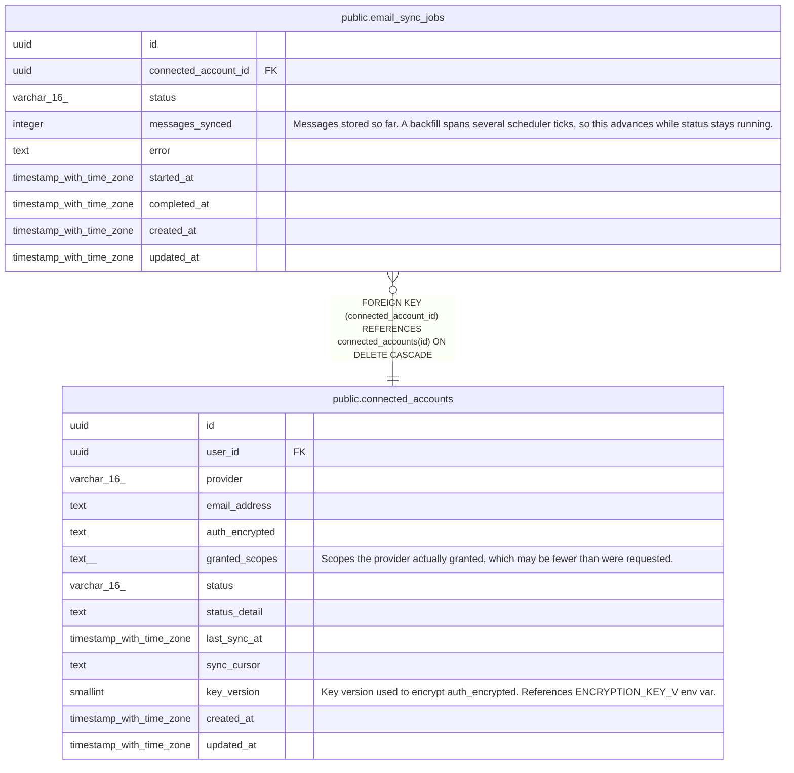

# public.email_sync_jobs

## Description

Progress of a bounded mailbox backfill. One row per backfill run; incremental syncs create none.

## Columns

| Name | Type | Default | Nullable | Children | Parents | Comment |
| ---- | ---- | ------- | -------- | -------- | ------- | ------- |
| id | uuid | gen_random_uuid() | false |  |  |  |
| connected_account_id | uuid |  | false |  | [public.connected_accounts](public.connected_accounts.md) |  |
| status | varchar(16) | 'pending'::character varying | false |  |  |  |
| messages_synced | integer | 0 | false |  |  | Messages stored so far. A backfill spans several scheduler ticks, so this advances while status stays running. |
| error | text |  | true |  |  |  |
| started_at | timestamp with time zone |  | true |  |  |  |
| completed_at | timestamp with time zone |  | true |  |  |  |
| created_at | timestamp with time zone | now() | false |  |  |  |
| updated_at | timestamp with time zone | now() | false |  |  |  |

## Constraints

| Name | Type | Definition |
| ---- | ---- | ---------- |
| email_sync_jobs_status_check | CHECK | CHECK (((status)::text = ANY ((ARRAY['pending'::character varying, 'running'::character varying, 'complete'::character varying, 'failed'::character varying])::text[]))) |
| email_sync_jobs_connected_account_id_fkey | FOREIGN KEY | FOREIGN KEY (connected_account_id) REFERENCES connected_accounts(id) ON DELETE CASCADE |
| email_sync_jobs_pkey | PRIMARY KEY | PRIMARY KEY (id) |

## Indexes

| Name | Definition |
| ---- | ---------- |
| email_sync_jobs_pkey | CREATE UNIQUE INDEX email_sync_jobs_pkey ON public.email_sync_jobs USING btree (id) |
| email_sync_jobs_account_id_idx | CREATE INDEX email_sync_jobs_account_id_idx ON public.email_sync_jobs USING btree (connected_account_id) |
| email_sync_jobs_one_active_per_account_idx | CREATE UNIQUE INDEX email_sync_jobs_one_active_per_account_idx ON public.email_sync_jobs USING btree (connected_account_id) WHERE ((status)::text = ANY ((ARRAY['pending'::character varying, 'running'::character varying])::text[])) |

## Triggers

| Name | Definition |
| ---- | ---------- |
| email_sync_jobs_set_updated_at | CREATE TRIGGER email_sync_jobs_set_updated_at BEFORE UPDATE ON public.email_sync_jobs FOR EACH ROW EXECUTE FUNCTION set_updated_at() |

## Relations

---

> Generated by [tbls](https://github.com/k1LoW/tbls)
