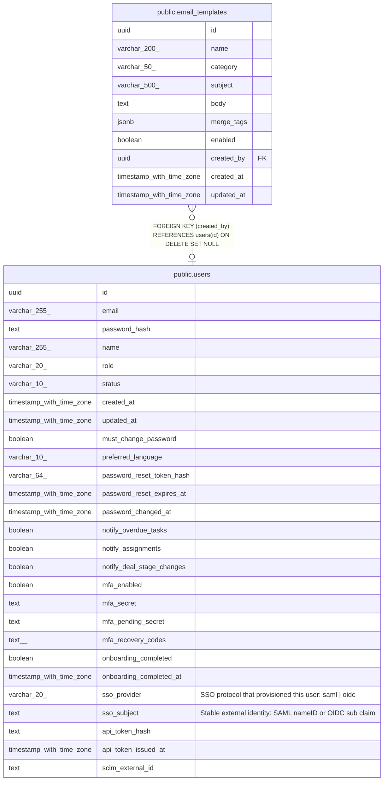

# public.email_templates

## Columns

| Name | Type | Default | Nullable | Children | Parents | Comment |
| ---- | ---- | ------- | -------- | -------- | ------- | ------- |
| id | uuid | gen_random_uuid() | false |  |  |  |
| name | varchar(200) |  | false |  |  |  |
| category | varchar(50) |  | false |  |  |  |
| subject | varchar(500) |  | false |  |  |  |
| body | text |  | false |  |  |  |
| merge_tags | jsonb | '[]'::jsonb | false |  |  |  |
| enabled | boolean | true | false |  |  |  |
| created_by | uuid |  | true |  | [public.users](public.users.md) |  |
| created_at | timestamp with time zone | now() | false |  |  |  |
| updated_at | timestamp with time zone | now() | false |  |  |  |

## Constraints

| Name | Type | Definition |
| ---- | ---- | ---------- |
| email_templates_created_by_fkey | FOREIGN KEY | FOREIGN KEY (created_by) REFERENCES users(id) ON DELETE SET NULL |
| email_templates_pkey | PRIMARY KEY | PRIMARY KEY (id) |
| email_templates_name_key | UNIQUE | UNIQUE (name) |

## Indexes

| Name | Definition |
| ---- | ---------- |
| email_templates_pkey | CREATE UNIQUE INDEX email_templates_pkey ON public.email_templates USING btree (id) |
| email_templates_name_key | CREATE UNIQUE INDEX email_templates_name_key ON public.email_templates USING btree (name) |
| email_templates_category_index | CREATE INDEX email_templates_category_index ON public.email_templates USING btree (category) |
| email_templates_enabled_index | CREATE INDEX email_templates_enabled_index ON public.email_templates USING btree (enabled) |

## Triggers

| Name | Definition |
| ---- | ---------- |
| email_templates_set_updated_at | CREATE TRIGGER email_templates_set_updated_at BEFORE UPDATE ON public.email_templates FOR EACH ROW EXECUTE FUNCTION set_updated_at() |

## Relations

---

> Generated by [tbls](https://github.com/k1LoW/tbls)
