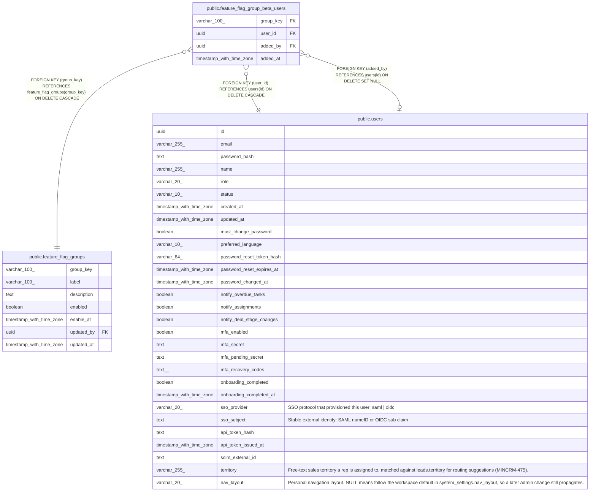

# public.feature_flag_group_beta_users

## Columns

| Name | Type | Default | Nullable | Children | Parents | Comment |
| ---- | ---- | ------- | -------- | -------- | ------- | ------- |
| group_key | varchar(100) |  | false |  | [public.feature_flag_groups](public.feature_flag_groups.md) |  |
| user_id | uuid |  | false |  | [public.users](public.users.md) |  |
| added_by | uuid |  | true |  | [public.users](public.users.md) |  |
| added_at | timestamp with time zone | now() | false |  |  |  |

## Constraints

| Name | Type | Definition |
| ---- | ---- | ---------- |
| feature_flag_group_beta_users_added_by_fkey | FOREIGN KEY | FOREIGN KEY (added_by) REFERENCES users(id) ON DELETE SET NULL |
| feature_flag_group_beta_users_user_id_fkey | FOREIGN KEY | FOREIGN KEY (user_id) REFERENCES users(id) ON DELETE CASCADE |
| feature_flag_group_beta_users_group_key_fkey | FOREIGN KEY | FOREIGN KEY (group_key) REFERENCES feature_flag_groups(group_key) ON DELETE CASCADE |
| feature_flag_group_beta_users_pkey | PRIMARY KEY | PRIMARY KEY (group_key, user_id) |

## Indexes

| Name | Definition |
| ---- | ---------- |
| feature_flag_group_beta_users_pkey | CREATE UNIQUE INDEX feature_flag_group_beta_users_pkey ON public.feature_flag_group_beta_users USING btree (group_key, user_id) |

## Relations

---

> Generated by [tbls](https://github.com/k1LoW/tbls)
