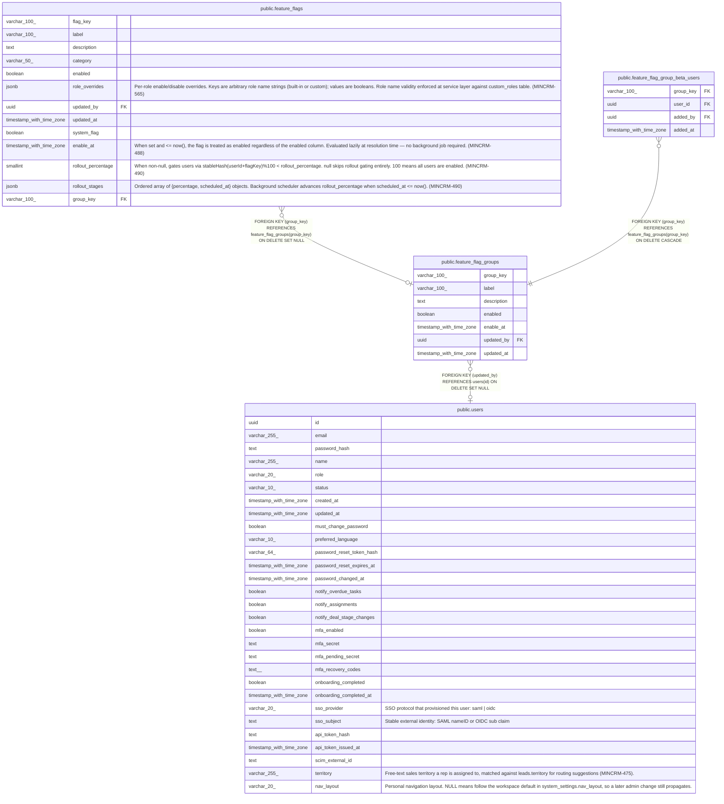

# public.feature_flag_groups

## Columns

| Name | Type | Default | Nullable | Children | Parents | Comment |
| ---- | ---- | ------- | -------- | -------- | ------- | ------- |
| group_key | varchar(100) |  | false | [public.feature_flags](public.feature_flags.md) [public.feature_flag_group_beta_users](public.feature_flag_group_beta_users.md) |  |  |
| label | varchar(100) |  | false |  |  |  |
| description | text | ''::text | false |  |  |  |
| enabled | boolean | true | false |  |  |  |
| enable_at | timestamp with time zone |  | true |  |  |  |
| updated_by | uuid |  | true |  | [public.users](public.users.md) |  |
| updated_at | timestamp with time zone | now() | false |  |  |  |

## Constraints

| Name | Type | Definition |
| ---- | ---- | ---------- |
| feature_flag_groups_updated_by_fkey | FOREIGN KEY | FOREIGN KEY (updated_by) REFERENCES users(id) ON DELETE SET NULL |
| feature_flag_groups_pkey | PRIMARY KEY | PRIMARY KEY (group_key) |

## Indexes

| Name | Definition |
| ---- | ---------- |
| feature_flag_groups_pkey | CREATE UNIQUE INDEX feature_flag_groups_pkey ON public.feature_flag_groups USING btree (group_key) |

## Relations

---

> Generated by [tbls](https://github.com/k1LoW/tbls)
