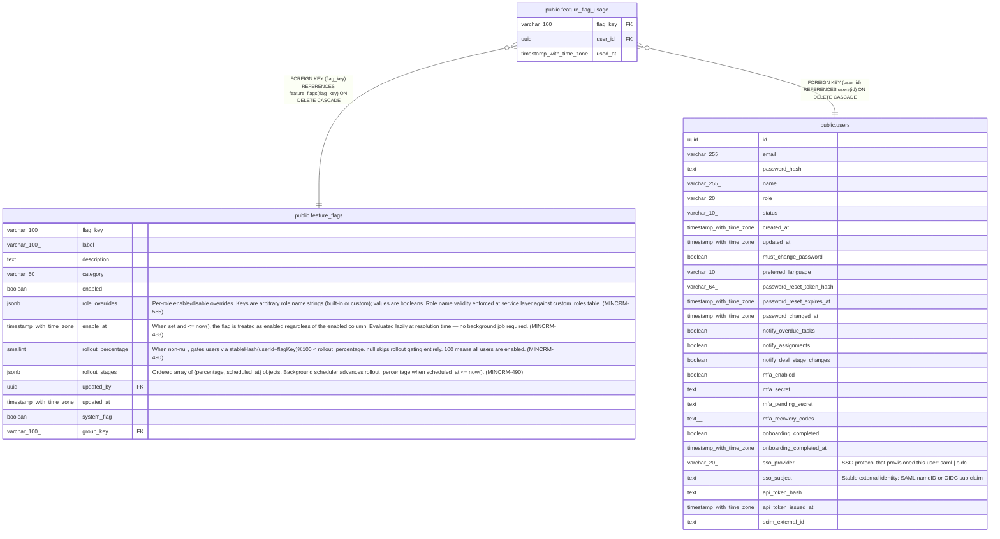

# public.feature_flag_usage

## Columns

| Name | Type | Default | Nullable | Children | Parents | Comment |
| ---- | ---- | ------- | -------- | -------- | ------- | ------- |
| flag_key | varchar(100) |  | false |  | [public.feature_flags](public.feature_flags.md) |  |
| user_id | uuid |  | false |  | [public.users](public.users.md) |  |
| used_at | timestamp with time zone | now() | false |  |  |  |

## Constraints

| Name | Type | Definition |
| ---- | ---- | ---------- |
| feature_flag_usage_user_id_fkey | FOREIGN KEY | FOREIGN KEY (user_id) REFERENCES users(id) ON DELETE CASCADE |
| feature_flag_usage_flag_key_fkey | FOREIGN KEY | FOREIGN KEY (flag_key) REFERENCES feature_flags(flag_key) ON DELETE CASCADE |
| pk_feature_flag_usage | PRIMARY KEY | PRIMARY KEY (flag_key, user_id) |

## Indexes

| Name | Definition |
| ---- | ---------- |
| pk_feature_flag_usage | CREATE UNIQUE INDEX pk_feature_flag_usage ON public.feature_flag_usage USING btree (flag_key, user_id) |
| feature_flag_usage_flag_key_used_at_idx | CREATE INDEX feature_flag_usage_flag_key_used_at_idx ON public.feature_flag_usage USING btree (flag_key, used_at) |
| feature_flag_usage_used_at_index | CREATE INDEX feature_flag_usage_used_at_index ON public.feature_flag_usage USING btree (used_at) |

## Relations

---

> Generated by [tbls](https://github.com/k1LoW/tbls)
